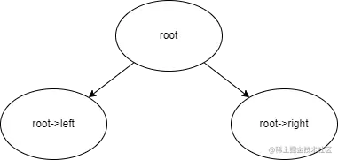
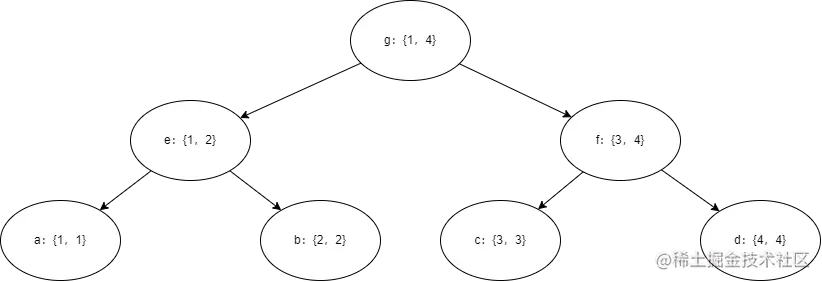

## 线段树

线段树是一种二叉搜索树，常常用来维护区间信息。他的功能十分的强大，可以在短时间内对一段区间进行如单点修改，区间修改，区间查询等操作


#### 一、二叉树

> 提问1：什么是二叉树？
>
> 答：如图
>
> 
>
> 每个节点具有至多两个子节点。我们一般将左边的叫做左孩子，右边的叫做右孩子。最下边的没有子节点的节点，我们称之为叶节点，即二叉树的叶子。最顶上的叫做根节点，也就是而二叉树的根
>
> 提问2：一棵n层的线段树，最多有几个节点？
>
> 答：$2^n - 1$个
>
> 第一层有一个根节点，即1个；第二层至多有两个，即根节点的两个自节点；由此可见，第$n$层最多有$2^{n-1}$个子节点。根据等比数列求和公式，$n$层的二叉树至多有$2^n - 1$个节点。

#### 二、线段

我们已经知道线段树中的“树”是什么了，现在再来看看线段树中的**线段**是什么。

现在给你一个区间：1～4。我们将其看作二叉树的叶节点来建立一颗二叉树：



每个节点表示一个区间，叶节点的区间**左右边界相同**，用区间的形式表示一个点。我们可以直观地看到，一个节点表示的区间是左孩子和右孩子的区间的和；一个节点的左孩子表示该节点的左半边区间，右孩子表示右半边区间。

当我们想要表示区间[1, 4]的时候，就用节点$g$。想要表示区间[1, 2]的时候，就用节点$e$。

> 提问：区间[2, 3]该怎么表示
>
> 答：用节点$b$和节点$f$一起

**也就是说，在该区间中的任何一段区间，我们都可以用线段树中若干个节点来表示**

现在，~~线段和树都凑齐了~~可以开始讲线段树了

#### 三、线段树的基本操作

我们先来看一道题

[模板](https://www.luogu.com.cn/problem/P3374)

先来直接暴力！

```c++
#include <iostream>
#include <vector>
using namespace std;

int main()
{
    int n, m;
    cin >> n >> m;
    vector<int> a(n + 1);
    for (int i = 1; i <= n; ++i)
        cin >> a[i];
    while (m--)
    {
        int op, x, k;
        cin >> op >> x >> k;
        if (op == 1)
            a[x] += k;
        else
        {
            int res = 0;
            for (int i = x; i <= k; ++i)
                res += a[i];
            cout << res << endl;
        }
    }
    return 0;
}
```


~~糟糕糟糕omg，暴力怎么失灵了~~


这里涉及到线段树的操作力！

```c++
/*
[[ ⣇⣿⠘⣿⣿⣿⡿⡿⣟⣟⢟⢟⢝⠵⡝⣿⡿⢂⣼⣿⣷⣌⠩⡫⡻⣝⠹⢿⣿⣷ ]],
[[ ⡆⣿⣆⠱⣝⡵⣝⢅⠙⣿⢕⢕⢕⢕⢝⣥⢒⠅⣿⣿⣿⡿⣳⣌⠪⡪⣡⢑⢝⣇ ]],
[[ ⡆⣿⣿⣦⠹⣳⣳⣕⢅⠈⢗⢕⢕⢕⢕⢕⢈⢆⠟⠋⠉⠁⠉⠉⠁⠈⠼⢐⢕⢽ ]],
[[ ⡗⢰⣶⣶⣦⣝⢝⢕⢕⠅⡆⢕⢕⢕⢕⢕⣴⠏⣠⡶⠛⡉⡉⡛⢶⣦⡀⠐⣕⢕ ]],
[[ ⡝⡄⢻⢟⣿⣿⣷⣕⣕⣅⣿⣔⣕⣵⣵⣿⣿⢠⣿⢠⣮⡈⣌⠨⠅⠹⣷⡀⢱⢕ ]],
[[ ⡝⡵⠟⠈⢀⣀⣀⡀⠉⢿⣿⣿⣿⣿⣿⣿⣿⣼⣿⢈⡋⠴⢿⡟⣡⡇⣿⡇⡀⢕ ]],
[[ ⡝⠁⣠⣾⠟⡉⡉⡉⠻⣦⣻⣿⣿⣿⣿⣿⣿⣿⣿⣧⠸⣿⣦⣥⣿⡇⡿⣰⢗⢄ ]],
[[ ⠁⢰⣿⡏⣴⣌⠈⣌⠡⠈⢻⣿⣿⣿⣿⣿⣿⣿⣿⣿⣿⣬⣉⣉⣁⣄⢖⢕⢕⢕ ]],
[[ ⡀⢻⣿⡇⢙⠁⠴⢿⡟⣡⡆⣿⣿⣿⣿⣿⣿⣿⣿⣿⣿⣿⣿⣿⣿⣿⣷⣵⣵⣿ ]],
[[ ⡻⣄⣻⣿⣌⠘⢿⣷⣥⣿⠇⣿⣿⣿⣿⣿⣿⠛⠻⣿⣿⣿⣿⣿⣿⣿⣿⣿⣿⣿ ]],
[[ ⣷⢄⠻⣿⣟⠿⠦⠍⠉⣡⣾⣿⣿⣿⣿⣿⣿⢸⣿⣦⠙⣿⣿⣿⣿⣿⣿⣿⣿⠟ ]],
[[ ⡕⡑⣑⣈⣻⢗⢟⢞⢝⣻⣿⣿⣿⣿⣿⣿⣿⠸⣿⠿⠃⣿⣿⣿⣿⣿⣿⡿⠁⣠ ]],
[[ ⡝⡵⡈⢟⢕⢕⢕⢕⣵⣿⣿⣿⣿⣿⣿⣿⣿⣿⣶⣶⣿⣿⣿⣿⣿⠿⠋⣀⣈⠙ ]],
[[ ⡝⡵⡕⡀⠑⠳⠿⣿⣿⣿⣿⣿⣿⣿⣿⣿⣿⣿⣿⣿⣿⠿⠛⢉⡠⡲⡫⡪⡪⡣ ]],
*/
// #pragma GCC optimize(2)
#include <bits/stdc++.h>
using namespace std;
#define endl '\n'
#define all(a) a.begin(), a.end()
#define rall(a) a.rbegin(), a.rend()
#define ll long long
#define vint vector<int>
#define pb push_back
#define Debug(x) cout << #x << ':' << x << endl
int input = 0;
const int N = 5e5 + 10;

int n, m;
int a[N];

struct node
{
    int val;
} tr[N << 2];

void pushup(int u)
{
    tr[u].val = tr[u << 1].val + tr[u << 1 | 1].val;
}

void build(int u, int ml, int mr)
{
    if (ml == mr)
    {
        tr[u] = {a[ml]};
        return;
    }
    int mid = mr + ml >> 1;
    build(u << 1, ml, mid), build(u << 1 | 1, mid + 1, mr);
    pushup(u);
}

void modify(int u, int x, int k, int ml, int mr)
{
    if (ml == mr)
    {
        tr[u].val += k;
        a[x] += k;
        return;
    }
    int mid = ml + mr >> 1;
    if (x <= mid)
        modify(u << 1, x, k, ml, mid);
    else
        modify(u << 1 | 1, x, k, mid + 1, mr);
    pushup(u);
}

int query(int u, int l, int r, int ml, int mr)
{
    if (l <= ml &&  mr <= r)
        return tr[u].val;
    int mid = ml + mr >> 1;
    int res = 0;
    if (l <= mid)
        res += query(u << 1, l, r, ml, mid);
    if (r > mid)
        res += query(u << 1 | 1, l, r, mid + 1, mr);
    return res;
}

void solve()
{
    cin >> n >> m;
    for (int i = 1; i <= n; ++i)
        cin >> a[i];
    build(1, 1, n);
    while (m--)
    {
        int op, x, k;
        cin >> op >> x >> k;
        if (op == 1)
            modify(1, x, k, 1, n);
        else
            cout << query(1, x, k, 1, n) << endl;
    }
}

signed main()
{
    ios::sync_with_stdio(false);
    cin.tie(0);

    // clock_t start, finish;
    // start = clock();

    int t = 1;
    if (input)
        cin >> t;
    while (t--)
        solve();

    // finish = clock();
    // cout <<endl<<"the time cost is:" << double(finish - start) / CLOCKS_PER_SEC<<endl;

    return 0;
}
```


首先是建立这棵树，我们每个点要存储的就是这个节点表示的区间的和，我们使用结构体来存储

```c++
struct node
{
    int val;
};
```


虽然这里只有一个元素，但是我们还是使用结构体来存储，目的是为了方便后面的修改

#### 四、线段树维护懒标记

上边的线段树是最简单的一种线段树，即单点修改区间查询，那么我们现在来看看稍微复杂一点的情况——**区间修改区间查询**

首先我们要明确一个情况，就是区间修改绝不是对区间内每个点进行单独修改，这样愚蠢的写法相信没有人会去这么写

正确的写法是对线段树的每个节点打一个lazy标记，即懒标记，在结构体当中我么这么写：
```c++
struct node 
{
	int val;//节点的值
	int lazy;//懒标记
	int size;//区间的大小
	/*
	区间大小的写法还可以用区间左右边界的值来表示：
	int l,r;
	*/
};
```

我们来看一道题：[维护懒标记](https://www.luogu.com.cn/problem/P3372)

直接贴代码：
```c++
/*
[[ ⣇⣿⠘⣿⣿⣿⡿⡿⣟⣟⢟⢟⢝⠵⡝⣿⡿⢂⣼⣿⣷⣌⠩⡫⡻⣝⠹⢿⣿⣷ ]],
[[ ⡆⣿⣆⠱⣝⡵⣝⢅⠙⣿⢕⢕⢕⢕⢝⣥⢒⠅⣿⣿⣿⡿⣳⣌⠪⡪⣡⢑⢝⣇ ]],
[[ ⡆⣿⣿⣦⠹⣳⣳⣕⢅⠈⢗⢕⢕⢕⢕⢕⢈⢆⠟⠋⠉⠁⠉⠉⠁⠈⠼⢐⢕⢽ ]],
[[ ⡗⢰⣶⣶⣦⣝⢝⢕⢕⠅⡆⢕⢕⢕⢕⢕⣴⠏⣠⡶⠛⡉⡉⡛⢶⣦⡀⠐⣕⢕ ]],
[[ ⡝⡄⢻⢟⣿⣿⣷⣕⣕⣅⣿⣔⣕⣵⣵⣿⣿⢠⣿⢠⣮⡈⣌⠨⠅⠹⣷⡀⢱⢕ ]],
[[ ⡝⡵⠟⠈⢀⣀⣀⡀⠉⢿⣿⣿⣿⣿⣿⣿⣿⣼⣿⢈⡋⠴⢿⡟⣡⡇⣿⡇⡀⢕ ]],
[[ ⡝⠁⣠⣾⠟⡉⡉⡉⠻⣦⣻⣿⣿⣿⣿⣿⣿⣿⣿⣧⠸⣿⣦⣥⣿⡇⡿⣰⢗⢄ ]],
[[ ⠁⢰⣿⡏⣴⣌⠈⣌⠡⠈⢻⣿⣿⣿⣿⣿⣿⣿⣿⣿⣿⣬⣉⣉⣁⣄⢖⢕⢕⢕ ]],
[[ ⡀⢻⣿⡇⢙⠁⠴⢿⡟⣡⡆⣿⣿⣿⣿⣿⣿⣿⣿⣿⣿⣿⣿⣿⣿⣿⣷⣵⣵⣿ ]],
[[ ⡻⣄⣻⣿⣌⠘⢿⣷⣥⣿⠇⣿⣿⣿⣿⣿⣿⠛⠻⣿⣿⣿⣿⣿⣿⣿⣿⣿⣿⣿ ]],
[[ ⣷⢄⠻⣿⣟⠿⠦⠍⠉⣡⣾⣿⣿⣿⣿⣿⣿⢸⣿⣦⠙⣿⣿⣿⣿⣿⣿⣿⣿⠟ ]],
[[ ⡕⡑⣑⣈⣻⢗⢟⢞⢝⣻⣿⣿⣿⣿⣿⣿⣿⠸⣿⠿⠃⣿⣿⣿⣿⣿⣿⡿⠁⣠ ]],
[[ ⡝⡵⡈⢟⢕⢕⢕⢕⣵⣿⣿⣿⣿⣿⣿⣿⣿⣿⣶⣶⣿⣿⣿⣿⣿⠿⠋⣀⣈⠙ ]],
[[ ⡝⡵⡕⡀⠑⠳⠿⣿⣿⣿⣿⣿⣿⣿⣿⣿⣿⣿⣿⣿⣿⠿⠛⢉⡠⡲⡫⡪⡪⡣ ]],
*/
// #pragma GCC optimize(2)
#include <bits/stdc++.h>
using namespace std;
#define endl '\n'
#define all(a) a.begin(), a.end()
#define rall(a) a.rbegin(), a.rend()
#define ll long long
#define vint vector<int>
#define pb push_back
#define Debug(x) cout << #x << ':' << x << endl
int input = 0;
const int N = 5e5 + 10;
#define int long long

int n, m;
int a[N];

struct node
{
    int val;
    int lazy;
    int size;
} tr[N << 2];

void pushup(int u)
{
    tr[u].val = tr[u << 1].val + tr[u << 1 | 1].val;
}

void pushdown(int u)
{
    node &rt = tr[u], &l = tr[u << 1], &r = tr[u << 1 | 1];
    l.val += l.size * rt.lazy, l.lazy += rt.lazy;
    r.val += r.size * rt.lazy, r.lazy += rt.lazy;
    rt.lazy = 0;
}

void build(int u, int ml, int mr)
{
    if (ml == mr)
    {
        tr[u] = {a[ml], 0, mr - ml + 1};
        return;
    }
    tr[u] = {0, 0, mr - ml + 1};
    int mid = mr + ml >> 1;
    build(u << 1, ml, mid), build(u << 1 | 1, mid + 1, mr);
    pushup(u);
}

void modify(int u, int l, int r, int k, int ml, int mr)
{
    if (l <= ml && mr <= r)
    {
        tr[u].lazy += k;
        tr[u].val += tr[u].size * k;
        return;
    }
    int mid = ml + mr >> 1;
    pushdown(u);
    if (l <= mid)
        modify(u << 1, l, r, k, ml, mid);
    if (r > mid)
        modify(u << 1 | 1, l, r, k, mid + 1, mr);
    pushup(u);
}

int query(int u, int l, int r, int ml, int mr)
{
    if (l <= ml && mr <= r)
        return tr[u].val;
    int mid = ml + mr >> 1;
    pushdown(u);
    int res = 0;
    if (l <= mid)
        res += query(u << 1, l, r, ml, mid);
    if (r > mid)
        res += query(u << 1 | 1, l, r, mid + 1, mr);
    return res;
}

void solve()
{
    cin >> n >> m;
    for (int i = 1; i <= n; ++i)
        cin >> a[i];
    build(1, 1, n);
    while (m--)
    {
        int op, l, r;
        cin >> op >> l >> r;
        if (op == 1)
        {
            int k;
            cin >> k;
            modify(1, l, r, k, 1, n);
        }
        else
            cout << query(1, l, r, 1, n) << endl;
    }
}

signed main()
{
    ios::sync_with_stdio(false);
    cin.tie(0);

    // clock_t start, finish;
    // start = clock();

    int t = 1;
    if (input)
        cin >> t;
    while (t--)
        solve();

    // finish = clock();
    // cout <<endl<<"the time cost is:" << double(finish - start) / CLOCKS_PER_SEC<<endl;

    return 0;
}
```

好了，这就是我要将的线段树的主要内容了，最后我来说说模板的运用和修改

```c++
// 线段树的信息
const int N = 2e5 + 10, mod = 1e9 + 7;
int a[N];
struct info // 存储线段树的值
{
    int size;
    int num;
};

struct tag // 存储线段树的懒标记
{
    int add;
    int mul;
};

struct Node // 线段树
{
    info val;
    tag lazy;
} tr[N << 2];
int st_size; // 线段树的总区间大小

// 线段树的具体操作
info operator+(const info &l, const info &r) // pushup的操作
{
    info c;
    c.size = l.size + r.size;
    c.num = (1ll * l.num + r.num) % mod;
    return c;
}

info operator+(const info &v, const tag &t) // pushdown时，对子节点info的操作
{
    info c;
    c.size = v.size;
    c.num = (1ll * v.num * t.mul + 1ll * v.size * t.add) % mod;
    return c;
}

tag operator+(const tag &ts, const tag &tp) // pushdown时，对子节点tag的操作
{
    tag c;
    c.add = (1ll * ts.add * tp.mul + tp.add) % mod;
    c.mul = 1ll * ts.mul * tp.mul % mod;
    return c;
}

void pushup(int u)
{
    tr[u].val = tr[u << 1].val + tr[u << 1 | 1].val;
}

void pushdown(int u)
{
    Node &t = tr[u], &l = tr[u << 1], &r = tr[u << 1 | 1];
    l.val = l.val + t.lazy, l.lazy = l.lazy + t.lazy;
    r.val = r.val + t.lazy, r.lazy = r.lazy + t.lazy;
    t.lazy = {0, 1};
}

void build(int u = 1, int l = 1, int r = st_size)
{
    if (l == r)
    {
        tr[u] = {r - l + 1, a[l], 0, 1};
        return;
    }
    tr[u] = {r - l + 1, 0, 0, 1};
    int mid = l + r >> 1;
    build(u << 1, l, mid), build(u << 1 | 1, mid + 1, r);
    pushup(u);
}

void modify(int u, int l, int r, tag c, int pl = 1, int pr = st_size)
{
    if (l <= pl && pr <= r)
    {
        tr[u].val = tr[u].val + c;
        tr[u].lazy = tr[u].lazy + c;
        return;
    }
    pushdown(u);
    int mid = pl + pr >> 1;
    if (l <= mid)
        modify(u << 1, l, r, c, pl, mid);
    if (r > mid)
        modify(u << 1 | 1, l, r, c, mid + 1, pr);
    pushup(u);
}

int query(int u, int l, int r, int pl = 1, int pr = st_size)
{
    if (l <= pl && pr <= r)
        return tr[u].val.num;
    int mid = pl + pr >> 1;
    pushdown(u);
    int res = 0;
    if (l <= mid)
        res = (1ll * res + query(u << 1, l, r, pl, mid)) % mod;
    if (r > mid)
        res = (1ll * res + query(u << 1 | 1, l, r, mid + 1, pr)) % mod;
    return res;
}
```


