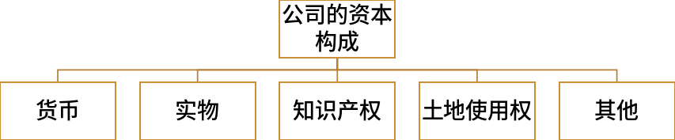
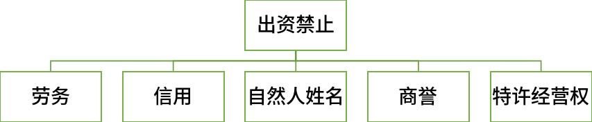

<!-- vim-markdown-toc GitLab -->

* [商法学](#商法学)
	* [绪论](#绪论)
		* [一、商法学的研究对象](#一商法学的研究对象)
		* [二、商法学的功能](#二商法学的功能)
	* [第一章、商法的一般理论](#第一章商法的一般理论)
		* [第一节、商法概述](#第一节商法概述)
			* [一、商法的概念与调整对象](#一商法的概念与调整对象)
				* [（一）商法的含义](#一商法的含义)
				* [（二）商法的调整对象](#二商法的调整对象)
			* [二、商法的基础概念](#二商法的基础概念)
				* [（一）商法的基础概念](#一商法的基础概念)
			* [三、商法的原则](#三商法的原则)
				* [（一）商法原则的含义和地位](#一商法原则的含义和地位)
				* [（二）经营自由原则](#二经营自由原则)
				* [（三）平等交换原则](#三平等交换原则)
				* [（四）企业维持原则](#四企业维持原则)
				* [（五）交易便利原则](#五交易便利原则)
				* [（六）交易安全原则](#六交易安全原则)
				* [（七）守法经营原则](#七守法经营原则)
		* [第二节、商法的渊源和体系](#第二节商法的渊源和体系)
			* [一、商法的渊源](#一商法的渊源)
			* [二、商法的体系](#二商法的体系)
			* [三、商法与其他部门法的关系](#三商法与其他部门法的关系)
				* [（一）商法和民法](#一商法和民法)
				* [（二）商法和经济法](#二商法和经济法)
		* [第三节、商事纠纷及其解决机制](#第三节商事纠纷及其解决机制)
			* [一、商事纠纷解决的基本模式](#一商事纠纷解决的基本模式)
			* [二、调节与仲裁解决商事纠纷的程序特征](#二调节与仲裁解决商事纠纷的程序特征)
				* [（一）商事调解的程序特征](#一商事调解的程序特征)
				* [（二）商事仲裁的程序特征](#二商事仲裁的程序特征)
			* [三、商事法律责任](#三商事法律责任)
	* [第二章、商事主体](#第二章商事主体)
		* [第一节、商事主体概述](#第一节商事主体概述)
			* [一、商事主体的概念与特征](#一商事主体的概念与特征)
				* [（一）商事主体的概念](#一商事主体的概念)
				* [（二）商事主体的特征](#二商事主体的特征)
			* [二、商事主体的种类](#二商事主体的种类)
				* [（一）商个人](#一商个人)
				* [（二）商法人](#二商法人)
				* [（三）商合伙](#三商合伙)
			* [三、商事主体的商事能力](#三商事主体的商事能力)
				* [（一）商事能力的概念](#一商事能力的概念)
				* [（二）关于商事能力的特别限制](#二关于商事能力的特别限制)
		* [第二节、商业名称](#第二节商业名称)
			* [一、商业名称的概念和特征](#一商业名称的概念和特征)
				* [（一）商业名称的概念](#一商业名称的概念)
				* [（二）关于商业名称的法律规范](#二关于商业名称的法律规范)
				* [（三）商业名称的法律特征](#三商业名称的法律特征)
				* [（四）商业名称与字号、商标](#四商业名称与字号商标)
			* [二、商业名称、选定和取得](#二商业名称选定和取得)
				* [（一）商业名称的构成](#一商业名称的构成)
				* [（二）商业名称的选定](#二商业名称的选定)
				* [（三）商业名称的取得](#三商业名称的取得)
			* [三、商业名称权与保护](#三商业名称权与保护)
				* [（一）商业名称权的概念](#一商业名称权的概念)
				* [（二）商业名称的权能](#二商业名称的权能)
				* [（三）商业名称权的保护](#三商业名称权的保护)
		* [第三节、商事账簿与商事审计](#第三节商事账簿与商事审计)
			* [一、商事账簿的概念与法律意义](#一商事账簿的概念与法律意义)
				* [（一）商事账簿的概念](#一商事账簿的概念)
				* [（二）商事账簿的分类](#二商事账簿的分类)
				* [（三）商事账簿的法律功能](#三商事账簿的法律功能)
			* [二、设置商事账簿的原则](#二设置商事账簿的原则)
			* [三、商事账簿的种类](#三商事账簿的种类)
				* [（一）会计凭证](#一会计凭证)
				* [（二）会计账簿](#二会计账簿)
				* [（三）会计报表](#三会计报表)
			* [四、商事账簿的保管](#四商事账簿的保管)
			* [五、商事审计](#五商事审计)
				* [（一）商事审计的意义](#一商事审计的意义)
				* [（二）商事审计的职能](#二商事审计的职能)
				* [（三）商事审计的目标](#三商事审计的目标)
				* [（四）商事审计报告](#四商事审计报告)
		* [第四节、商事登记制度](#第四节商事登记制度)
			* [一、商事登记概述](#一商事登记概述)
				* [（一）商事登记的概念](#一商事登记的概念)
				* [（二）商事登记的特征](#二商事登记的特征)
				* [（三）商事登记的意义](#三商事登记的意义)
				* [（四）商事登记的法律规范](#四商事登记的法律规范)
			* [二、商事登记管理机关与登记原则](#二商事登记管理机关与登记原则)
				* [（一）商事登记管理机关](#一商事登记管理机关)
				* [（二）商事登记原则](#二商事登记原则)
			* [三、商事登记的种类和程序](#三商事登记的种类和程序)
				* [（一）商事登记的种类](#一商事登记的种类)
				* [（二）商事登记的程序](#二商事登记的程序)
			* [四、商事登记的效力](#四商事登记的效力)
				* [（一）对商事主体的效力](#一对商事主体的效力)
			* [（二）对第三人的效力](#二对第三人的效力)
			* [五、商事登记制度改革与企业信息公示制度](#五商事登记制度改革与企业信息公示制度)
				* [（一）商事登记制度改革](#一商事登记制度改革)
				* [（二）企业信息公示制度](#二企业信息公示制度)
		* [第三章、商事行为](#第三章商事行为)
			* [一、商事行为概念](#一商事行为概念)
			* [二、商事行为的特征](#二商事行为的特征)
			* [三、商事行为的分类](#三商事行为的分类)
			* [四、特殊商事行为规则](#四特殊商事行为规则)
				* [（一）商事买卖](#一商事买卖)
				* [（二）商事代理](#二商事代理)
				* [（三）商事居间](#三商事居间)
				* [（四）商事行纪](#四商事行纪)
				* [（五）商事留置](#五商事留置)
				* [（六）商事保证](#六商事保证)
				* [（七）商事债权的时效制度](#七商事债权的时效制度)
				* [（八）商事信用](#八商事信用)
				* [（九）融资租赁](#九融资租赁)
				* [（十）商事仓储](#十商事仓储)
				* [（十一）商事运输](#十一商事运输)
		* [第二节、营业](#第二节营业)
			* [一、营业概述](#一营业概述)
				* [（一）营业的概念和特点](#一营业的概念和特点)
				* [（二）营业权](#二营业权)
				* [（三）营业权的保护](#三营业权的保护)
			* [二、营业资产](#二营业资产)
				* [（一）营业资产的概念](#一营业资产的概念)
				* [（二）营业资产的特征](#二营业资产的特征)
				* [（三）营业资产的分类](#三营业资产的分类)
			* [三、营业转让](#三营业转让)
				* [（一）营业转让的概念](#一营业转让的概念)
				* [（二）营业转让合同](#二营业转让合同)
	* [第三章、公司法](#第三章公司法)
		* [第一节、公司法概述](#第一节公司法概述)
			* [一、公司法的概念与调整对象](#一公司法的概念与调整对象)
				* [（一）公司法的概念](#一公司法的概念)
				* [（二）公司法的调整对象](#二公司法的调整对象)
			* [二、《公司法》的制定与修订](#二公司法的制定与修订)
			* [三、公司的概念与特征](#三公司的概念与特征)
				* [（一）公司的概念](#一公司的概念)
				* [（二）公司的特征](#二公司的特征)
			* [四、公司的种类](#四公司的种类)
			* [五、公司的设立](#五公司的设立)
				* [（一）公司设立的概念](#一公司设立的概念)
				* [（二）公司设立的方式](#二公司设立的方式)
				* [（三）公司设立的效力：法律后果](#三公司设立的效力法律后果)
				* [（四）发起人的责任](#四发起人的责任)
				* [（五）公司章程](#五公司章程)
			* [六、公司的人格](#六公司的人格)
				* [（一）公司人格的独立](#一公司人格的独立)
				* [（二）公司人格的否认](#二公司人格的否认)
		* [第二节、公司的资本制度](#第二节公司的资本制度)
			* [一、公司资本的构成](#一公司资本的构成)
			* [二、公司资本的类型](#二公司资本的类型)
			* [三、出资和转让](#三出资和转让)
				* [（一）出资](#一出资)
				* [（二）转让](#二转让)

<!-- vim-markdown-toc -->

# 商法学
## 绪论
### 一、商法学的研究对象
> 商法学是以商法的一般理论与制度及商事部门法理论与制度为研究对象的部门法理论与学科，是法学理论体系与学科体系的重要组成部分

| 一般理论           | 商事部门法     |
| :----------------: | :----------:   |
| 商法的起源与历史   | 公司法         |
| 商法的价值         | 证券法         |
| 商法理念与商法思维 | 票据法与保险法 |
| 商法原则           | 信托法与基金法 |
| 商法规范与商法体系 | 海商法         |
| 商事主体           | 电子商务法     |
| 商事行为           | 运输与物流法   |
| 商事纠纷解决程序   | 破产法         |

### 二、商法学的功能
1. 商法学有助于构建和发展中国特色社会主义商法
2. 商法学有助于完善中国特色社会主义商事制度，维护社会主义市场经济秩序
3. 商法学将推动当代中国法制文化观念的变革
4. 商法学是树立社会商业道德，推动社会主义精神文明建设的助力
5. 商法学是我国实现国际经济战略的重要法律制度理论依托

## 第一章、商法的一般理论
### 第一节、商法概述
#### 一、商法的概念与调整对象
##### （一）商法的含义
商法，又称**商事法**，指调整商事主体参加的商事关系的特别私法。商法和民法均称为私法，都调整人身关系和财产关系。但相对于民法，商法有以下特点：
1. 商法是商人法，所谓商人法，是指专门规范商事主体地位、组织及营业的法律
2. 商法是私法。商法在调整商事主体之间的商事关系时，既要遵循民事主体地位平等、意思自治、公平、诚实信用等基本原则，又要秉承保障商事交易自由、平等交换、便捷安全等原则
3. 商法是特别私法。民法是普通法，商法是特别法。商法又分为商事普通法和商事特别法

##### （二）商法的调整对象
商事关系
1. 商事关系的主体。商事主体是特殊的民事主体。民事主体若要取得商事主体资格，通常要先行办理商事登记
2. 商事关系的客体。商事关系的客体既包括**动产**和**不动产**，又包括**营业**或者**营业资产**等，还可以包括其他权力或利益
3. 商事关系的内容。即商事权力义务关系。在双方或者多方关系中，各方当事人按照意思自治等规则确定相互之间的权力义务关系。在单方商事关系中，商事主体既要遵从商法和民法原则，又要遵守消费者权益保护法的特别规定

#### 二、商法的基础概念
##### （一）商法的基础概念
1. 商和商事
	1. 商的含义：
		1. 生意或者买卖（限定事业或行为时）
		2. 商人或者从事生意或买卖的人（限定法律关系的主体时）
	2. 商法的适用：商法规定 > 商事习惯 > 民法
2. 商人
	1. 商人既包括自然人，也包括法律拟制之人
	2. 从事各种营业活动，包括运输、存储、信贷、代理等从买卖中独立出来的商业形式
3. 商行为：商人经营或从事营利事业的各种营利行为
	1. 商行为是商人实施的行为
	2. 商行为限于营利事业范围内的行为
	3. 商行为包括法律行为和其他行为
4. 营利事业
5. 营业：运营中的营利事业，既包括组织和经营活动，也包括财产关系
	1. 主观营业：指各种营利事业之经营活动，属于法律关系之内容的范畴。商人从事经营活动的法律效果，包括意定效果和法定效果
	2. 客观营业：指营业所依赖的

#### 三、商法的原则
##### （一）商法原则的含义和地位
1. 商法原则与商法功能、商法价值
	- 商法原则、商法功能和商法价值是性质相异、但又相互联系的三个概念。商法原则虽然具有抽象性，却属于法律规范的范畴，裁判者可以援引并做出裁判。商法的功能、商法价值是重要的、抽象的，但不具有裁判上的意义，不属于法律规范的范畴
	- 商法价值和商法功能相互影响，共同决定了商法原则的内涵。为了减少商法价值和功能在司法中的不确定性，立法者应当将商法原则作为商法价值和功能的表象形式，使之成为商事裁判的法律依据
2. 商法原则与民法基本原则的关系

##### （二）经营自由原则
> 经营自由，也称经商自由、交易自由或营业自由，是指除非依照法律规定或整体利益不得从事经营活动者外，行为人有权自主决定从事经营活动，即享有是否从事经营活动的自由和从事何种经营活动的自由

经营自由的限制：
- 法定限制：指对权利人经营自由加以限制的法律规定
- 也称整体利益限制，指权利人未事先取得某种特殊资格，即不得从事特定营业的限制 

##### （三）平等交换原则
> 平等交换，是指商事主体在从事营业或者财产交易中，应当基于等价交换而确定商事主体之间的权利义务。

按照平等交换的原则，商事主体在取得权利的同时，也承担相应的义务

##### （四）企业维持原则
> 企业维持既是旨在维持企业存续、稳定、协调和发展的商法原则，也是在该原则支配下形成的一整套商法制度和规则

1. 企业主体地位的维持
2. 资本充实规则
3. 盈利分配规则

##### （五）交易便利原则
> 传统商法源于商人习惯法，强调商业活动的效率价值。近代和现代商法主要采用指定法的形式，但任然强调交易的便捷和效率价值。交易便捷原则的核心是减少繁琐的交易手续、降低交易成本

1. 形式自由：商法重视效率价值，在法律行为形式要件上的要求较低
2. 权利外观[^权利外观]：商法承认权力外观表象在权力认定上的有限效力
3. 短期时效：对于商事纠纷，使用《民法典》关于诉讼时效的一般规定。如果商人或企业约定了较短的质量检验期限，应当按照意思自治原则予以认可

[^权利外观]:权力外观：权利外观又称权利表征、权利表象。从概念上来说是指行为人所享有权利的外在表现形式

##### （六）交易安全原则
> 商法在秉承交易便捷原则的同时，为了增强交易的确定性，也应当观者交易安全的原则

1. 公示原则：商人或企业对于涉及到利害关系人的客观事实，必须依照法律和行政法规的规定,向公众进行公式，以便于利害关系人知晓
2. 强制主义：国家采用公法手段，对商事关系的某些内容做出强制性规定
3. 加重责任：商法上的加重责任[^严格责任]包括**严格责任**和**连带责任**[^连带责任]此外还涉及**社会责任**[^社会责任]

[^严格责任]:严格责任：是指商人或企业即使没有过错,在法律特别规定场合下，也要向相对人承担责任

[^连带责任]:连带责任：既包括投资者对商人或企业违反法律义务之后果依法承担全部责任，也包括商人或企业对他人违反法律义务之后果依法承担全部责任

[^社会责任]:社会责任：指商人或企业对社会承担的法律上义务之外的道德性“责任”

##### （七）守法经营原则
> 企业守法经营，指企业应当遵守有关经营的商法规定并履行其他特殊义务。既包括承担私法义务，也包括承担公法义务

1. 有关商业等级的义务：任何人从事商事活动的，除非法律、行政法规另有规定，必须依法办理商事登记
2. 有关会计账簿的义务：除非法律或行政法规另有规定者外，企业必须依法建立会计制度和会计账簿
3. 有关经营活动的特殊义务：为了维持良好的经济和社会秩序，企业既要遵循公平竞争的规则，还要承担保护消费者的特殊义务

### 第二节、商法的渊源和体系
#### 一、商法的渊源
简单了解即可

#### 二、商法的体系
简单了解即可

#### 三、商法与其他部门法的关系
##### （一）商法和民法
|  不同点  |                  商法                  |             民法             |
|:--------:|:--------------------------------------:|:----------------------------:|
| 假设前提 |                特别之人                |           普通之人           |
| 价值观念 |              等价有偿原则              | 相互帮扶、社会公平、公序良俗 |
| 技术处理 | 商业活动特殊性以及商法规范的社会适应性 |   民法规范的普适性和原则性   |
| 责任观念 |              强调经济伦理              |       强调社会伦理价值       |

##### （二）商法和经济法
| 不同点       | 商法                            | 经济法                                    |
| :----------: | :-----------------------------: | :---------------------------------------: |
| 法律关系范围 | 强调经济伦理                    | 强调社会伦理的价值                        |
| 法律关系主体 | 商人或企业之间发生的商事关系    | 国家参与、管理或干预经济而形成的          |

### 第三节、商事纠纷及其解决机制
#### 一、商事纠纷解决的基本模式
简单了解即可
#### 二、调节与仲裁解决商事纠纷的程序特征
##### （一）商事调解的程序特征
1. 调解程序的自愿性：一般而言，调解经当事人同意方可进行，同意可以通过签订协议或者口头承诺等方式进行，可以是主动同意，也可以是通过第三方劝说同意
2. 调解员的中立性：调解员必须中立，才能取得当事人信任并促使其自愿履行，达到解决纠纷的效果
3. 调解程序的保密性：调解员必须对当事人在调解过程中的言论及知晓的信息予以保密，不能随意向法庭及其他人员展示，更不能未经许可用作庭审证据
4. 调解协议的“软司法约束力”：法院外调解协议要取得司法约束力，往往需要历经法院确认的过程

##### （二）商事仲裁的程序特征
1. 仲裁程序的自愿性：商事仲裁是一种“合意解决纠纷”的形式，以双方当事人自愿为前提
2. 仲裁员的专业性：仲裁员通常有某方面的专业背景，体现出仲裁裁决的专业性和权威性
3. 仲裁程序的便捷性：适应商事交易注重协商谈判及效率提升的需求
4. 仲裁程序的保密性：以不公开审理为原则，以公开审理为例外；商事仲裁员及秘书有保密义务
5. 仲裁裁决的强司法效力性：商事仲裁裁决具有强制执行的效力，依托法院进行强制执行

#### 三、商事法律责任
> 商事法律责任，是指商事主体在商事交易过程中，依法应承担的法律责任。商事法律责任在类型上属于特别的私法责任范畴。

与**其他法律责任及普通民事责任**相比，商事法律责任具有如下特征：
1. 商事交易以自由为原则，多以契约方式展开。
2. 法定责任的严格性
3. 追责时效的特殊性

## 第二章、商事主体
### 第一节、商事主体概述
#### 一、商事主体的概念与特征
##### （一）商事主体的概念
> 商事主体，也称商事法律关系主体、商主体，是指依照商法的规定具有商事权利能力和商事行为能力，能够以自己的名义独立从事商事行为，在商事法律关系中享有权力和承担义务的个人和组织。在传统商法上，商事主体也叫商人

##### （二）商事主体的特征
1. 商事主体由商法法定
2. 商事主体依法具有商事能力
3. 商事主体的身份或资格经商事登记而取得
4. 商事主体从事营利性活动为其常业

#### 二、商事主体的种类
> 我国的商事主体主要是依照商事主体的组织形式进行划分

##### （一）商个人
> 商个人，又称商个体、商自然人、个体商人，是指依法定程序取得商事主体资格的自然人或公民

1. 法律特征：
	1. 商个人作为商法确认的主体，须依法定核准登记，才能享有商事权利和商行为能力，并在核准登记的范围内从事商事行为
	2. 商个人的权利与自然人的权利不同，与一般自然人人身相关的权利
	3. 商个人所从事的是商事行为，即以营利为目的的经营性行为；非营利性的行为
	4. 商个人对其经营债务须承担无限责任

2. 具体表现：
	1. 个体工商户
	2. 农村承包经营户

##### （二）商法人
> 商法人，指按照法定要件和程序设立的，具有法人资格，能够独立进行商事经营活动，并享有商事权利和承担商事义务的各种商事企业

1. 法律特征
	1. 商法人是具有独立法律人格的法人组织，具备一般法人必须具备的基本条件和特点，包括依法成立、有自己的组织机构和场所、拥有独立财产、承担独立责任
	2. 商法人的设立和活动由商法规范调整，其设立依照商法规定的条件和程序，通常以注册等级的方式进行。商法人的人格由商法赋予
	3. 商法人以营利为目的，具有特殊的从事商事行为的权利能力和行为能力，有权在其目的范围内开展经营活动，并承担相应法律义务和责任

2. 具体表现：
	1. 全民所有制企业，又称国企
	2. 集体企业
	3. 外商投资企业

##### （三）商合伙
> 商合伙，是介于商个人和商法人之间的一种商事主体，是指两个或两个以上的合伙人按照法律和合伙协议的规定共同出资、共同经营、共享收益、共担风险，普通合伙人对合伙经营所产生的债务承担无限连带责任，有限合伙人对合伙债务承担有限责任的商事组织

1. 法律特征：
	1. 商合伙由两个以上的合伙人组成，是共同投资、共同经营、共享利益、共担风险的共同经营体
	2. 商合伙是非法人企业，这是商合伙区别于商法人的主要法律特征
	3. 商合伙依商事法律成立并受商法规范调整
	4. 商合伙以营利为目的，这是商合伙不同于一般民事合伙的主要特征
2. 具体表现
	1. 合伙企业

#### 三、商事主体的商事能力
##### （一）商事能力的概念
> 商事能力，又称商事主体资格，指商事主体独立从事商事活动，享有权利和承担义务的资格和能力，包括商事权利能力和行为能力

商事能力区别于一般民事能力的三个特征：
1. 商事能力是权利能力与行为能力的统一
2. 商事能力的内容具有差异性
3. 商事能力因商事登记而确定

##### （二）关于商事能力的特别限制

1. 未成年人商事行为能力的限制
2. 关于公务人员商事能力的限制
3. 外国人商事能力的限制
	1. 按照我国法律设立的具有我国商事主体资格的外商投资企业
	2. 外国企业依法设立分支机构从事经营活动
	3. 外国企业依法设立常驻代表机构
	4. 外国企业经批准直接从事生产经营活动

### 第二节、商业名称
#### 一、商业名称的概念和特征
##### （一）商业名称的概念
> 商业名称又称商号，是商事主体在从事商事行为时表彰自身身份并区别于其他主体而使用的名称

在我国，依照法律和法规规定，商业名称包括企业名称、个体工商户和个人合伙的字号

##### （二）关于商业名称的法律规范

##### （三）商业名称的法律特征
1. 使用者是商事主体
2. 商业名称是商事主体在营业活动中使用的名称
3. 具有主体间的区别功能

##### （四）商业名称与字号、商标
1. **商业名称与字号**：字号通常指商业名称中的表彰商事主体的特殊文字，是商业名称的核心部分，一般由两个或两个以上的文字组成。字号是商事主体之间互相区别的主要标志，具有重要商业价值。商事主体的商誉与其字号密切关联，法律对字号给予特别的保护，以避免商事主体处于不正当目的使用他人的字号，u而可以将其注册为商标
2. **商业名称与商标**：商业名称与商标都是一定对象的标识，都具有一定的区别功能，有时商业名称中的字号本身就是商标

字号与商标的区别：

|  不同点  |       字号       |                 商标                 |
|:--------:|:----------------:|:------------------------------------:|
|  区别点  | 区分不同商事主体 |             区分不同商品             |
|   数量   |       一个       |              可以有多个              |
|   形态   |       文字       | 文字、图形、数字、字母、颜色极其组合 |
|  必要性  |       必要       |               可以没有               |
| 空间效力 |  核准机关辖区  |                 全国                 |


#### 二、商业名称、选定和取得
##### （一）商业名称的构成
在我国，商业名称必须具备下列要素：
1. 行政区划
2. 字号
3. 行业或经营特点
4. 组织形式

##### （二）商业名称的选定
关于商业名称的选定，目前各国法律中主要存在两种立法注意：
1. 严格主义：指商事主体选定的商业名必须与其名称或者营业内容相一致，不符合的，均不予承认，且无法转让或者继承
2. 自由主义：自由主义规定，商事主体的商业名称由当事人自由选择，法律原则上不加限制。商业名称与营业人的姓名及营业种类没有必然的联系

##### （三）商业名称的取得
1. 商业名称登记的概念和种类
	1. 创设登记
	2. 变更登记
	3. 转让登记
	4. 废止登记
	5. 撤销登记
2. 商业名称登记的效力
	1. **排他效力**：商事主体取得商业名称权，就取得了在一定地域范围内排除他人登记和使用与该商品名称**相同或者相类似**的商业名称的权利
	2. **救济效力**：商事主体经登记而取得商业名称的专用权，如果其他商事主体侵犯其专用权，所有人可以请求其停止侵害，如造成损失，可以要求赔偿损失

#### 三、商业名称权与保护
##### （一）商业名称权的概念
1. 概念：商业名称权，即商业名称专用权，是指商业名称经登记，商事主体取得该商业名称的专有权利。商业名称权兼具人格权和财产权的双重属性
2. 特征：
	1. 地域性
	2. 公开性
	3. 可转让性
	4. 时间上的无限性

##### （二）商业名称的权能
1. 专有使用权
2. 许可使用权
3. 商业名称变更权
4. 商业名称转让权

##### （三）商业名称权的保护
法律对于商业名称权的保护主要体现在两个方面
1. **同一商业名称登记的排除**：在商业名称的登记机关辖区内，不得再登记与已登记的同行商业名称相同或者近似的商业名称
2. **同一商业名称或类似商业名称使用的排除**：保护商业名称权的立法模式在各国并不统一，通常是同时适用多重法律予以保护，如民法、商法、反不正当竞争法及专门法等

### 第三节、商事账簿与商事审计
#### 一、商事账簿的概念与法律意义
##### （一）商事账簿的概念
> 商事账簿是商事主体为记载和表明营业活动和财产状况，根据会计原则，依法制作的书面簿册

##### （二）商事账簿的分类
1. 形式商事账簿
2. 实质商事账簿

##### （三）商事账簿的法律功能
1. 对商事主体自身而言，可以了解其自身的营业状况和财务状况，是作为计算盈利、分配利润的依据
2. 对交易相对人而言，可以通过商事账簿了解某一商事主体的营业状况、资信能力，作为是否与之交易、投资决策的依据
3. 对股东而言，是其掌握企业财产、营业和盈利状况的依据；还是投资者分取股息、红利以及确定其股权价格和企业剩余财产的依据
4. 对有关国家主管机关而言，商事主体制作的商事账簿是政府主管部门了解商事主体经营状况，对其进行财务、物价检查，经营效益考核与审计的主要依据
5. 在民事诉讼中，商事账簿具有重要的证据效力

#### 二、设置商事账簿的原则
1. 大陆法系国家多采此原则。法律既规定商事主体必须设置账簿，又对账簿种类、内容及记载方式有详细规定，而且还规定政府有关部门对商事账簿制作及其内容进行审查与监督
2. 自由主义原则。此种立法原则大多为英美法系国家采用。即法律不直接规定商事主体必须设立账簿，队友商事账簿是否设置，纯粹是商人的自由，法律不干涉
3. 折中主义原则。日本是此原则的典型。即法律上仅规定商事主体有置备商事账簿的义务，但并不规定商事账簿的记载内容、形式和方法，也未规定国家主管机关的监管。另外，从事小规模商事交易活动的商个人，一般不要制作商事账簿

我国采用强制主义原则

#### 三、商事账簿的种类
##### （一）会计凭证
> 会计凭证是记录经济业务的发展和完成情况，明确经济责任的书面凭证，是登记会计账簿的依据

1. 会计凭证的种类
	1. 原始凭证
	2. 记账凭证
2. 会计凭证的审核
	1. 形式审核
	2. 实质审核

##### （二）会计账簿
1. 会计账簿的概念和作用
	1. 概念：会计账簿，指商事主体的会计人员以会计凭证为依据，按照一定程序和方法制作的，具有固定格式且相互连结的账页组成的，用以连续、系统、全面记载商事注意各项经营活动的簿册
	2. 作用：
		1. 能够提供全面、系统的会计信息,成为会计报表编制的依据
		2. 是进行资产评估的基础
		3. 为经营利润分配和各项计划执行情况的考核评价提供依据
		4. 是会计根系的基本资料，为审计检查提供依据
2. 会计账簿的种类
	1. 序时账簿
	2. 分类账簿
	3. 辅助账簿

##### （三）会计报表
1. 会计报表的概念和作用
	1. 概念：会计报表，也叫会计表册，指根据会计账簿及其会计资料，按照统一的格式、内容和方法编制的，以综合反映商事主体在一定时期内（通常是一个会计期间）的生产经营成果和财务状况的一种书面报告和表册。主要包括资产负债表、损益表、现金流量表、财务状况说明书以及利润分配表
	2. 会计报表的作用：其作用在于反映商事主体的财务状况和经营成果，向会计报表使用人提供必要的财务资料和会计信息
2. 会计报表的种类

|      分类方式      |    种类一    |    种类二    |
|:------------------:|:------------:|:------------:|
|  编制时间确定与否  |   定期报表   |  不定期报表  |
|     用途和作用     |   会计报表   | 附属会计报表 |
| 反映的资金运动状况 |   静态报表   |   动态报表   |
|      编制主体      | 个别会计报表 | 合并会计报表 |

#### 四、商事账簿的保管
我国：
1. 永久
2. 定期

#### 五、商事审计
> 审计是指由独立专职机构或人员依据职权、授权或委托，对被审计对象的会计账簿进行审查，并依据法律法规、会计规则和审计准则对其真实性、公允性和合法性作出评价的会计监督活动

1. 我国审计分类：
	1. 国家审计
	2. 内部审计
	3. 社会审计
2. 审计与会计
	1. 审计：监督
	2. 会计：管理

##### （一）商事审计的意义
> 商事审计的重要意义是由商事账簿本身的意义和法律效力决定的，缺少了审计的保障，就不能对商事账簿的真实性、公允性和合法性作出核查和评价，商事账簿本身就失去了其应有的法律意义，无法发挥其应有的功能和作用

##### （二）商事审计的职能
1. 经济监督
2. 经济鉴证
3. 经济评价

##### （三）商事审计的目标


##### （四）商事审计报告
1. 审计报告是审计工作情况的全面总结汇报，说明审计工作成果
2. 审计报告是一份具有法律效力的证明性文件
3. 审计报告也是一种公开的信息报告

### 第四节、商事登记制度
#### 一、商事登记概述
##### （一）商事登记的概念
> 商事登记，也称商业登记，是指为取得、变更或终止商事主体资格，依照法律法规规定的程序，向主管机关提出申请，并由主管机关依法对申请事项审查、登记的一种法律行为和法律程序

##### （二）商事登记的特征
1. 创设性
2. 要式性
3. 公法性

##### （三）商事登记的意义
1. 确认商事主体的商事活动资格，保护商事主体的合法营业活动
2. 公示。商事登记的基本作用不仅在于通过法律程序创制或确定经营性主体，而且在于确认登记事项的效力，向社会公开经营性注意的信用、能力和责任
3. 有利于国家的监督管理，维护良好的社会经济秩序

##### （四）商事登记的法律规范

商事登记法律规范是规范商事登记行为，确定商事登记主管机关、登记内容、登记程序等事项，调整商事登记关系的法律规范的总称。我国目前尚未形成统一的商事登记法，调整商事登记关系的法律散见于众多的民事、商事实体法、程序法中。其中，主要有：《企业法人登记管理条例》、《企业法人登记管理条例施行细则》、《公司登记管理条例》、《合伙企业登记管理办法》、《企业名称登记管理规定》等

#### 二、商事登记管理机关与登记原则
##### （一）商事登记管理机关
各国关于商事登记主管机关主要有三种模式：
1. 德国、日本：法院
2. 美国、英国：专门的行政机关
3. 法国：法院—一般商事登记；行政机关—公司商事登记

##### （二）商事登记原则
1. 强制登记原则：
	1. 商事主体的设立、变更和终止必须进行登记。非经登记者不具有商事权利能力和行为能力，不得从事任何种类的商事活动
	2. 商事登记应就法律规定的商事主体的全部必要事项进行登记，未经登记不发生法律效力
2. 全面审查原则：商事主体提出的登记申请，必须完全依据法律规定的核准登记标准，商事登记主管机关对于必要登记事项依法采取形式审查和注册备案制度，不符合规定的不予登记
3. 登记公开原则：登记公开原则是指应向社会公众公开商事登记的内容
	1. 登记申请公开、真实
	2. 登记程序公开
	3. 公告
	4. 登记事项查阅公开

#### 三、商事登记的种类和程序
##### （一）商事登记的种类
1. 设立登记
2. 变更登记
3. 注销登记

##### （二）商事登记的程序


#### 四、商事登记的效力
##### （一）对商事主体的效力
1. 商事登记是商法人获得法律人格的必要条件，未经登记及公告，商法人不能成立，其行为不能被视为商行为
2. 商事登记不是商事主体资格取得的必要条件，未经登记程序，行为人实施了商行为，同样可以享有商人的权利并履行商人的义务
3. 商事登记是各类商事主体成立的必要要件，未经商事登记程序，行为人即使实施了商事经营活动，也不得享有商人的权利，同时也不必履行商人的义务，该行为可被认定为无效行为

#### （二）对第三人的效力
> 考察各国司法实践，登记与公示对第三人的法律效力是一个颇为复杂的问题

1. 必须登记的事项在未履行登记或已履行登记但尚未公告的情况下，对第三人的效力
2. 应登记事项在得到正确登记和公告之后对行为人和第三人的效力
3. 已登记事项在公告发生差错的情况下对第三人的效力

#### 五、商事登记制度改革与企业信息公示制度
##### （一）商事登记制度改革
工商登记制度改革的主要内容：
1. 放宽公司注册资本登记条件
2. 将企业年检制度改为年度报告制度
3. 放宽市场主体住所（经营场所）登记条件，由地方政府具体规定
4. 大力推进企业诚信制度建设
5. 推进注册资本由实缴登记制改为认缴登记制

##### （二）企业信息公示制度
企业信息公示制度的主要内容：
1. 企业信息公示
2. 企业年度报告报送与公示
3. 企业公示信息随机摇号抽查
4. 企业信息公示“黑名单”
5. 信用约束与联动惩戒机制

### 第三章、商事行为
#### 一、商事行为概念
> 学理上通常认为，商事行为是指法律主体以营利为主要目的而实施的，并且通常具有连续性的经营行为；企业的经营行为一般视为商行为，但明显不以营利为目的之行为除外

**商行为**：
	- 主观主义模式：商人从事的其商业经营的全部行为
	- 客观主义模式：商法规定的各种营业活动
	- 折衷主义模式：任何主体从事的营利性营业行为，商事主体从事的任何营业行为

#### 二、商事行为的特征
1. 以营利为目的的法律行为
2. 经营性行为
3. 商事主体从事的行为
4. 体现商事经营特点的行为
5. 受法律严格规范和约束的行为

#### 三、商事行为的分类
1. 单方商事行为与双方商事行为
2. 一般商事行为与特殊商事行为
3. 绝对商事行为与相对商事行为
4. 基本商事行为与辅助商事行为
5. 必然商事行为与推定商事行为

#### 四、特殊商事行为规则
##### （一）商事买卖
> 它是指出卖人转移标的物的所有权于买受人、买受人支付价款的商事法律行为

##### （二）商事代理
- 狭义：商事代理是指具有商人身份的人以自己的名义或以委托人的名义，为委托人买卖或提供其他服务，并从中获取佣金的营业性活动
- 广义：广义的商事代理还包括商业雇用人对企业的代理活动，如经理或其他雇员的代理

**特点和规则**：
1. 商事代理可以为非显名代理
2. 商事代理权的存续基于营业存续
3. 商事代理权的权限较大

##### （三）商事居间
> 商事居间是指商事主体为获取一定的报酬（佣金）而从事的为委托人与第三人订立合同提供缔约机会或进行介绍，以促成合同订立的行为

##### （四）商事行纪
> 商事行纪是指商事主体以自己的名义为委托人购买或销售货物、有价证券等，由此获取报酬，并以此作为职业性经营的行为

商事行纪与代理、居间不同，具有自身的特殊规则：
1. 商事行纪人以自己的名义从事贸易活动，法律后果由行纪人自己承担
2. 商事行纪人为委托人从事贸易活动，因交易所产生的经济上的损益全部归属于委托人

##### （五）商事留置
> 商事留置是指在双方商事行为中，债权人为了实现其债权，留置债务人的物或有价证券，并在其不履行义务时，变卖或对标的物折价以受偿其债权的行为

##### （六）商事保证
> 商事保证是指在商事经营中，保证人和债权人约定，当债务人不履行债务时，保证人按照约定履行债务或者承担责任的行为

商事保证的特殊规则：
1. 商事保证的独立性
2. 商事保证的单独性
3. 商事保证形式的严格性
4. 商事保证的保证人通常无先诉抗辩权

##### （七）商事债权的时效制度
> 商事债权的时效是指商事债权失效的权利性质和失效的时间计算

##### （八）商事信用
> 商事信用是英美法系国家商法的概念，指在商品销售、提供服务、提供贷款等商事交易中取得商品、接受服务或贷款的一方，同意在规定的未来某日期支付货款、服务报酬、贷款本息的承诺

##### （九）融资租赁
> 是指出租人和承租人双方商事主体约定，出租人根据承租人的决定，向承租人选定的第三人（供货方）购买承租人选定的物品，然后将其租给承租人长期使用，以收取承租人支付的租金的方式来收回投资的一种商事行为

##### （十）商事仓储
> 商事仓储是由商事主体所从事的仓库经营，即保管人对存货人交付的仓储货物储存和保管的商事行为

##### （十一）商事运输
> 商事运输包括货运和旅客运输

### 第二节、营业
#### 一、营业概述
##### （一）营业的概念和特点
1. 营业的概念：“营业”是指运营中的营利事业，既包括组织和经营活动，也包括财产关系
2. 相关制度：营业构成、营业权、营业自由与限制、营业场所、营业资产、营业转让等
3. 营业的特点：
	1. 与商事主体联系在一起
	2. 应该遵循法律，且应该为人知悉、不违背善良风俗
	3. 可以成为权利的客体
	4. 综合性行为

##### （二）营业权
1. 营业权概念：营业权是指商事主体基于平等的主体资格和营业机会，**自由**选择特定商事领域进行经营，从事以营利为目的的活动而免受国家法律之外的不合理限制和其他主体干预的权利
2. 营业自由
	1. 营业机会平等享有的自由
	2. 营业资格取得的自由
	3. 营业进入与退出的自由
	4. 营业领域选择的自由
	5. 营业事项自主设定的自由
	6. 营业方式自我决定的自由
	7. 经营管理独立决策的自由
	8. 营业侵权有效救济方式选择的自由

##### （三）营业权的保护
1. 宪法保护
2. 民法保护
3. 竞争法保护
4. 刑法保护

#### 二、营业资产
##### （一）营业资产的概念
> 指商事主体所拥有的、基于营利目的而形成的并用于营业活动的全部财产。（不动产+动产+债权及债务+有形资产+无形资产等

##### （二）营业资产的特征
1. 财产属性（资本属性）
2. 价值实现取决于财产，更依赖于营业
3. 整体性、确定性、可转让性

##### （三）营业资产的分类
1. 有形财产与无形财产
2. 积极财产与消极财产

#### 三、营业转让
##### （一）营业转让的概念
> 营业转让是指商事主体将其所拥有的组织化的营业全部或者部分转让给受让人的行为

##### （二）营业转让合同
1. 营业转让合同的客体：营业资产[^营业资产]
2. 营业转让人的义务
	1. 营业转让业务：由于营业资产的构成复杂，营业转让人在转让营业资产时，要根据构成营业资产的各种财产形态，分别履行财产转移义务，办理相关手续
	2. 竞业禁止义务：在一定的时间和区域内，营业转让人不得经营与所转让的营业相同或类似的活动
	3. 营业的瑕疵担保义务：为维护交易安全，转让人除了对受让人履行移转营业的义务外，还应承担对所转让营业的瑕疵担保义务，包括物和权利的瑕疵担保义务
3. 营业转让合同中的第三人保护：第三人主要是营业的债权人、劳动者等及与营业转让有法律上利害关系的人

[^营业资产]:营业资产：包括不动产、动产、知识产权、区别性标记、商誉及其他商事人格权、各种有价值的事实关系，也包括作为营业转让客体必须具备的构成要素

## 第三章、公司法
### 第一节、公司法概述
#### 一、公司法的概念与调整对象
##### （一）公司法的概念
> 公司法是调整公司在设立、组织、活动和解散的过程中所发生的社会关系的法律规范的总称

##### （二）公司法的调整对象
1. 公司的全部组织关系
2. 公司的部分经营关系

#### 二、《公司法》的制定与修订
简单了解即可

#### 三、公司的概念与特征
##### （一）公司的概念
> 公司是世界性的经济组织形式，由于各国法律文化及公司法制度的差异，对公司 概念的表述也不尽一致。 依据我国公司法的规定，公司 是指依照我国 《公司法》在中国

##### （二）公司的特征
```
. 公司的特征
|
+--- 营利性
+--- 社团性
+--- 法人性
```

#### 四、公司的种类
```
. 公司的种类
|
+--- 无限公司、有限公司、股份有限公司和两合公司
+--- 人合公司、资合公司及人合兼资合公司
+--- 封闭式公司与开放式公司
+--- 母公司与子公司
+--- 总公司与分公司
+--- 本国公司、外国公司与跨国公司
+--- 一人公司和国有独资公司
+--- 上市公司和不上市公司
```

#### 五、公司的设立
##### （一）公司设立的概念
> 公司设立，是指发起人为组建公司，使其取得法人资格所进行的一系列法律行为的总称

##### （二）公司设立的方式
1. 发起设立
2. 募集设立

##### （三）公司设立的效力：法律后果
1. 公司经过设立程序，符合法定条件，被依法核准登记，取得法人资格
2. 公司经过设立程序，但不符合法定条件或违反法律强制性规定，公司不能成立或导致公司设立无效和撤销

##### （四）发起人的责任
- 公司发起时：发起人须承担资本充实责任
- 公司不成立时：发起人须对设立行为所产生的债务和费用承担连带责任

##### （五）公司章程
> 公司经过设立程序，但不符合法定条件或违反法律强制性规定，公司不能成立或导致公司设立无效和撤销

| 公司类型         | 指定主体                       | 修改主体   | 载明事项          |
| :--------:       | :--------:                     | :--------: | :--------:        |
| 有限责任公司章程 | 全体股东共同制定               | 股东会     | 《公司法》第25条  |
| 股份有限公司章程 | 由发起人制定，并经创立大会通过 | 股东大会   | 《公司法》第81条 |

#### 六、公司的人格
##### （一）公司人格的独立
1. 公司具有独立的人格，体现在两个方面：
	1. 能够独立地承担民事责任
	2. 必须独立于股东之外
2. 公司有无独立的法人人格，直接关系到市场经济活动中有无适格的主体
3. 由于公司是具有独立责任能力的法人，所以在对外投资、提供担保等问题上所受限制较为严格
	1. 公司对外投资的对象受到限制
	2. 公司对外投资、提供担保的表决程序较为严格 

##### （二）公司人格的否认
> 所谓公司人格的否认，又被形象地概括为“揭穿公司的面纱”，是指在具体的法律关系中，基于特定事由，否认公司的独立法人人格，使股东对公司债务承担无限责任

### 第二节、公司的资本制度
#### 一、公司资本的构成
> 公司资本专指在公司成立时由章程所确定的由股东出资构成的公司财产总额



股东出资静止




#### 二、公司资本的类型
> 经过长期的实践，世界各国已经形成了相对独立的三种公司资本制度，即法定资本制、授权资本制和折中资本制

**法定资本制和授权资本制的利弊**

|      |                                        法定资本制                                       |                        授权资本制                        |
|:----:|:---------------------------------------------------------------------------------------:|:--------------------------------------------------------:|
| 优点 | 保证公司 资本真实、可靠，防止公司设立中的欺诈和投机行为，以及有效地保障债权和交易安全等 |                     便于公司迅速成立                     |
| 缺点 |                                  公司成立后增资程序繁琐                                 | 具有被欺诈行为利用的可能性，减弱了对公司债权人利益的保护 |

我国公司法采用的法定资本制

#### 三、出资和转让
##### （一）出资
```
.出资
|
+--- 股东出资方式
|    +--- 出资平等主义
|    +--- 出资不平等主义
|    +--- 基本出资制
+--- 股东出资的缴纳
|    +--- 有限责任公司的资本总额应由各股东全部认足，
|    |    至于出资是否必须一次缴清，各国立法规定不同。
|    |    我国公司法允许股东分期缴纳出资
+--- 违反出资义务的民事责任
|    +--- 有限责任公司股东违反出资义务的责任
|    |    +--- 违约责任
|    |    +--- 差额补足责任
|    +--- 股份有限公司发起人的责任（公司不成立+公司成立）
```


##### （二）转让


