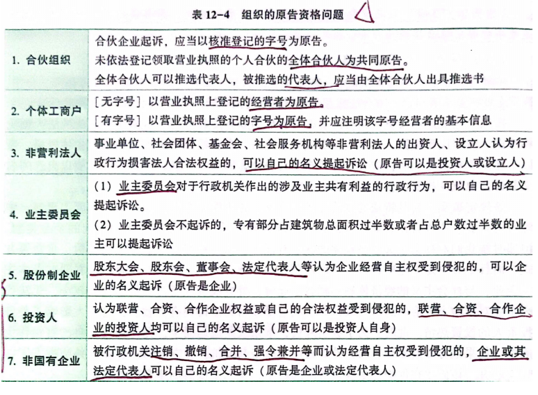
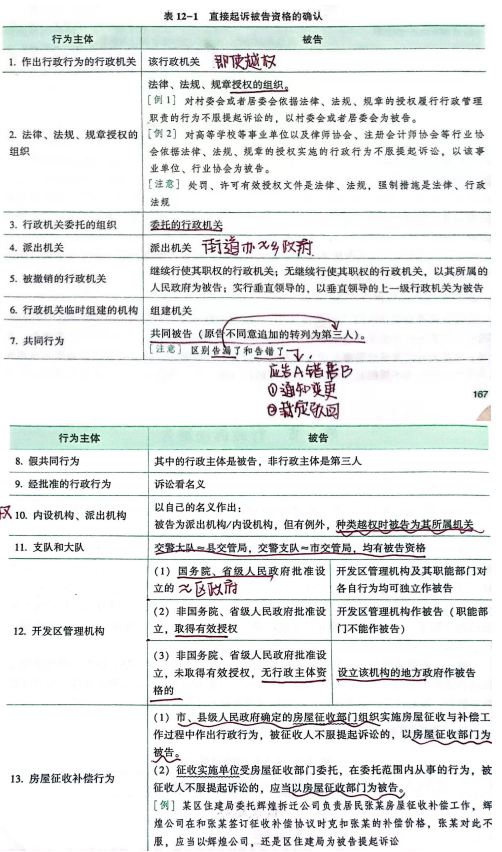

# 行政法与行政诉讼法
## 第一章 行政法概述

## 第二章 行政法的渊源
### 一、行政法的制定法律渊源
#### （一）法律渊源：
1. 宪法
2. 法律
3. 行政法规
4. 地方性法规和自治条例、单行条例
5. 行政规章（部门规章和地方政府规章）
#### （二）制定法渊源
1. 上位法优先于下位法：
    ```mermaid
    graph TD;
    a(宪法（全国人大制定）);
    b(法律（全国人大及其常委会）);
    c(行政法规（国务院制定）);
    d(地方性法规<br>（省、自治区、直辖市和设区的市，<br>自治州的人大及其常委会制定）);
    f(部门规章（国务院各部、<br>各委员会及其他工作部门制定）);
    e(地方政府规章<br>（省、自治区、直辖市和设区的市、<br>自治州的人民政府判定）);
    g(自治条例和单行条例<br>（民族自治地方的人大制定）)
    a --> b --> c;
    c --> d --> e
    c --> f
    c --> g
    ```
2. 新法优先于旧法（程序）
3. 旧法优先于新法（实体）
4. 特别法优先于一般法

### 二、行政法的非制定法律渊源
1. 法律解释
    1. 立法解释
    2. 司法解释
    3. 行政解释
2. 国际条约、惯例
3. 指导性案例

## 第三章 行政法的基本原则（六法方面原则）
1. ==依法行政原则==：是各国行政法的共同理念或基本原则，其基本含义在与行政机关和其他公务组织必须依法行驶行政权或者从事行政管理活动
    1. 职权法定原则：法律授予的权力才是正当的公共权力；在法律授权之外，公共权力便没有存在和行驶的正当理由
    2. 法律优先原则：法律优先实质上强调的是法律的位阶体系。立法权高于行政权、行政权从属法律的体现
    3. 法律保留原则：凡是法律保留的事项，行政机关都不能擅自做出决定
2. ==行政合理原则==：行政决定的内容要客观、适度、符合理性。主要表现为比例原则和平等对待原则两个方面
    1. ==**比例原则**==：
        1. 适当性原则（目的取向）：有助目的的实现，行为方式适当性
        2. 必要性原则（法律后果）：不可大炮打小鸟
        3. 狭义比例原则（价值取向）：手段和目的的比例关系
    2. 平等对待原则：非有正当理由不得区别对待，即非歧视原则
        1. 禁止恣意原则
        2. 行政自我约束原则（受行政惯例、先例的拘束）
3. ==程序正当原则==：
    1. 行政公开原则：除依法保密以外，一律公开
    2. 程序公正原则
    3. 公众参与原则
4. ==诚信原则==：
    1. 诚实守信：不得为了自身利益欺骗行政相对人
    2. ==信赖保护==：指行政机关的职权行为使行政相对人获得对某种利益的正当、合理的信赖，行政机关不得随意改变其行为，确需改变的，应到补偿就是基于一定的要件保护私人对行政机关的信赖而产生利益的行政的行政法
5. 高效便民原则
6. 监督救济原则

## 第四章 行政主体
> 1. 行政机关
> 2. 法律法规规章授权的组织

1. ==行政主体的概念==：行政主体是指享有国家行政权，能以自己的名义行驶行政权，并能独立地承担因此而产生的相应法律责任的组织
2. ==派出机关==：
    1. （如：街道办、由区、不设区的市政府设、上机政府批）：职权性（国家行政机关,天生有权）
    2. （如：派出所、xx所）：授权性（法律法规授权的组织）区分于被委托的组织（非行政主体），受行政机关委托，以行政机关名义
    3. 民族自治地区的行政机关
3. 行政授权和行政委托的的概念、区别、特征
    1. 概念：
        1. 授权：指法律、法规、规章直接规定将某项或某一方面的行政职权的一部分或者全部授权于某个组织；或者法律法规规定由特定的行政主体，通过法定的方式,将某项或者某一方面的行政授权的一部分或者全部授予某个组织的法律行为
        2. 委托：是指行政主体将其职权的一部分，依法委托给其他组织的法律行为
    2. 区别和特征
        1. 依据：授权必须有法律、法规或者规章明文规定作为依据
        2. 方式：授权必须符合法律、法规规定的方式，委托的
        |      | 授权                                                                                         | 委托                                                           |
        |------|----------------------------------------------------------------------------------------------|----------------------------------------------------------------|
        | 依据 | 必须有法律、法规或者规章明文规定作为依据                                                     |                                                                |
        | 方式 | 授权必须符合法律、法规规定的方式                                                             | 在行政主体的活动中，以具体的委托决定来进行的                   |
        | 后果 | 使某一原本无行政主体资格的组织取得主体资格，或者使其原有行政主体的职权范围扩大，职权内容增加 | 被委托的组织或者个人不能因委托而取得行驶被委托人的行政主体资格 |
4. 法律法规授权的组织：残联、工（公）会、烟草、派出所、高校、基层群众自治组织（村委会、居委会）、行业组织（会计协、律协）、救助站

## 第五章 行政行为概述
1. 行政行为的概念：（含义）具体国家行政职权的机关、组织及其工作人员，与行使国家行政权力有关的，对公民、法人或者其他组织的权益产生实际影响的行为以及相应的不作为（刑事司法行为不属于严格意义上的行政行为）
2. 行政行为的特征：
    1. 公务性
    2. 从属法律性
    3. 裁量性
    4. 权力性
3. 行政行为的分类：
    1. 抽象行政行为与具体行政行为
        1. 抽象行政行为：以不特定的人、事为管理对象，有普遍约束
        2. 具体行政行为：针对特定的人、事所采取的具体措施行为，其行为的内容、结果将影响某一个人、组织的权益
        3. 区分方式：
            1. 行为对象数量在行为做出时可统计，则为具体行政行为
            2. 抽象行政行为对自然人、法人和其他组织不产生直接的执行效力，具体行政行为才对特定人产生执行效力
            3. 通过行政立法确定的政府政策，直接视为抽象行政行为
    2. 内部行政行为与外部行政行为
        1. 内部行政行为：行政主体在内部行政组织管理过程中所作的只对行政组织内部产生法律效力的行政行为，如：行政命令
        2. 外部行政行为：行政主体在对社会实施行政管理活动过程中针对公民、法人或其他组织作出的行政行为，如：行政许可行为、行政处罚行为
    3. 羁束行政行为与自由裁量行政行为
        1. 羁束行政行为（体现在合法性）：法律法规对其范围、条件、标准、形式、程序等作了具体明确规定的行政行为
        2. 自由裁量行政行为（体现在合理性）：法律法规仅对其行为的目的、范围等原则性作规定，而将行为的具体条件等留给行政机关自行选择决定的行政行为
    4. 单方行政行为与双方行政行为
        1. 单方行政行为：行政机关单方意思即可成立的行政行为，如：行政处罚行为、行政监督行为
        2. 双方行政行为：行政机关为实现公务目的，与行政相对人协商达成一致而成的行政行为，如：行政协商行为
    5. 终局行政行为与非终局行政行为
        1. 终局行政行为：不受司法审查
        2. 非终局行政行为：受司法审查
4. ==行政行为的四个合法要件==
    1. 主体要件（主体合法）：主体、人员、委托合法
    2. 权限要件（必须是自身法定的职权）
    3. 内容要件（事实证据，法律依据，立法目的）
    4. 程序要件（法定方式、步骤、顺序、时限）
5. 行政行为的效力（4个）
    1. 内容
        1. 公定力：行政行为一经作出，不论其实质上是否合法，都具有被推定为合法而要求所有机关、组织、个人予以尊重的一种法律效力
        2. 确定力：行政行为作出后，除非有重大、明显的违法情形，即发生法律效力，行政主体本身非经法定程序，不得变更，撤销，废止
        3. 拘束力：行政行为成立后，其内容对有关人员或组织所产生的法律上的约束效力，有关人员和组织必须遵守、服从
        4. 执行力：行政行为生效后，行政主体和行政相对人必须自觉履行相应的行政行为所确定的义务，并且拒绝履行或拖延的一放承担责任
    2. 生效
        1. 一般抽象行政行为的生效要件
            1. 经相应行政机关会议讨论决定
            2. 经相关行政机关行政首长签署发布
            3. 公开发布
            4. 行为确定的生效日期已到
        2. 具体行政行为的生效要件
            1. 行政主体作出行政决定
            2. 行政决定已送达行政相对人
            3. 附款行为所附条件成熟
    3. 失效
        1. 行政行为的撤销：行政行为在具备可撤销情形时，由有权国家机关作出撤销决定后失去法律效力
            1. 行政行为撤销的条件
                1. 行政行为合法要件的缺损
                2. 行政行为不适当
            2. 行政行为撤销的后果
                1. 相应行政行为通常自撤销之日起失去法律效力，撤销前仍有效
                2. 如果行政行为的撤销是因为行政主体过错引起的，且相应行政行为是收益行政行为，撤销的效力可不追溯到行政行为作出之日
                3. 如果行政行为的撤销是由行政相对人的过错或行政主体与相对人的共同过错引起的，那么行政行为撤销的效力应追溯到行为作出之日
        2. 行政行为的废止
            1. 行政行为废止的条件
                1. 行政行为所依据的法律、法规、规章、政策经有权机关依法修改、废止或撤销，相应的行为如继续存在，则与新的法律、法规、规章、政策相抵触，故行政主体必须废止源行政行为
                2. 行政行为所依据的客观情况发生重大变化，原行政行为继续存在将不利于或损害国家、社会公共利益
                3. 行政行为已完成原定目标、任务，实现了其历史使命，从而没有存在的必要，行政行为自然终止
            2. 行政行为废止的后果
                1. 行政行为自废止之日起失效，行政主体在废止之前通过相应行为已给予行政相对人的利益、好处不再收回；行政相对人依原行为已履行的义务不能要求行政主体予以赔偿
                2. 行政行为的废止如果是因法律、法规、规章的废、改、撤或客观情况的变化，为了公共利益的需要而实施的，那么对于废止给行政相对人的合法利益造成的损失，行政主体应予以补偿
            3. 行政行为的无效
                1. 行政行为无效的条件
                    1. 行政机关具有特别重大的违法情形
                    2. 行政机关具有明显的违法情形
                    3. 行政行为的实施将导致犯罪
                    4. 没有可能实施的行政行为
                    5. 行政主体受胁迫作出的行政行为
                    6. 行政主体不明确或明显超越行政主体职权的行政行为
                2. 行政行为无效的法律后果
                    1. 行政相对人可不受该行为拘束，不履行该行为确定的任何义务，即具有抵制权，并且对此种不履行不承担法律责任
                    2. 行政相对人可在任何时候请求有权国家机关（行为机关的上级机关、权力机关、人民法院）宣布该行为无效
                    3. 有权国家机关可在任何时候宣布相应行政行为无效，因为无效行政行为不具备公定力和确定力
                    4. 行政行为被宣布无效后，行政主体通过相应行为从行政相对人处所获取的一切（如罚没款物等）均返还相对人；所加于相对人的一切义务均应取消；对相对人所造成的一切实际损失，均应赔偿

## 第六章 行政立法
> 行政立法是抽象行政行为
1. 行政立法的概念：国家行政机关依照法律规定的权限和程序，制定行政法规和行政规章的活动
2. 行政立法的分类（3个）
    1. 一般授权立法与特别授权立法（权力来源）
        1. 一般授权立法：直接依照宪法和有关组织法规定的职权制定行政法规和行政规章的活动
        2. 特别授权立法：依据特定的法律和法规授权或者国家权力机关或上级国家行政机关通过专门协议的委托来制定规范性法律文件的行为
    2. 中央行政立法与地方性立法（权力主体）
    3. 执行性立法、补充型立法、试验性立法（内容、目的）
3. 部门规章与地方性法规的冲突问题：地方性法规与部门规章之间规定不一致，不能确定如何适用时，由国务院提出意见，过国务院认为使用地方性法规，则用地方性法规；认为使用部门规章，应提请全国人大常委会裁决
4. 行政规范性文件的定义：各级国家行政机关，为实施法律来，执行政策，在法定权限内对社会实施行政管理，依法定权限和法定程序发布的规范个人和组织行为的具有普遍约束力的决定、命令以及行政措施等。其中，其他行政规范文件指行政法规、规章以外的行政机关发布的规范性文件

## 第七章 受益行政行为
1. 行政给付的概念：又称行政物质帮助，指行政机关对公民在年老、疾病、丧失劳动能力或其他特殊情况下，依照有关法律法规或政策等规定，赋予其一定的物质权益（金钱or实物）或与物质有关的权益的**具体行政行为**
2. 行政给付的性质和制度
    - 形式：
        1. 抚恤金
        2. 特定人员离、退休金
        3. 社会救济、福利金
        4. 自然灾害救济金和救济物资
    - 制度：
        1. 行政保障制度
        2. 行政求助制度
        3. 行政帮助制度
3. 行政许可的定义：行政机关根据公民、法人或者其他组织的申请，经依法审查，准予其从事特定活动的行为
4. 行政许可的分类
    1. 特许（自然资源、公共资源配置、垄断性行业的市场准入）
    2. 一般许可（危险物品经营，食品，高度社会信用企业的市场准入）
    3. 认可（对申请人是否具有特定技能的认定，如注册会计师、律师）
    4. 核准（对事项是否达到特定技术标准，经济技术规范判断、确定，特种设备，进出口商品）
    5. 登记（备案）：确立个人、企业或者其他组织的特定主体资格
5. 可以不设行政许可的情况
    1. 公民、个人或其他组织能够自主决定的
    2. 市场竞争机制能够有效调节的
    3. 行业组织或者中介机构能自律管理的
    4. 行政机关要用事后监督等其他行政管理方式能够解决的
6.行政许可中的**案件排他原则**：行政机关的许可决定只能以听证笔录为根据，而不能在笔录之外以相对人未知悉或未质证的事实为根据
7. 期限
    1. 能当场做出许可决定的，就当场做出许可决定
    2. 不能当场做出许可决定的，应当自受理行政许可申请之日起20内日做出决定

## 第八章 负担行政行为
> 行政处罚、行政强制、行政征收、行政征用
1. 行政处罚的定义：行政机关依法对违反行政管理秩序的公民、法人或者其他组织，以减损权益或增加义务的方式予以惩戒的行为
2. 行政处罚的分类
    1. 申诫罚：如警告、通报批评
    2. 财产罚：如罚款、没收违法所得、没收非法财物
    3. 资格罚：如暂扣或吊销许可证、降低资质等级
    4. 行为罚：如限制开展生产经营活动、责令停产停业、责令关闭、限制从业
    5. 人身罚：如行政拘留
3. 相对集中行使行政处罚权
    1. 必须由国务院或经国务院授权的省、直辖市、自治区人民政府决定
    2. 一个行政机关行使另一个行政机关的处罚权，两个机关职权必须有有关性
    3. 限制人身自由的行政处罚只能由公安机关和法律规定的其他机关（国家安全机关、海警机构）行使
    4. 国家在城市管理、市场监管、生态环境、文化市场、交通运输、应急管理、农业等领域推行建立综合行政执法制度，相对集中行政处罚权
4. 一行为不两次罚款$\neq$一事不再罚制度
    1. 一行为不两次罚款：对当事人的同一违法行为，不得给予两次以上罚款的行政处罚
    2. 一事不再罚制度：同一个违法行为违反多个法律规范应当给予罚款处罚时，按照罚款数额高的规定处罚
5. 简易程序的适用条件：即当场处罚程序，行政机关或法定组织对**事实清楚、情节简单、后果轻微**的行政违法行为，当场给予行政处罚的程序
6. 听证程序：下列处罚决定，当事人要求听证的，应组织听证（5日内提出），举行7日内通知时间地点
    1. 罚款数额较大
    2. 没收较大数额的违法所得、没收加大数额的的非法财务
    3. 降低资质等级、吊销许可证件
    4. 责令停业停产、责令关闭、限制从业
    5. 其他较重的行政处罚
    6. 法律、法规、规章规定的其他情形
7. 当场收缴罚款
    1. 依法给予100元以下的罚款
    2. 不当收缴收事后难以执行的
8. 到期不缴纳罚款，每日按罚款数额的3%加处罚款，加处罚款额不得超过罚款数额
9. 行政征收和行政征用
    1. 行政征收：行政主体依法向行政相对人强制地收取税费或私有财产的行政行为（土地征收、房屋征收、财产征收、税、费的征收）
    2. 行政征用：行政主体根据法律规定，处于公共利益的需要，强制地使用相对人的财产并给予补偿的行政行为
    3. 区别：
        | 行政征收   | 行政征用                     |
        |------------|------------------------------|
        | 处分所有权 | 限制所有权、补偿原则、应急性 |
10. 行政强制措施和行政强制执行的概念
    1. 行政强制措施：行政机关在行政管理的过程中为了制止违法行为、防止证据毁损、避免危险发生、危险扩大，依法对公民的人身自由实施暂时限制或者对公民、法人、组织的财务**暂时性控制行为**
        1. 对人身：限制人身自由
        2. 对财产：查封场所、设施、财物；扣押财务、冻结存款、汇款
    2. 行政强制执行：行政机关或行政机关申请人民法院，对不履行行政决定的公民、法人、组织依法强制履行义务的行为
        1. 间接
            1. 执行罚：加处罚款或滞纳金
            2. 代履行：当事人拒绝履行行政决定的义务时，由行政机关或第三人代替当事人履行行政决定的义务，并向当事人收取履行费用的执行方式
        2. 直接：划拨存款、汇款，拍卖依法处理、查封扣押场所、财务，排除妨碍，恢复原状
11. 查封、扣押：限于涉案场所、设施或财务，不可查封、扣押公民个人及其所抚养家属的生活必需品；不可重复查封
12. 具有直接强制执行权力：公安、国安、税务、工商、海关和县级以上政府。不具有直接强制执行全力的，只能申请法院非诉执行

## 第九章 行政复议
1. 简易程序
2. 受案范围
    1. 对行政机关作出的行政处罚不服的
    2. 对行政机关作出的行政强制措施、行政强制执行决定不服
    3. 申请行政许可，行政机关拒绝或者在法定期限内不予答复，或者对行政机关作出的有关行政许可的其他决定不服
    4. 对行政机关作出的确认自然资源的所有权的决定不服
    5. 对行政机关作出的征收征用决定及其补偿决定不服
    6. 对行政机关作出的赔偿决定或者不予赔偿决定不服
    7. 对行政机关作出的不予受理工伤认定申请的决定或者工伤认定结论不服
    8. 认为行政机关侵犯其经营自主权或者农村土地承包经营权、农村土地经营权
    9. 认为行政机关滥用行政权力排除或限制竞争
    10. 认为行政机关违法集资、摊派费用或者违法要求履行其他义务
    11. 申请行政机关履行保护人身权利、财产权力、受教育权利等合法权益的法定责任，行政机关拒绝履行、未依法履行或者不予答复
    12. 申请行政机关依法给予抚恤金、社会保障待遇或者最低生活保障等社会保障，行政机关没有依法给付
    13. 认为行政机关不依法订立、不依法履行、未按照约定履行或者违法变更、解除政府特许经营协议、土地房屋征收补偿协议等行政工作协议
    14. 认为行政机关在政府信息公开工作中侵犯合法权益
    15. 认为行政机关的其他行政行为侵犯合法权益
3. 行政复议变更决定
    1. 事实清楚，证据确凿，适用依据正确，但是内容不适当
    2. 事实清楚，证据确凿，程序合法，但是未正确适用依据（依据违法、不当）
    3. 事实不清、证据不足，经行政复议机关查清事实和证据
    > 行政复议机关不得作出对申请人更为不利的变更决定，但是第三人提出相反请求的除外
4. 行政复议的维持和改变的认定：以结果是否改变作为最重要的判断依据
    1. 结果没变，事实和依据变了：维持
    2. 结果变了，事实和依据没变：改变

## 第十章 行政诉讼
1. 原、被告的资格认定
    1. 原告：认为行政行为侵犯其合法权益，而依法向法院提起诉讼的公民、法人或者其他组织
        1. 行政相对人必然有原告资格
        2. 行政相关人一定情况下具有原告资格
            1. 侵权关系
            2. 物权关系
            3. 公平竞争关系
            4. 合同关系
        
    2. 被告：
        

2. 行政诉讼管辖
    1. 行政复议维持的情况下，以作出原行政行为的行政机关和复议机关为共同被告，去原行政行为的行政机关所在的人民法院，级别管辖是根据原行政机关来确定的
    2. 行政复议变更的情况下，以复议机关为被告；复议机关不作为的情况下，以原告意愿决定被告
3. 原则
    1. 人民法院对行政行为实行合法性审查原则
    2. 司法有限变更原则
    3. 司法最终裁决原则
    > 比例原则不适用与行政诉讼：行政诉讼方核心关注对行政行为的合法性审查，不关注行政行为的合理性审查
4. 撤诉
    1. 撤诉的情形
        1. 原告自动撤诉
        2. 因被告改变被诉的行政行为而撤诉
    2. 撤诉的条件
        1. 必须自愿
        2. 必须在人民法院作出裁判前提出
        3. 必须经过人民法院裁定准许
