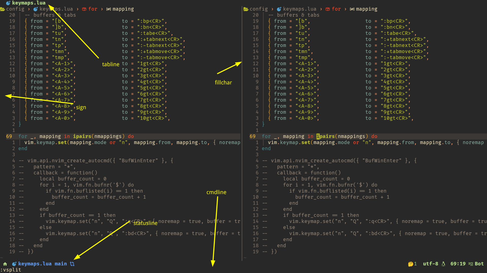

## 从0打造属于你的neovim[0]

> 大家好，这里是小冷，一个vimer，这个博客是为了帮助各位想要配置属于自己的neovim的朋友们入门的小教程。食用本教程最好具有一定的lua基础以及对vim的编辑模式有基本的了解，~~至少要学会怎么退出vim~~

##### 本系列内容（暂定）
1. 基本配置及其讲解
2. 基本插件与配置
3. lsp配置与补全配置
4. 插件介绍

那么，这一期我们先讲讲基本的配置

### neovim配置的文件结构
主流的neovim配置为`lua`和`vimscript`两种，本文将以`lua`为例

#### neovim的配置文件
nvim的配置文件是：`~/.config/nvim/init.lua`，我们的一切配置都在`init.lua`当中。不过主流的配置方式为在配置文件中调用其他文件，将配置拆分开来，方便修改和阅读。比如`LazyVim`的文件结构：

```
~/.config/nvim
├── lua
│   ├── config
│   │   ├── autocmds.lua
│   │   ├── keymaps.lua
│   │   ├── lazy.lua
│   │   └── options.lua
│   └── plugins
│       ├── spec1.lua
│       ├── **
│       └── spec2.lua
└── init.lua
```

在不同的功能分类放到不同的文件当中，各文件的功能这里按下不表。

本教程采用的文件结构为：

```
~/.config/nvim
├── lua
│   ├── config
│   │   ├── defaults.lua
│   │   ├── keymaps.lua
│   │   └── plugins.lua
│   ├── plugins
│   │   ├── editor.lua
│   │   ├── lsp.lua
│   │   ├── tools.lua
│   │   └── ui.lua
│   └── user
│       ├── user1.lua
│       ├── user2.lua
│       └── **.lua
├── snippets
│   └── *.snippets
└── init.lua
```

那么本期，我们讲解的就是`lua/config/defaults.lua`和`lua/config/keymaps.lua`这两个文件，这两个文件分别表示基本配置和快捷键设置

#### 如何配置
##### 配置文件创建
1. 创建`~/.config/nvim`这个文件夹，然后进入到其中去
2. 创建init.lua文件，这个文件是配置文件的入口
3. 创建`lua/config/defaults.lua`和`lua/config/keymaps.lua`这两个文件
4. 在init.lua中加入下面内容：
```lua
require("config.defaults")
require("config.keymaps")
```

也就是分别将`lua/config/default.lua`和`lua/config/keymaps.lua`这两个文件引入到配置文件当中

**配置defaults.lua文件**
<details>
<summary>defaults.lua文件预览</summary>

```lua
vim.opt.termguicolors = true
vim.env.NVIM_TUI_ENABLE_TRUE_COLOR = 1
vim.opt.ttyfast = true
vim.opt.autochdir = true
vim.g.mapleader = ' '
vim.opt.cursorline = true
vim.opt.wrap = false
vim.opt.number = true
vim.opt.relativenumber = true
vim.opt.tabstop = 2
vim.opt.shiftwidth = 2
vim.opt.softtabstop = 2
vim.api.nvim_create_autocmd({ "BufRead", "BufNewFile", "FileType" }, {
  pattern = { 'c', 'cpp', 'txt', 'c.snippets', 'cpp.snippets' },
  callback = function()
    vim.opt_local.tabstop = 4
    vim.opt_local.shiftwidth = 4
    vim.opt_local.softtabstop = 4
  end,
})
vim.opt.expandtab = true
vim.opt.smarttab = true
vim.opt.autoindent = true
vim.opt.smartindent = true
vim.opt.ignorecase = true
vim.opt.smartcase = true
vim.opt.ttimeoutlen = 0
vim.opt.timeout = false
vim.opt.virtualedit = 'block'
vim.opt.conceallevel = 0
vim.opt.showtabline = 3
vim.opt.laststatus = 3
vim.opt.signcolumn = "yes"
vim.opt.list = true
vim.opt.listchars = 'tab:┃ ,trail:▫'
vim.opt.fillchars = {
  vert = '│',
}
vim.opt.cmdheight = 1
vim.opt.scrolloff = 6
vim.opt.colorcolumn = '-1'
if vim.fn.filereadable("$HOME/.config/nvim/tmp/undo") == 0 then
  vim.cmd("silent !mkdir -p $HOME/.config/nvim/tmp/undo")
end
vim.opt.undofile = true
vim.opt.undodir = "$HOME/.config/nvim/tmp/undo,."
vim.cmd([[au BufReadPost * if line("'\"") > 1 && line("'\"") <= line("$") | exe "normal! g'\"" | endif]])
vim.api.nvim_create_autocmd("TermOpen", { pattern = "term://*", command = [[startinsert]] })
vim.api.nvim_create_autocmd({ "BufRead", "BufNewFile" }, { pattern = "*.md, *.txt", command = "setlocal wrap", })
```

</details>


<details>
<summary>代码讲解</summary>

```lua
vim.opt.termguicolors = true
vim.env.NVIM_TUI_ENABLE_TRUE_COLOR = 1
```
这两行为开启彩色，如果终端支持的话，建议开启


```lua
vim.opt.ttyfast = true
```
这一行是提高性能，建议开启


```lua
vim.opt.autochdir = true
```
这里是自动切换目录，比如当前处于`~/.config/nvim/init.lua`这个文件中，则此时的路径为`~/.config/nvim`。如果我打开`~/.config/nvim/lua/config/plugins.lua`，则nvim会自动将路径跳转到`~/.config/nvim/lua/config`当中


```lua
vim.g.mapleader = ' '
```
设置leader键为空格，默认为`\`。这个在快捷键当中经常使用


```lua
vim.opt.cursorline = true
vim.opt.wrap = false
vim.opt.number = true
vim.opt.relativenumber = true
```
启动本行高亮，关闭自动换行，开启行号，开启相对行号


```lua
vim.opt.cursorline = true
vim.opt.wrap = false
vim.opt.number = true
vim.opt.relativenumber = true
```
启动本行高亮，关闭自动换行，开启行号，开启相对行号


```lua
vim.opt.tabstop = 2
vim.opt.shiftwidth = 2
vim.opt.softtabstop = 2
vim.api.nvim_create_autocmd({ "BufRead", "BufNewFile", "FileType" }, {
  pattern = { 'c', 'cpp', 'txt', 'c.snippets', 'cpp.snippets' },
  callback = function()
    vim.opt_local.tabstop = 4
    vim.opt_local.shiftwidth = 4
    vim.opt_local.softtabstop = 4
  end,
})
```
这里将文本缩进宽度设置为2，并在特定的文件类型当中转化为4


```lua
vim.opt.expandtab = true
vim.opt.smarttab = true
vim.opt.autoindent = true
vim.opt.smartindent = true
```
将tab转化为空格，智能tab，自动缩进以及智能缩进


```lua
vim.opt.ignorecase = true
vim.opt.smartcase = true
```
查找文本时大小写忽略，输入大写时不会匹配小写


```lua
vim.opt.ttimeoutlen = 0
vim.opt.timeout = false
```
将快捷键的等待时切换为0。当我设置了`<leader>aa`和`<leader>a`两个快捷键时，如果我没有这两行配置，输入`<leader>a`和`<leader>aa`的时候，会等待一小会再去执行相对应的事件；设置了之后，则`<leader>a`会失效，`<leader>aa`会立即执行


```lua
vim.opt.virtualedit = 'block'
vim.opt.conceallevel = 0
```
开启虚拟文本和取消符号隐藏。


```lua
vim.opt.showtabline = 3
vim.opt.laststatus = 3
vim.opt.signcolumn = "yes"
vim.opt.list = true
vim.opt.listchars = 'tab:┃ ,trail:▫'
vim.opt.fillchars = {
  vert = '│',
}
vim.opt.cmdheight = 1
```
这是一些ui方面的设置，前两行为让tabline和statusline时刻全局显示；第三行为让sign栏时刻显示；list为符号显示，将tab显示为┃，空格显示为▫；然后是分屏时的分隔线；最后是下方命令行栏的高度




```lua
vim.opt.showtabline = 3
vim.opt.laststatus = 3
vim.opt.signcolumn = "yes"
vim.opt.list = true
vim.opt.listchars = 'tab:┃ ,trail:▫'
vim.opt.fillchars = {
  vert = '│',
}
vim.opt.cmdheight = 1
vim.opt.scrolloff = 6
vim.opt.colorcolumn = '-1'
```
这是一些ui方面的设置，前两行为让tabline和statusline时刻全局显示；第三行为让sign栏时刻显示；list为符号显示，将tab显示为┃，空格显示为▫；分屏时的分隔线；下方命令行栏的高度；距离顶端和底端的行数；列数提示栏，我这里未设置，如果将-1改成100，则会在100列的位置显示一个高亮的竖线来表示这个位置为100列


```lua
if vim.fn.filereadable("$HOME/.config/nvim/tmp/undo") == 0 then
  vim.cmd("silent !mkdir -p $HOME/.config/nvim/tmp/undo")
end
vim.opt.undofile = true
vim.opt.undodir = "$HOME/.config/nvim/tmp/undo,."
```
撤销永久化操作。检查`$HOME/.config/nvim/tmp/`下是否具有`undo`文件夹，如果没有则创建一个；打开撤销永久化，设置撤消文件的位置为`$HOME/.config/nvim/tmp/undo`


```lua
vim.cmd([[au BufReadPost * if line("'\"") > 1 && line("'\"") <= line("$") | exe "normal! g'\"" | endif]])
```
打开文件时，将光标定位到上次退出这个文件时所在的行


```lua
vim.api.nvim_create_autocmd("TermOpen", { pattern = "term://*", command = [[startinsert]] })
vim.api.nvim_create_autocmd({ "BufRead", "BufNewFile" }, { pattern = "*.md, *.txt", command = "setlocal wrap", })
```
进入到term中自动进入插入模式；进入到txt和md文件中，自动开启换行

</details>

<br>

**配置keymaps.lua文件**
<details>
<summary>keymaps.lua文件预览</summary>

```lua
local mode_nv = { "n", "v" }
local mode_n = { "n" }
local mode_v = { "v" }
local mode_i = { "i" }
local mode_t = { "t" }
local nmappings = {
  -- base
  { from = "W",                to = ":w<CR>",                                                      mode = mode_n },
  { from = "Q",                to = ":q<CR>",                                                      mode = mode_n },
  { from = "B",                to = ":bd<CR>",                                                     mode = mode_n },
  { from = "N",                to = ":normal ",                                                    mode = mode_v },
  { from = "Y",                to = "\"+y",                                                        mode = mode_v },
  { from = "ca",               to = ":! xclip -sel c %<CR><CR>:lua vim.notify(\" Copied!\")<CR>", mode = mode_n },
  { from = "<leader>sc",       to = ":set spell!<CR>",                                             mode = mode_n },
  { from = "<leader>sw",       to = ":set wrap!<CR>",                                              mode = mode_n },
  { from = "<leader><cr>",     to = ":noh<CR>",                                                    mode = mode_n },
  { from = "<C-N>",            to = "<C-\\><C-N>",                                                 mode = mode_t },
  { from = "<C-O>",            to = "<C-\\><C-N><C-O>",                                            mode = mode_t },

  -- move
  { from = "j",                to = "gj",                                                          mode = mode_n },
  { from = "k",                to = "gk",                                                          mode = mode_n },
  { from = "<A-l>",            to = "<Right>",                                                     mode = mode_i },
  { from = "<A-j>",            to = "<cmd>m .+1<cr>==",                                            mode = mode_n },
  { from = "<A-k>",            to = "<cmd>m .-2<cr>==",                                            mode = mode_n },
  { from = "<A-j>",            to = ":m '>+1<cr>gv=gv",                                            mode = mode_v },
  { from = "<A-k>",            to = ":m '<-2<cr>gv=gv",                                            mode = mode_v },


  -- windows splits
  { from = "s",                to = "<nop>", },
  { from = "sh",               to = ":set nosplitright<CR>:vsplit<CR>",                            mode = mode_n },
  { from = "sj",               to = ":set splitbelow<CR>:split<CR>",                               mode = mode_n },
  { from = "sk",               to = ":set nosplitbelow<CR>:split<CR>",                             mode = mode_n },
  { from = "sl",               to = ":set splitright<CR>:vsplit<CR>",                              mode = mode_n },
  { from = "smv",              to = "<C-w>t<c-W>H",                                                mode = mode_n },
  { from = "smh",              to = "<C-w>t<c-W>K",                                                mode = mode_n },
  { from = "<leader>h",        to = "<c-w>h",                                                      mode = mode_n },
  { from = "<leader>j",        to = "<c-w>j",                                                      mode = mode_n },
  { from = "<leader>k",        to = "<c-w>k",                                                      mode = mode_n },
  { from = "<leader>l",        to = "<c-w>l",                                                      mode = mode_n },
  { from = "<up>",             to = ":res +5<CR>",                                                 mode = mode_n },
  { from = "<down>",           to = ":res -5<CR>",                                                 mode = mode_n },
  { from = "<left>",           to = ":vertical resize-5<CR>",                                      mode = mode_n },
  { from = "<right>",          to = ":vertical resize+5<CR>",                                      mode = mode_n },
  { from = "<leader><leader>", to = "/<++><CR>:noh<CR>\"_c4l",                                     mode = mode_n },
  { from = "<leader>vim",      to = ":tabe ~/.config/nvim/init.lua<CR>",                           mode = mode_n },

  -- buffers & tabs
  { from = "[b",               to = ":bp<CR>",                                                     mode = mode_n },
  { from = "]b",               to = ":bn<CR>",                                                     mode = mode_n },
  { from = "tu",               to = ":tabe<CR>",                                                   mode = mode_n },
  { from = "tn",               to = ":+tabnext<CR>",                                               mode = mode_n },
  { from = "tp",               to = ":-tabnext<CR>",                                               mode = mode_n },
  { from = "tmn",              to = ":+tabmove<CR>",                                               mode = mode_n },
  { from = "tmp",              to = ":-tabmove<CR>",                                               mode = mode_n },
  { from = "<A-1>",            to = "1gt<CR>",                                                     mode = mode_n },
  { from = "<A-2>",            to = "2gt<CR>",                                                     mode = mode_n },
  { from = "<A-3>",            to = "3gt<CR>",                                                     mode = mode_n },
  { from = "<A-4>",            to = "4gt<CR>",                                                     mode = mode_n },
  { from = "<A-5>",            to = "5gt<CR>",                                                     mode = mode_n },
  { from = "<A-6>",            to = "6gt<CR>",                                                     mode = mode_n },
  { from = "<A-7>",            to = "7gt<CR>",                                                     mode = mode_n },
  { from = "<A-8>",            to = "8gt<CR>",                                                     mode = mode_n },
  { from = "<A-9>",            to = "9gt<CR>",                                                     mode = mode_n },
  { from = "<A-0>",            to = "10gt<CR>",                                                    mode = mode_n },
}

for _, mapping in ipairs(nmappings) do
  vim.keymap.set(mapping.mode or "n", mapping.from, mapping.to, { noremap = true })
end

-- vim.api.nvim_create_autocmd({ "BufWinEnter" }, {
--   pattern = "*",
--   callback = function()
--     local buffer_count = 0
--     for i = 1, vim.fn.bufnr('$') do
--       if vim.fn.buflisted(i) == 1 then
--         buffer_count = buffer_count + 1
--       end
--     end
--     if buffer_count == 1 then
--       vim.keymap.set("n", "Q", ":q<CR>", { noremap = true, buffer = true })
--     else
--       vim.keymap.set("n", "Q", ":bd<CR>", { noremap = true, buffer = true })
--     end
--   end
-- })
```

这就没什么好讲解的了，`from`填写快捷键，`to`填写对应的代码，`mode`填写相应的模式

</details>
