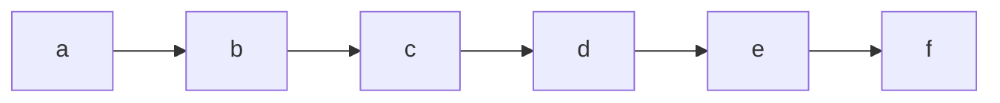
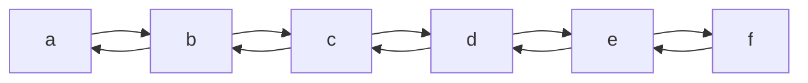

内容

- 栈
- 队列
  1. 双端队列
- 链表
- Trie树（字典树）
- 并查集
- 堆
  1. 大根堆
  2. 小根堆
  3. 优先队列（堆+队列）
- 哈希表
- 树状数组
- 线段树
  1. 普通线段树
  2. 带lazy标记的线段树
  3. 可持久化线段树（主席树）
- 平衡树
  1. 伸展树（Splay）
  2. 红黑树（Red-Black）
- 树套树


# 栈

## 一、概念
> 栈（Stack）是一种线性数据结构，采用后进先出（LIFO, Last In First Out）的原则，即最新入栈的元素最先出栈。

## 二、栈的基本操作

### 1. 栈的结构与初始化
> 栈需要有个用于存储数据的容器，这里使用指针动态分配内存；初始化的时候需要输入栈的初始大小，栈的初始大小至少为1

```c
// 结构
typedef struct Stack Stack;
struct Stack {
        int *stack; // 栈
        int top; // 栈顶
        int size; // 栈的容量，用于动态分配
};

// 初始化
void init_stack(Stack *s, int size) {
        if (size <= 0) { // 栈的大小至少为1
                size = 1;
        }
        s->top = 0;
        s->size = size;
        s->stack = malloc(size * sizeof(int));
        if (!s->stack) {
                printf("内存分配错误\n");
                exit(1);
        }
}
```

### 2. 入栈
> 将新元素插入到栈中，如果超过栈的大小，则动态增大栈的大小

```c
int push_back(Stack *self, int val) {
        if (self->top >= self->size) { // 如果栈已满，增加容量
                self->size *= 2;
                self->stack = realloc(self->stack, self->size * sizeof(int)); // 重新分配内存
                if (!self->stack) {
                        printf("内存分配错误\n");
                        return -1;
                }
        }
        self->stack[self->top++] = val;
        return 0;
}
```

### 3. 出栈
> 将栈顶的元素从栈中弹出，如果栈为空，则弹出失败

```c
int pop_back(Stack *self) {
        if (self->top == 0) {
                printf("这个栈为空栈\n");
                return -1;
        }
        return self->stack[--self->top];
}
```

### 4. 访问栈顶
> 获取栈顶元素的值

```c
int back(Stack *self) {
        if (self->top == 0) {
                printf("这个栈为空栈\n");
                return -1; // 表示错误
        }
        return self->stack[self->top - 1];
}
```

### 5. 完整代码
```c
#include <stdlib.h>
#include <stdio.h>

typedef struct Stack Stack;

int back(Stack *self);
int push_back(Stack *self, int val);
int pop_back(Stack *self);

struct Stack {
        int *stack; // 栈
        int top; // 栈顶
        int size; // 栈的容量，用于动态分配
};

int back(Stack *self) {
        if (self->top == 0) {
                printf("这个栈为空栈\n");
                return -1; // 表示错误
        }
        return self->stack[self->top - 1];
}

int push_back(Stack *self, int val) {
        if (self->top >= self->size) { // 如果栈已满，增加容量
                self->size *= 2;
                self->stack = realloc(self->stack, self->size * sizeof(int)); // 重新分配内存
                if (!self->stack) {
                        printf("内存分配错误\n");
                        return -1;
                }
        }
        self->stack[self->top++] = val;
        return 0;
}

int pop_back(Stack *self) {
        if (self->top == 0) {
                printf("这个栈为空栈\n");
                return -1;
        }
        return self->stack[--self->top];
}

// 初始化栈
void init_stack(Stack *s, int size) {
        if (size <= 0) {
                size = 1;
        }
        s->top = 0;
        s->size = size;
        s->stack = malloc(size * sizeof(int));
        if (!s->stack) {
                printf("内存分配错误\n");
                exit(1);
        }
}

// 清除栈的内存
void free_stack(Stack *s) {
        free(s->stack);
        s->stack = NULL;
}

int main() {
        Stack s;
        init_stack(&s, 2);

        push_back(&s, 10);
        push_back(&s, 20);
        printf("栈顶元素为: %d\n", back(&s));

        pop_back(&s);
        printf("弹出栈顶元素后的栈顶元素为: %d\n", back(&s));

        free_stack(&s);
        return 0;
}
```

# 队列

## 一、队列的概念
> 队列（Queue）是一种线性数据结构，采用先进先出（FIFO, First In First Out）的原则。


# 链表

## 一、概念与分类
> 链表(List)是一种线性数据结构，由一组节点组成，每个节点包含数据域和指向其他节点的指针。

### 1. 单链表：每个节点只包含指向下一个节点的指针，结构如下：


### 2. 双链表：每个节点包含指向上一个和下一个节点的指针，结构如下：


## 二、插入操作

### 1. 节点结构
```c
struct Node {
        int val; // 数据域
        struct Node *prev; // 指向上个节点的指针(单链表没有这个指针)
        struct Node *next; // 指向下个节点的指针
};

```

### 2. 插入节点

#### 情况1 在两个节点之间插入新节点
> 在a, b两节点之间插入新的节点c，只需要让a的next指针指向c，b的prev指针指向c，然后让c的prev和next指针分别指向a和b即可

```c
void insert(struct Node *a, struct Node *c) {
        struct Node *b = a->next;
        a->next = c; // a的next指针指向c
        c->prev = a; // c的prev指针指向a
        b->prev = c; // b的prev指针指向c
        c->next = b; // c的next指针指向b
}
```

#### 情况2 在链表开头或者结尾插入新节点
> 只需要在链表两边加上哨兵，即可将情况2转换为情况1

### 3. 删除节点
> 在a, b两节点之间删除节点c，只需要让a的next指针指向b，b的prev指针指向a，然后释放c即可

```c
void delete(struct Node *c) {
        struct Node *a = c->prev;
        struct Node *b = c->next;
        a->next = b;
        b->prev = a;
        free(c);
}
```

### 4. 完整代码展示
```c
#include <stdlib.h>
#include <stdio.h>

typedef struct Node Node;

struct Node {
        int val;
        Node *prev;
        Node *next;
};

void delete_node(Node *c) {
        Node *a = c->prev;
        Node *b = c->next;
        if (a == NULL || b == NULL) {
                printf("不能删除哨兵节点\n");
                return;
        }
        a->next = b;
        b->prev = a;
        free(c);
}

void insert_node(Node *a, Node *c) {
        Node *b = a->next;
        if (b == NULL) {
                printf("不能在哨兵后面添加节点\n");
                return;
        }
        a->next = c;
        c->prev = a;
        b->prev = c;
        c->next = b;
}

void delete_list(Node *start_node, Node *end_node) {
        for (Node *x = start_node->next; x != end_node; x = x->next) {
                free(x);
        }
        free(start_node);
        free(end_node);
        printf("链表已经被删除\n");
}

int main() {
        // 创建哨兵
        Node *start_node = (Node *)malloc(sizeof(Node));
        Node *end_node = (Node *)malloc(sizeof(Node));
        start_node->prev = NULL;
        start_node->next = end_node;
        end_node->prev = start_node;
        end_node->next = NULL;

        // 创建新节点
        Node *a = (Node *)malloc(sizeof(Node));
        Node *b = (Node *)malloc(sizeof(Node));
        Node *c = (Node *)malloc(sizeof(Node));
        a->val = 1;
        b->val = 2;
        c->val = 3;

        // 将新节点都插入到链表中
        insert_node(start_node, a);
        insert_node(a, b);
        insert_node(b, c);

        // 遍历链表
        for (Node *x = start_node->next; x != end_node; x = x->next) {
                printf("这个节点的值为：%d\n", x->val);
        }

        // 删除b节点
        delete_node(b);

        // 遍历链表
        for (Node *x = start_node->next; x != end_node; x = x->next) {
                printf("这个节点的值为：%d\n", x->val);
        }

        // 删除链表
        delete_list(start_node, end_node);

        return 0;
}
```

# Red-Black Tree（红黑树）

## 一、插入
红黑树是一种平衡二叉搜索树，插入操作主要涉及保持其平衡性。红黑树的插入过程可以分为以下几个步骤：

### 1. 标准的二叉搜索树插入
- 首先按照普通的二叉搜索树的规则插入新节点，并将新插入的节点着色为**红色**。
- 将新节点着色为红色有助于避免破坏红黑树的黑色平衡性。

### 2. 处理红黑树的性质
插入节点为红色后，可能会导致红黑树的性质被破坏。特别是有可能出现**两个连续的红色节点**（即红红冲突），我们需要进行调整。红黑树的调整分为以下几种情况：

#### 情况1：新节点的父节点是黑色
- 在这种情况下，不会破坏红黑树的性质，直接插入即可。

#### 情况2：新节点的父节点是红色（产生“红红冲突”）
- 这种情况下，必须对红黑树进行调整，具体的调整步骤取决于新节点的叔叔节点的颜色。

##### 情况2.1：叔叔节点也是红色
- **解决方法：** 将父节点和叔叔节点变成黑色，将祖父节点变为红色。然后，将祖父节点作为新的当前节点，重复上述步骤进行调整。
- **效果：** 这样操作后，红黑树的性质可能会在更高的层次上继续被破坏，因此需要递归地调整树的平衡。

##### 情况2.2：叔叔节点是黑色
- 这种情况下，需要通过旋转来调整红黑树的结构。

  具体旋转操作取决于新节点在父节点和祖父节点的位置，分为以下四种子情况：

  1. **左左情况（左重）：**
     - 新节点是其父节点的左子节点，父节点是祖父节点的左子节点。
     - **解决方法：** 对祖父节点进行一次右旋转，并交换父节点和祖父节点的颜色。

  2. **右右情况（右重）：**
     - 新节点是其父节点的右子节点，父节点是祖父节点的右子节点。
     - **解决方法：** 对祖父节点进行一次左旋转，并交换父节点和祖父节点的颜色。

  3. **左右情况：**
     - 新节点是其父节点的左子节点，父节点是祖父节点的右子节点。
     - **解决方法：** 对父节点进行一次右旋转，将其转为右右情况，然后再对祖父节点进行左旋转，交换颜色。

  4. **右左情况：**
     - 新节点是其父节点的右子节点，父节点是祖父节点的左子节点。
     - **解决方法：** 对父节点进行一次左旋转，将其转为左左情况，然后再对祖父节点进行右旋转，交换颜色。


### 3. 确保根节点是黑色
- 调整完成后，可能根节点会变成红色，需要将根节点重新设为黑色以保持红黑树的性质。

## 二、删除

红黑树的删除操作较为复杂，因为删除节点后可能会破坏红黑树的性质，需要进行修复操作。删除过程包括以下几个步骤：

### 1. 标准的二叉搜索树删除
红黑树的删除基于标准的二叉搜索树删除操作：
- 首先找到要删除的节点 `z`。
- 如果 `z` 有两个子节点，则找到其**后继节点**（即右子树的最左节点）`y`，用 `y` 的值替换 `z` 的值，然后将问题转移为删除 `y` 节点。
- 如果 `z` 只有一个子节点或没有子节点，则直接删除该节点或将其子节点提升到它的位置。
- 将删除的节点设为 `x`，`x` 是替代了 `z` 的节点（可能是 `z` 的孩子或是 `TNULL` 哨兵节点）。

### 2. 修复红黑树性质
删除节点后，可能会破坏红黑树的性质（例如黑色高度不平衡），因此需要进行修复。修复过程分为以下几种情况：

#### 情况1：`x` 是红色
- 如果 `x` 是红色，将它直接变成黑色即可，因为这样不会影响红黑树的平衡性。

#### 情况2：`x` 是黑色
- 当 `x` 是黑色时，我们需要进行以下操作来恢复红黑树的平衡：

##### 情况2.1：`x` 的兄弟节点 `w` 是红色
- 这意味着 `w` 的子节点必定是黑色。
- **解决方法：** 将 `w` 设为黑色，`x` 的父节点设为红色，然后对 `x` 的父节点进行左旋或右旋（取决于 `x` 在左子树还是右子树）。
- **效果：** 旋转后，新的 `x` 的兄弟节点将是黑色，可以继续按情况2.2、2.3或2.4处理。

##### 情况2.2：`x` 的兄弟节点 `w` 是黑色，且 `w` 的两个子节点也是黑色
- **解决方法：** 将 `w` 设为红色，并将 `x` 的父节点设为新的 `x`。
- **效果：** 如果 `x` 的父节点是红色，这样可以直接结束；如果 `x` 的父节点是黑色，则需要继续调整，可能会递归到更高层次。

##### 情况2.3：`x` 的兄弟节点 `w` 是黑色，且 `w` 的左子节点是红色、右子节点是黑色
- **解决方法：** 将 `w` 的左子节点设为黑色，将 `w` 设为红色，然后对 `w` 进行右旋。
- **效果：** 旋转后，可以将问题转化为情况2.4处理。

##### 情况2.4：`x` 的兄弟节点 `w` 是黑色，且 `w` 的右子节点是红色
- **解决方法：** 使 `w` 的颜色与 `x` 的父节点颜色相同，`x` 的父节点设为黑色，`w` 的右子节点设为黑色。然后对 `x` 的父节点进行左旋。
- **效果：** 旋转后，红黑树恢复平衡。

### 3. 确保根节点是黑色
- 最后，将根节点设为黑色，以确保红黑树的性质满足。
