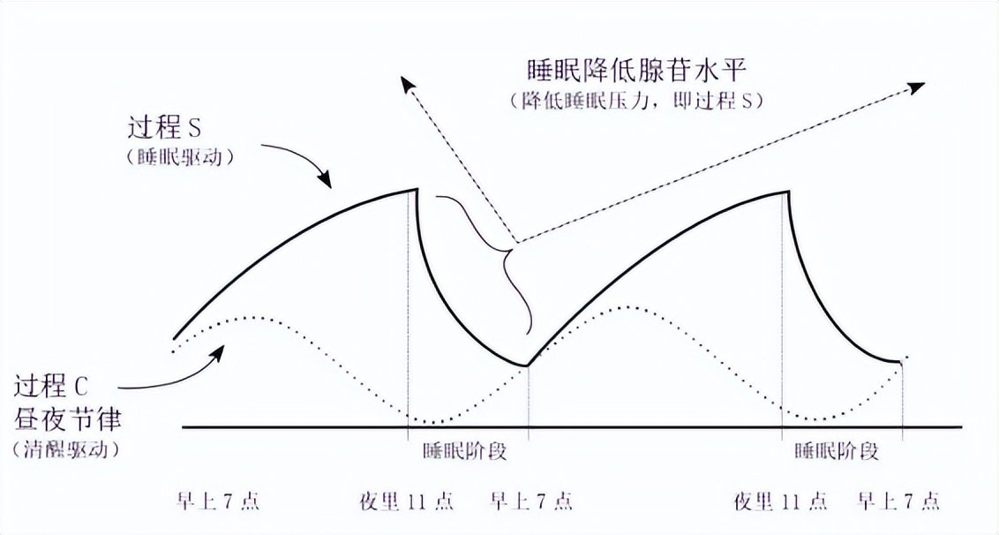

# 《我们为什么睡觉》读书笔记
## 一、关于睡眠
### （一）睡眠节奏

**控制睡眠的因素：**
- 生物钟（昼夜节律）：成年人的平均的节律为==24小时15分钟==，通常年轻时较长，随着年龄增长会缩短。通常会根据外部光源（主要为阳光）调整节律，将其调整为较精准的24小时
- 腺苷：重要信号分子和代谢产物，其浓度随着清醒时间增长而增加，同时困意增加。睡眠期间会代谢

> 由于人的睡眠节律通常大于24小时，所以熬夜晚睡一般比早睡要更容易自主操控

**节律的调节：**
- 褪黑色素：给出睡眠信号，告诉大脑该睡觉了，但是==不会对睡眠本身起作用==。褪黑色素与睡眠的关系就像发令枪和运动员，是否奔跑取决于运动员而不是发令枪。
- 咖啡因：常见的兴奋剂，通过霸占腺苷的受体来对抗困意。其半衰期为==5～7小时==

当过程s和过程c之间的差值增大的时候，困意就会增加

**检验睡眠是否充足**
- [x] 睡醒后3～4小时是否还能再次入睡
- [x] 在中午前是否能在不摄入咖啡因的情况下保持清醒
- [x] 没闹钟是否会睡过头
- [x] 是否经常重复阅读同一段话
- [x] 是否经常忘记一些刚发生的小事
