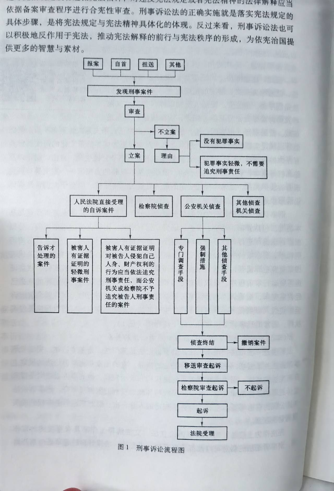
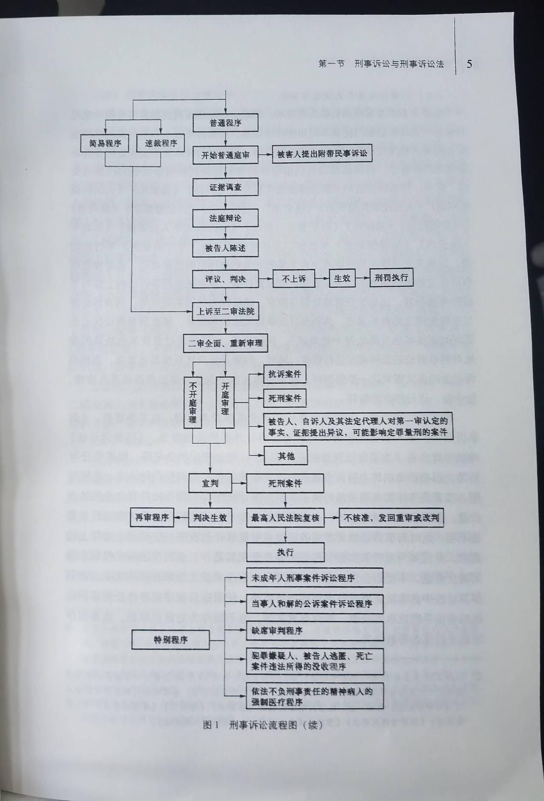

# 刑事诉讼法

<!-- vim-markdown-toc GitLab -->

* [绪论](#绪论)
  * [第一节、刑事诉讼与刑事诉讼法](#第一节刑事诉讼与刑事诉讼法)
    * [一、刑事诉讼的概念](#一刑事诉讼的概念)
    * [二、刑事诉讼法的概念及其法律渊源](#二刑事诉讼法的概念及其法律渊源)
      * [（一）狭义的刑事诉讼法即《刑事诉讼法》](#一狭义的刑事诉讼法即刑事诉讼法)
      * [（二）宪法性法律渊源及宪法与刑事诉讼法的关系](#二宪法性法律渊源及宪法与刑事诉讼法的关系)
      * [（三）刑事诉讼法与关联法律法规](#三刑事诉讼法与关联法律法规)
      * [（四）刑事诉讼法的法律解释](#四刑事诉讼法的法律解释)
      * [（五）国际公约、条文与准则](#五国际公约条文与准则)
  * [第二节、刑事诉讼法的指定目的与任务](#第二节刑事诉讼法的指定目的与任务)
    * [一、刑事诉讼法的制定目的](#一刑事诉讼法的制定目的)
    * [二、刑事诉讼法的任务](#二刑事诉讼法的任务)

<!-- vim-markdown-toc -->

## 绪论
### 第一节、刑事诉讼与刑事诉讼法
#### 一、刑事诉讼的概念
- 概念：刑事诉讼是为人民法院在控方即人民检察院（公安机关等侦查机关予以协助）以及自诉人的追诉活动与辩方的防御活动之间实施审查，并使双方展开理性争辩与说服，最终对刑事案件作出裁判的活动与过程

#### 二、刑事诉讼法的概念及其法律渊源
- 概念：刑事诉讼法是规范刑事诉讼活动的基本法律
  - 狭义：国家立法机关指定的成文的刑事诉讼法典
  - 广义：一切与刑事诉讼有关的法律规范，即刑事诉讼法的给类法律渊源
- 调整对象：
  1. 公安机关、检察机关或自诉人为揭露、证实犯罪而实施的追诉活动
  2. 被追诉者实施的辩护与防御活动
  3. 法院的审查、裁判活动
  4. 其他诉讼参与人参加刑事诉讼的活动

##### （一）狭义的刑事诉讼法即《刑事诉讼法》
- 特点：
  1. 刑事诉讼法是规范刑事诉讼流程的程序法，法律本身规定的多是刑事案件自立案到侦查、起诉、审判以及执行的整个流程
  2. 刑事诉讼法是程序法，是公安、司法人员据以操作的规范，设计的诉讼行为十分具体、细微，法律规定必须充足，细致
  3. 刑事诉讼法规范的对象是剥夺公民生命、自由、财产以及隐私权等基本权利的刑事司法活动，因此与基本权利的大宪章——宪法具有情迷的法律关系，是落实宪法规定的**最为重要的**基本法律
- 结构：
  1. 总则：规定基本原则与基本制度，包括管辖、回避、辩护、证据、强制措施、附带民事诉讼制度等
  2. 分则：根据诉讼流程进行的顺序分为：
    1. 审前程序
    2. 审判程序
    3. 执行程序
    4. 特别案件执行特别程序
- 通常的刑事诉讼流程图： 

##### （二）宪法性法律渊源及宪法与刑事诉讼法的关系
| 宪法                     | 刑事诉讼法                         |
|--------------------------|------------------------------------|
| 根本大法                 | 部门法、基本法律                   |
| 规定了公民权利和政治权力 | 涉及公民权利和政治权力的限制或剥夺 |
| 规定公民的基本权利       | 涉及公民的基本权利                 |

##### （三）刑事诉讼法与关联法律法规

##### （四）刑事诉讼法的法律解释

##### （五）国际公约、条文与准则
> 与刑事诉讼联系最为密切的四个国际公约是：《禁止酷刑和其他残忍、不人道或有辱人格的待遇或处罚公约》《公民权利和政治权利国际公约》《联合国打击跨国有组织犯罪公约》《联合国反腐败公约》

### 第二节、刑事诉讼法的指定目的与任务
#### 一、刑事诉讼法的制定目的
> 《刑事诉讼法》第1条规定：“为了保证刑法的正确实施，惩罚犯罪，保护人民，保障国家安全和社会共公共安全，维护社会主义社会秩序，根据宪法，制定本法”

#### 二、刑事诉讼法的任务

