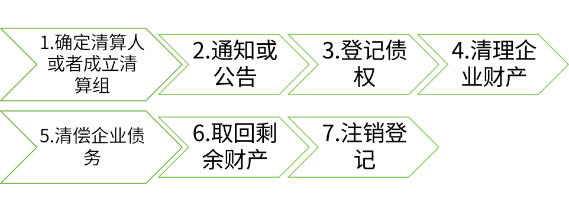
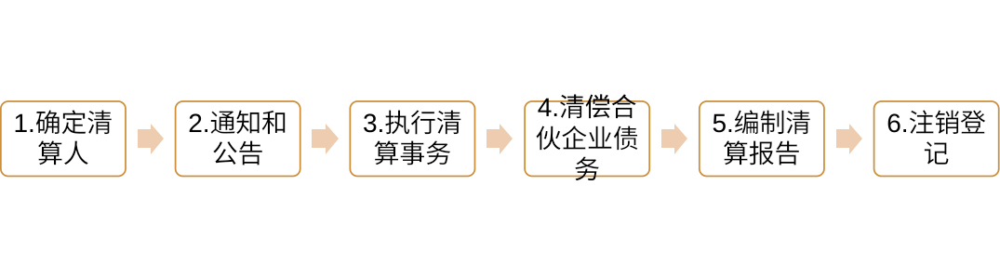
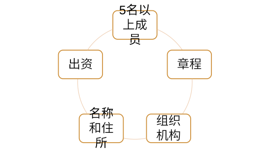
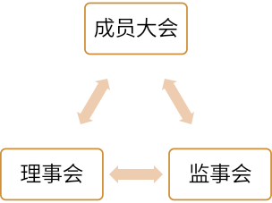
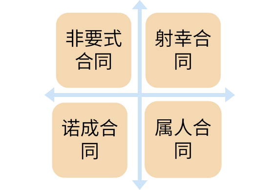
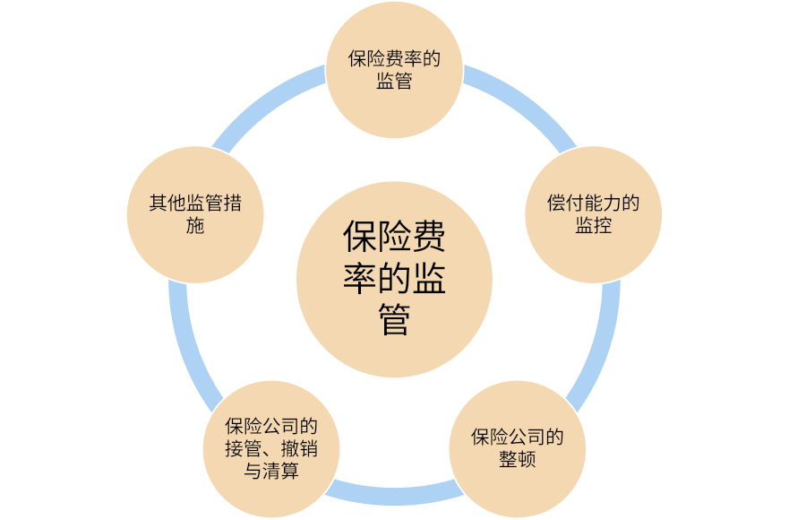

# 商法学

## 绪论
### 一、商法学的研究对象
> 商法学是以商法的一般理论与制度及商事部门法理论与制度为研究对象的部门法理论与学科，是法学理论体系与学科体系的重要组成部分

| 一般理论           | 商事部门法     |
|--------------------|----------------|
| 商法的起源与历史   | 公司法         |
| 商法的价值         | 证券法         |
| 商法理念与商法思维 | 票据法与保险法 |
| 商法原则           | 信托法与基金法 |
| 商法规范与商法体系 | 海商法         |
| 商事主体           | 电子商务法     |
| 商事行为           | 运输与物流法   |
| 商事纠纷解决程序   | 破产法         |

### 二、商法学的功能
1. 商法学有助于构建和发展中国特色社会主义商法
2. 商法学有助于完善中国特色社会主义商事制度，维护社会主义市场经济秩序
3. 商法学将推动当代中国法制文化观念的变革
4. 商法学是树立社会商业道德，推动社会主义精神文明建设的助力
5. 商法学是我国实现国际经济战略的重要法律制度理论依托

## 第一章、商法的一般理论
### 第一节、商法概述
#### 一、商法的概念与调整对象
##### （一）商法的含义
商法，又称**商事法**，指调整商事主体参加的商事关系的特别私法。商法和民法均称为私法，都调整人身关系和财产关系。但相对于民法，商法有以下特点：
1. 商法是商人法，所谓商人法，是指专门规范商事主体地位、组织及营业的法律
2. 商法是私法。商法在调整商事主体之间的商事关系时，既要遵循民事主体地位平等、意思自治、公平、诚实信用等基本原则，又要秉承保障商事交易自由、平等交换、便捷安全等原则
3. 商法是特别私法。民法是普通法，商法是特别法。商法又分为商事普通法和商事特别法

##### （二）商法的调整对象
商事关系
1. 商事关系的主体。商事主体是特殊的民事主体。民事主体若要取得商事主体资格，通常要先行办理商事登记
2. 商事关系的客体。商事关系的客体既包括**动产**和**不动产**，又包括**营业**或者**营业资产**等，还可以包括其他权力或利益
3. 商事关系的内容。即商事权力义务关系。在双方或者多方关系中，各方当事人按照意思自治等规则确定相互之间的权力义务关系。在单方商事关系中，商事主体既要遵从商法和民法原则，又要遵守消费者权益保护法的特别规定

#### 二、商法的基础概念
##### （一）商法的基础概念
1. 商和商事
  1. 商的含义：
    1. 生意或者买卖（限定事业或行为时）
    2. 商人或者从事生意或买卖的人（限定法律关系的主体时）
  2. 商法的适用：商法规定 > 商事习惯 > 民法
2. 商人
  1. 商人既包括自然人，也包括法律拟制之人
  2. 从事各种营业活动，包括运输、存储、信贷、代理等从买卖中独立出来的商业形式
3. 商行为：商人经营或从事营利事业的各种营利行为
  1. 商行为是商人实施的行为
  2. 商行为限于营利事业范围内的行为
  3. 商行为包括法律行为和其他行为
4. 营利事业
5. 营业：运营中的营利事业，既包括组织和经营活动，也包括财产关系
  1. 主观营业：指各种营利事业之经营活动，属于法律关系之内容的范畴。商人从事经营活动的法律效果，包括意定效果和法定效果
  2. 客观营业：指营业所依赖的

#### 三、商法的原则
##### （一）商法原则的含义和地位
1. 商法原则与商法功能、商法价值
  - 商法原则、商法功能和商法价值是性质相异、但又相互联系的三个概念。商法原则虽然具有抽象性，却属于法律规范的范畴，裁判者可以援引并做出裁判。商法的功能、商法价值是重要的、抽象的，但不具有裁判上的意义，不属于法律规范的范畴
  - 商法价值和商法功能相互影响，共同决定了商法原则的内涵。为了减少商法价值和功能在司法中的不确定性，立法者应当将商法原则作为商法价值和功能的表象形式，使之成为商事裁判的法律依据
2. 商法原则与民法基本原则的关系

##### （二）经营自由原则
> 经营自由，也称经商自由、交易自由或营业自由，是指除非依照法律规定或整体利益不得从事经营活动者外，行为人有权自主决定从事经营活动，即享有是否从事经营活动的自由和从事何种经营活动的自由

经营自由的限制：
- 法定限制：指对权利人经营自由加以限制的法律规定
- 也称整体利益限制，指权利人未事先取得某种特殊资格，即不得从事特定营业的限制 

##### （三）平等交换原则
> 平等交换，是指商事主体在从事营业或者财产交易中，应当基于等价交换而确定商事主体之间的权利义务。

按照平等交换的原则，商事主体在取得权利的同时，也承担相应的义务

##### （四）企业维持原则
> 企业维持既是旨在维持企业存续、稳定、协调和发展的商法原则，也是在该原则支配下形成的一整套商法制度和规则

1. 企业主体地位的维持
2. 资本充实规则
3. 盈利分配规则

##### （五）交易便利原则
> 传统商法源于商人习惯法，强调商业活动的效率价值。近代和现代商法主要采用指定法的形式，但任然强调交易的便捷和效率价值。交易便捷原则的核心是减少繁琐的交易手续、降低交易成本

1. 形式自由：商法重视效率价值，在法律行为形式要件上的要求较低
2. 权利外观[^权利外观]：商法承认权力外观表象在权力认定上的有限效力
3. 短期时效：对于商事纠纷，使用《民法典》关于诉讼时效的一般规定。如果商人或企业约定了较短的质量检验期限，应当按照意思自治原则予以认可

[^权利外观]:权力外观：权利外观又称权利表征、权利表象。从概念上来说是指行为人所享有权利的外在表现形式

##### （六）交易安全原则
> 商法在秉承交易便捷原则的同时，为了增强交易的确定性，也应当观者交易安全的原则

1. 公示原则：商人或企业对于涉及到利害关系人的客观事实，必须依照法律和行政法规的规定,向公众进行公式，以便于利害关系人知晓
2. 强制主义：国家采用公法手段，对商事关系的某些内容做出强制性规定
3. 加重责任：商法上的加重责任[^严格责任]包括**严格责任**和**连带责任**[^连带责任]此外还涉及**社会责任**[^社会责任]

[^严格责任]:严格责任：是指商人或企业即使没有过错,在法律特别规定场合下，也要向相对人承担责任

[^连带责任]:连带责任：既包括投资者对商人或企业违反法律义务之后果依法承担全部责任，也包括商人或企业对他人违反法律义务之后果依法承担全部责任

[^社会责任]:社会责任：指商人或企业对社会承担的法律上义务之外的道德性“责任”

##### （七）守法经营原则
> 企业守法经营，指企业应当遵守有关经营的商法规定并履行其他特殊义务。既包括承担私法义务，也包括承担公法义务

1. 有关商业等级的义务：任何人从事商事活动的，除非法律、行政法规另有规定，必须依法办理商事登记
2. 有关会计账簿的义务：除非法律或行政法规另有规定者外，企业必须依法建立会计制度和会计账簿
3. 有关经营活动的特殊义务：为了维持良好的经济和社会秩序，企业既要遵循公平竞争的规则，还要承担保护消费者的特殊义务

### 第二节、商法的渊源和体系
#### 一、商法的渊源
简单了解即可

#### 二、商法的体系
简单了解即可

#### 三、商法与其他部门法的关系
##### （一）商法和民法
|  不同点  |                  商法                  |             民法             |
|----------|----------------------------------------|------------------------------|
| 假设前提 |                特别之人                |           普通之人           |
| 价值观念 |              等价有偿原则              | 相互帮扶、社会公平、公序良俗 |
| 技术处理 | 商业活动特殊性以及商法规范的社会适应性 |   民法规范的普适性和原则性   |
| 责任观念 |              强调经济伦理              |       强调社会伦理价值       |

##### （二）商法和经济法
| 不同点       | 商法                            | 经济法                                    |
| ------------ | ------------------------------- | ----------------------------------------- |
| 法律关系范围 | 强调经济伦理                    | 强调社会伦理的价值                        |
| 法律关系主体 | 商人或企业之间发生的商事关系    | 国家参与、管理或干预经济而形成的          |

### 第三节、商事纠纷及其解决机制
#### 一、商事纠纷解决的基本模式
简单了解即可
#### 二、调节与仲裁解决商事纠纷的程序特征
##### （一）商事调解的程序特征
1. 调解程序的自愿性：一般而言，调解经当事人同意方可进行，同意可以通过签订协议或者口头承诺等方式进行，可以是主动同意，也可以是通过第三方劝说同意
2. 调解员的中立性：调解员必须中立，才能取得当事人信任并促使其自愿履行，达到解决纠纷的效果
3. 调解程序的保密性：调解员必须对当事人在调解过程中的言论及知晓的信息予以保密，不能随意向法庭及其他人员展示，更不能未经许可用作庭审证据
4. 调解协议的“软司法约束力”：法院外调解协议要取得司法约束力，往往需要历经法院确认的过程

##### （二）商事仲裁的程序特征
1. 仲裁程序的自愿性：商事仲裁是一种“合意解决纠纷”的形式，以双方当事人自愿为前提
2. 仲裁员的专业性：仲裁员通常有某方面的专业背景，体现出仲裁裁决的专业性和权威性
3. 仲裁程序的便捷性：适应商事交易注重协商谈判及效率提升的需求
4. 仲裁程序的保密性：以不公开审理为原则，以公开审理为例外；商事仲裁员及秘书有保密义务
5. 仲裁裁决的强司法效力性：商事仲裁裁决具有强制执行的效力，依托法院进行强制执行

#### 三、商事法律责任
> 商事法律责任，是指商事主体在商事交易过程中，依法应承担的法律责任。商事法律责任在类型上属于特别的私法责任范畴。

与**其他法律责任及普通民事责任**相比，商事法律责任具有如下特征：
1. 商事交易以自由为原则，多以契约方式展开。
2. 法定责任的严格性
3. 追责时效的特殊性

## 第二章、商事主体
### 第一节、商事主体概述
#### 一、商事主体的概念与特征
##### （一）商事主体的概念
> 商事主体，也称商事法律关系主体、商主体，是指依照商法的规定具有商事权利能力和商事行为能力，能够以自己的名义独立从事商事行为，在商事法律关系中享有权力和承担义务的个人和组织。在传统商法上，商事主体也叫商人

##### （二）商事主体的特征
1. 商事主体由商法法定
2. 商事主体依法具有商事能力
3. 商事主体的身份或资格经商事登记而取得
4. 商事主体从事营利性活动为其常业

#### 二、商事主体的种类
> 我国的商事主体主要是依照商事主体的组织形式进行划分

##### （一）商个人
> 商个人，又称商个体、商自然人、个体商人，是指依法定程序取得商事主体资格的自然人或公民

1. 法律特征：
  1. 商个人作为商法确认的主体，须依法定核准登记，才能享有商事权利和商行为能力，并在核准登记的范围内从事商事行为
  2. 商个人的权利与自然人的权利不同，与一般自然人人身相关的权利
  3. 商个人所从事的是商事行为，即以营利为目的的经营性行为；非营利性的行为
  4. 商个人对其经营债务须承担无限责任

2. 具体表现：
  1. 个体工商户
  2. 农村承包经营户

##### （二）商法人
> 商法人，指按照法定要件和程序设立的，具有法人资格，能够独立进行商事经营活动，并享有商事权利和承担商事义务的各种商事企业

1. 法律特征
  1. 商法人是具有独立法律人格的法人组织，具备一般法人必须具备的基本条件和特点，包括依法成立、有自己的组织机构和场所、拥有独立财产、承担独立责任
  2. 商法人的设立和活动由商法规范调整，其设立依照商法规定的条件和程序，通常以注册等级的方式进行。商法人的人格由商法赋予
  3. 商法人以营利为目的，具有特殊的从事商事行为的权利能力和行为能力，有权在其目的范围内开展经营活动，并承担相应法律义务和责任

2. 具体表现：
  1. 全民所有制企业，又称国企
  2. 集体企业
  3. 外商投资企业

##### （三）商合伙
> 商合伙，是介于商个人和商法人之间的一种商事主体，是指两个或两个以上的合伙人按照法律和合伙协议的规定共同出资、共同经营、共享收益、共担风险，普通合伙人对合伙经营所产生的债务承担无限连带责任，有限合伙人对合伙债务承担有限责任的商事组织

1. 法律特征：
  1. 商合伙由两个以上的合伙人组成，是共同投资、共同经营、共享利益、共担风险的共同经营体
  2. 商合伙是非法人企业，这是商合伙区别于商法人的主要法律特征
  3. 商合伙依商事法律成立并受商法规范调整
  4. 商合伙以营利为目的，这是商合伙不同于一般民事合伙的主要特征
2. 具体表现
  1. 合伙企业

#### 三、商事主体的商事能力
##### （一）商事能力的概念
> 商事能力，又称商事主体资格，指商事主体独立从事商事活动，享有权利和承担义务的资格和能力，包括商事权利能力和行为能力

商事能力区别于一般民事能力的三个特征：
1. 商事能力是权利能力与行为能力的统一
2. 商事能力的内容具有差异性
3. 商事能力因商事登记而确定

##### （二）关于商事能力的特别限制

1. 未成年人商事行为能力的限制
2. 关于公务人员商事能力的限制
3. 外国人商事能力的限制
  1. 按照我国法律设立的具有我国商事主体资格的外商投资企业
  2. 外国企业依法设立分支机构从事经营活动
  3. 外国企业依法设立常驻代表机构
  4. 外国企业经批准直接从事生产经营活动

### 第二节、商业名称
#### 一、商业名称的概念和特征
##### （一）商业名称的概念
> 商业名称又称商号，是商事主体在从事商事行为时表彰自身身份并区别于其他主体而使用的名称

在我国，依照法律和法规规定，商业名称包括企业名称、个体工商户和个人合伙的字号

##### （二）关于商业名称的法律规范

##### （三）商业名称的法律特征
1. 使用者是商事主体
2. 商业名称是商事主体在营业活动中使用的名称
3. 具有主体间的区别功能

##### （四）商业名称与字号、商标
1. **商业名称与字号**：字号通常指商业名称中的表彰商事主体的特殊文字，是商业名称的核心部分，一般由两个或两个以上的文字组成。字号是商事主体之间互相区别的主要标志，具有重要商业价值。商事主体的商誉与其字号密切关联，法律对字号给予特别的保护，以避免商事主体处于不正当目的使用他人的字号，u而可以将其注册为商标
2. **商业名称与商标**：商业名称与商标都是一定对象的标识，都具有一定的区别功能，有时商业名称中的字号本身就是商标

字号与商标的区别：

|  不同点  |       字号       |                 商标                 |
|----------|------------------|--------------------------------------|
|  区别点  | 区分不同商事主体 |             区分不同商品             |
|   数量   |       一个       |              可以有多个              |
|   形态   |       文字       | 文字、图形、数字、字母、颜色极其组合 |
|  必要性  |       必要       |               可以没有               |
| 空间效力 |  核准机关辖区  |                 全国                 |


#### 二、商业名称、选定和取得
##### （一）商业名称的构成
在我国，商业名称必须具备下列要素：
1. 行政区划
2. 字号
3. 行业或经营特点
4. 组织形式

##### （二）商业名称的选定
关于商业名称的选定，目前各国法律中主要存在两种立法注意：
1. 严格主义：指商事主体选定的商业名必须与其名称或者营业内容相一致，不符合的，均不予承认，且无法转让或者继承
2. 自由主义：自由主义规定，商事主体的商业名称由当事人自由选择，法律原则上不加限制。商业名称与营业人的姓名及营业种类没有必然的联系

##### （三）商业名称的取得
1. 商业名称登记的概念和种类
  1. 创设登记
  2. 变更登记
  3. 转让登记
  4. 废止登记
  5. 撤销登记
2. 商业名称登记的效力
  1. **排他效力**：商事主体取得商业名称权，就取得了在一定地域范围内排除他人登记和使用与该商品名称**相同或者相类似**的商业名称的权利
  2. **救济效力**：商事主体经登记而取得商业名称的专用权，如果其他商事主体侵犯其专用权，所有人可以请求其停止侵害，如造成损失，可以要求赔偿损失

#### 三、商业名称权与保护
##### （一）商业名称权的概念
1. 概念：商业名称权，即商业名称专用权，是指商业名称经登记，商事主体取得该商业名称的专有权利。商业名称权兼具人格权和财产权的双重属性
2. 特征：
  1. 地域性
  2. 公开性
  3. 可转让性
  4. 时间上的无限性

##### （二）商业名称的权能
1. 专有使用权
2. 许可使用权
3. 商业名称变更权
4. 商业名称转让权

##### （三）商业名称权的保护
法律对于商业名称权的保护主要体现在两个方面
1. **同一商业名称登记的排除**：在商业名称的登记机关辖区内，不得再登记与已登记的同行商业名称相同或者近似的商业名称
2. **同一商业名称或类似商业名称使用的排除**：保护商业名称权的立法模式在各国并不统一，通常是同时适用多重法律予以保护，如民法、商法、反不正当竞争法及专门法等

### 第三节、商事账簿与商事审计
#### 一、商事账簿的概念与法律意义
##### （一）商事账簿的概念
> 商事账簿是商事主体为记载和表明营业活动和财产状况，根据会计原则，依法制作的书面簿册

##### （二）商事账簿的分类
1. 形式商事账簿
2. 实质商事账簿

##### （三）商事账簿的法律功能
1. 对商事主体自身而言，可以了解其自身的营业状况和财务状况，是作为计算盈利、分配利润的依据
2. 对交易相对人而言，可以通过商事账簿了解某一商事主体的营业状况、资信能力，作为是否与之交易、投资决策的依据
3. 对股东而言，是其掌握企业财产、营业和盈利状况的依据；还是投资者分取股息、红利以及确定其股权价格和企业剩余财产的依据
4. 对有关国家主管机关而言，商事主体制作的商事账簿是政府主管部门了解商事主体经营状况，对其进行财务、物价检查，经营效益考核与审计的主要依据
5. 在民事诉讼中，商事账簿具有重要的证据效力

#### 二、设置商事账簿的原则
1. 大陆法系国家多采此原则。法律既规定商事主体必须设置账簿，又对账簿种类、内容及记载方式有详细规定，而且还规定政府有关部门对商事账簿制作及其内容进行审查与监督
2. 自由主义原则。此种立法原则大多为英美法系国家采用。即法律不直接规定商事主体必须设立账簿，队友商事账簿是否设置，纯粹是商人的自由，法律不干涉
3. 折中主义原则。日本是此原则的典型。即法律上仅规定商事主体有置备商事账簿的义务，但并不规定商事账簿的记载内容、形式和方法，也未规定国家主管机关的监管。另外，从事小规模商事交易活动的商个人，一般不要制作商事账簿

我国采用强制主义原则

#### 三、商事账簿的种类
##### （一）会计凭证
> 会计凭证是记录经济业务的发展和完成情况，明确经济责任的书面凭证，是登记会计账簿的依据

1. 会计凭证的种类
  1. 原始凭证
  2. 记账凭证
2. 会计凭证的审核
  1. 形式审核
  2. 实质审核

##### （二）会计账簿
1. 会计账簿的概念和作用
  1. 概念：会计账簿，指商事主体的会计人员以会计凭证为依据，按照一定程序和方法制作的，具有固定格式且相互连结的账页组成的，用以连续、系统、全面记载商事注意各项经营活动的簿册
  2. 作用：
    1. 能够提供全面、系统的会计信息,成为会计报表编制的依据
    2. 是进行资产评估的基础
    3. 为经营利润分配和各项计划执行情况的考核评价提供依据
    4. 是会计根系的基本资料，为审计检查提供依据
2. 会计账簿的种类
  1. 序时账簿
  2. 分类账簿
  3. 辅助账簿

##### （三）会计报表
1. 会计报表的概念和作用
  1. 概念：会计报表，也叫会计表册，指根据会计账簿及其会计资料，按照统一的格式、内容和方法编制的，以综合反映商事主体在一定时期内（通常是一个会计期间）的生产经营成果和财务状况的一种书面报告和表册。主要包括资产负债表、损益表、现金流量表、财务状况说明书以及利润分配表
  2. 会计报表的作用：其作用在于反映商事主体的财务状况和经营成果，向会计报表使用人提供必要的财务资料和会计信息
2. 会计报表的种类

|      分类方式      |    种类一    |    种类二    |
|--------------------|--------------|--------------|
|  编制时间确定与否  |   定期报表   |  不定期报表  |
|     用途和作用     |   会计报表   | 附属会计报表 |
| 反映的资金运动状况 |   静态报表   |   动态报表   |
|      编制主体      | 个别会计报表 | 合并会计报表 |

#### 四、商事账簿的保管
我国：
1. 永久
2. 定期

#### 五、商事审计
> 审计是指由独立专职机构或人员依据职权、授权或委托，对被审计对象的会计账簿进行审查，并依据法律法规、会计规则和审计准则对其真实性、公允性和合法性作出评价的会计监督活动

1. 我国审计分类：
  1. 国家审计
  2. 内部审计
  3. 社会审计
2. 审计与会计
  1. 审计：监督
  2. 会计：管理

##### （一）商事审计的意义
> 商事审计的重要意义是由商事账簿本身的意义和法律效力决定的，缺少了审计的保障，就不能对商事账簿的真实性、公允性和合法性作出核查和评价，商事账簿本身就失去了其应有的法律意义，无法发挥其应有的功能和作用

##### （二）商事审计的职能
1. 经济监督
2. 经济鉴证
3. 经济评价

##### （三）商事审计的目标


##### （四）商事审计报告
1. 审计报告是审计工作情况的全面总结汇报，说明审计工作成果
2. 审计报告是一份具有法律效力的证明性文件
3. 审计报告也是一种公开的信息报告

### 第四节、商事登记制度
#### 一、商事登记概述
##### （一）商事登记的概念
> 商事登记，也称商业登记，是指为取得、变更或终止商事主体资格，依照法律法规规定的程序，向主管机关提出申请，并由主管机关依法对申请事项审查、登记的一种法律行为和法律程序

##### （二）商事登记的特征
1. 创设性
2. 要式性
3. 公法性

##### （三）商事登记的意义
1. 确认商事主体的商事活动资格，保护商事主体的合法营业活动
2. 公示。商事登记的基本作用不仅在于通过法律程序创制或确定经营性主体，而且在于确认登记事项的效力，向社会公开经营性注意的信用、能力和责任
3. 有利于国家的监督管理，维护良好的社会经济秩序

##### （四）商事登记的法律规范

商事登记法律规范是规范商事登记行为，确定商事登记主管机关、登记内容、登记程序等事项，调整商事登记关系的法律规范的总称。我国目前尚未形成统一的商事登记法，调整商事登记关系的法律散见于众多的民事、商事实体法、程序法中。其中，主要有：《企业法人登记管理条例》、《企业法人登记管理条例施行细则》、《公司登记管理条例》、《合伙企业登记管理办法》、《企业名称登记管理规定》等

#### 二、商事登记管理机关与登记原则
##### （一）商事登记管理机关
各国关于商事登记主管机关主要有三种模式：
1. 德国、日本：法院
2. 美国、英国：专门的行政机关
3. 法国：法院—一般商事登记；行政机关—公司商事登记

##### （二）商事登记原则
1. 强制登记原则：
  1. 商事主体的设立、变更和终止必须进行登记。非经登记者不具有商事权利能力和行为能力，不得从事任何种类的商事活动
  2. 商事登记应就法律规定的商事主体的全部必要事项进行登记，未经登记不发生法律效力
2. 全面审查原则：商事主体提出的登记申请，必须完全依据法律规定的核准登记标准，商事登记主管机关对于必要登记事项依法采取形式审查和注册备案制度，不符合规定的不予登记
3. 登记公开原则：登记公开原则是指应向社会公众公开商事登记的内容
  1. 登记申请公开、真实
  2. 登记程序公开
  3. 公告
  4. 登记事项查阅公开

#### 三、商事登记的种类和程序
##### （一）商事登记的种类
1. 设立登记
2. 变更登记
3. 注销登记

##### （二）商事登记的程序


#### 四、商事登记的效力
##### （一）对商事主体的效力
1. 商事登记是商法人获得法律人格的必要条件，未经登记及公告，商法人不能成立，其行为不能被视为商行为
2. 商事登记不是商事主体资格取得的必要条件，未经登记程序，行为人实施了商行为，同样可以享有商人的权利并履行商人的义务
3. 商事登记是各类商事主体成立的必要要件，未经商事登记程序，行为人即使实施了商事经营活动，也不得享有商人的权利，同时也不必履行商人的义务，该行为可被认定为无效行为

#### （二）对第三人的效力
> 考察各国司法实践，登记与公示对第三人的法律效力是一个颇为复杂的问题

1. 必须登记的事项在未履行登记或已履行登记但尚未公告的情况下，对第三人的效力
2. 应登记事项在得到正确登记和公告之后对行为人和第三人的效力
3. 已登记事项在公告发生差错的情况下对第三人的效力

#### 五、商事登记制度改革与企业信息公示制度
##### （一）商事登记制度改革
工商登记制度改革的主要内容：
1. 放宽公司注册资本登记条件
2. 将企业年检制度改为年度报告制度
3. 放宽市场主体住所（经营场所）登记条件，由地方政府具体规定
4. 大力推进企业诚信制度建设
5. 推进注册资本由实缴登记制改为认缴登记制

##### （二）企业信息公示制度
企业信息公示制度的主要内容：
1. 企业信息公示
2. 企业年度报告报送与公示
3. 企业公示信息随机摇号抽查
4. 企业信息公示“黑名单”
5. 信用约束与联动惩戒机制

### 第三章、商事行为
#### 一、商事行为概念
> 学理上通常认为，商事行为是指法律主体以营利为主要目的而实施的，并且通常具有连续性的经营行为；企业的经营行为一般视为商行为，但明显不以营利为目的之行为除外

**商行为**：
  - 主观主义模式：商人从事的其商业经营的全部行为
  - 客观主义模式：商法规定的各种营业活动
  - 折衷主义模式：任何主体从事的营利性营业行为，商事主体从事的任何营业行为

#### 二、商事行为的特征
1. 以营利为目的的法律行为
2. 经营性行为
3. 商事主体从事的行为
4. 体现商事经营特点的行为
5. 受法律严格规范和约束的行为

#### 三、商事行为的分类
1. 单方商事行为与双方商事行为
2. 一般商事行为与特殊商事行为
3. 绝对商事行为与相对商事行为
4. 基本商事行为与辅助商事行为
5. 必然商事行为与推定商事行为

#### 四、特殊商事行为规则
##### （一）商事买卖
> 它是指出卖人转移标的物的所有权于买受人、买受人支付价款的商事法律行为

##### （二）商事代理
- 狭义：商事代理是指具有商人身份的人以自己的名义或以委托人的名义，为委托人买卖或提供其他服务，并从中获取佣金的营业性活动
- 广义：广义的商事代理还包括商业雇用人对企业的代理活动，如经理或其他雇员的代理

**特点和规则**：
1. 商事代理可以为非显名代理
2. 商事代理权的存续基于营业存续
3. 商事代理权的权限较大

##### （三）商事居间
> 商事居间是指商事主体为获取一定的报酬（佣金）而从事的为委托人与第三人订立合同提供缔约机会或进行介绍，以促成合同订立的行为

##### （四）商事行纪
> 商事行纪是指商事主体以自己的名义为委托人购买或销售货物、有价证券等，由此获取报酬，并以此作为职业性经营的行为

商事行纪与代理、居间不同，具有自身的特殊规则：
1. 商事行纪人以自己的名义从事贸易活动，法律后果由行纪人自己承担
2. 商事行纪人为委托人从事贸易活动，因交易所产生的经济上的损益全部归属于委托人

##### （五）商事留置
> 商事留置是指在双方商事行为中，债权人为了实现其债权，留置债务人的物或有价证券，并在其不履行义务时，变卖或对标的物折价以受偿其债权的行为

##### （六）商事保证
> 商事保证是指在商事经营中，保证人和债权人约定，当债务人不履行债务时，保证人按照约定履行债务或者承担责任的行为

商事保证的特殊规则：
1. 商事保证的独立性
2. 商事保证的单独性
3. 商事保证形式的严格性
4. 商事保证的保证人通常无先诉抗辩权

##### （七）商事债权的时效制度
> 商事债权的时效是指商事债权失效的权利性质和失效的时间计算

##### （八）商事信用
> 商事信用是英美法系国家商法的概念，指在商品销售、提供服务、提供贷款等商事交易中取得商品、接受服务或贷款的一方，同意在规定的未来某日期支付货款、服务报酬、贷款本息的承诺

##### （九）融资租赁
> 是指出租人和承租人双方商事主体约定，出租人根据承租人的决定，向承租人选定的第三人（供货方）购买承租人选定的物品，然后将其租给承租人长期使用，以收取承租人支付的租金的方式来收回投资的一种商事行为

##### （十）商事仓储
> 商事仓储是由商事主体所从事的仓库经营，即保管人对存货人交付的仓储货物储存和保管的商事行为

##### （十一）商事运输
> 商事运输包括货运和旅客运输

### 第二节、营业
#### 一、营业概述
##### （一）营业的概念和特点
1. 营业的概念：“营业”是指运营中的营利事业，既包括组织和经营活动，也包括财产关系
2. 相关制度：营业构成、营业权、营业自由与限制、营业场所、营业资产、营业转让等
3. 营业的特点：
  1. 与商事主体联系在一起
  2. 应该遵循法律，且应该为人知悉、不违背善良风俗
  3. 可以成为权利的客体
  4. 综合性行为

##### （二）营业权
1. 营业权概念：营业权是指商事主体基于平等的主体资格和营业机会，**自由**选择特定商事领域进行经营，从事以营利为目的的活动而免受国家法律之外的不合理限制和其他主体干预的权利
2. 营业自由
  1. 营业机会平等享有的自由
  2. 营业资格取得的自由
  3. 营业进入与退出的自由
  4. 营业领域选择的自由
  5. 营业事项自主设定的自由
  6. 营业方式自我决定的自由
  7. 经营管理独立决策的自由
  8. 营业侵权有效救济方式选择的自由

##### （三）营业权的保护
1. 宪法保护
2. 民法保护
3. 竞争法保护
4. 刑法保护

#### 二、营业资产
##### （一）营业资产的概念
> 指商事主体所拥有的、基于营利目的而形成的并用于营业活动的全部财产。（不动产+动产+债权及债务+有形资产+无形资产等

##### （二）营业资产的特征
1. 财产属性（资本属性）
2. 价值实现取决于财产，更依赖于营业
3. 整体性、确定性、可转让性

##### （三）营业资产的分类
1. 有形财产与无形财产
2. 积极财产与消极财产

#### 三、营业转让
##### （一）营业转让的概念
> 营业转让是指商事主体将其所拥有的组织化的营业全部或者部分转让给受让人的行为

##### （二）营业转让合同
1. 营业转让合同的客体：营业资产[^营业资产]
2. 营业转让人的义务
  1. 营业转让业务：由于营业资产的构成复杂，营业转让人在转让营业资产时，要根据构成营业资产的各种财产形态，分别履行财产转移义务，办理相关手续
  2. 竞业禁止义务：在一定的时间和区域内，营业转让人不得经营与所转让的营业相同或类似的活动
  3. 营业的瑕疵担保义务：为维护交易安全，转让人除了对受让人履行移转营业的义务外，还应承担对所转让营业的瑕疵担保义务，包括物和权利的瑕疵担保义务
3. 营业转让合同中的第三人保护：第三人主要是营业的债权人、劳动者等及与营业转让有法律上利害关系的人

[^营业资产]:营业资产：包括不动产、动产、知识产权、区别性标记、商誉及其他商事人格权、各种有价值的事实关系，也包括作为营业转让客体必须具备的构成要素

## 第四章、公司法
### 第一节、公司法概述
#### 一、公司法的概念与调整对象
##### （一）公司法的概念
> 公司法是调整公司在设立、组织、活动和解散的过程中所发生的社会关系的法律规范的总称

##### （二）公司法的调整对象
1. 公司的全部组织关系
2. 公司的部分经营关系

#### 二、《公司法》的制定与修订
简单了解即可

#### 三、公司的概念与特征
##### （一）公司的概念
> 公司是世界性的经济组织形式，由于各国法律文化及公司法制度的差异，对公司 概念的表述也不尽一致。 依据我国公司法的规定，公司 是指依照我国 《公司法》在中国

##### （二）公司的特征
```
. 公司的特征
|
+--- 营利性
+--- 社团性
+--- 法人性
```

#### 四、公司的种类
```
. 公司的种类
|
+--- 无限公司、有限公司、股份有限公司和两合公司
+--- 人合公司、资合公司及人合兼资合公司
+--- 封闭式公司与开放式公司
+--- 母公司与子公司
+--- 总公司与分公司
+--- 本国公司、外国公司与跨国公司
+--- 一人公司和国有独资公司
+--- 上市公司和不上市公司
```

#### 五、公司的设立
##### （一）公司设立的概念
> 公司设立，是指发起人为组建公司，使其取得法人资格所进行的一系列法律行为的总称

##### （二）公司设立的方式
1. 发起设立
2. 募集设立

##### （三）公司设立的效力：法律后果
1. 公司经过设立程序，符合法定条件，被依法核准登记，取得法人资格
2. 公司经过设立程序，但不符合法定条件或违反法律强制性规定，公司不能成立或导致公司设立无效和撤销

##### （四）发起人的责任
- 公司发起时：发起人须承担资本充实责任
- 公司不成立时：发起人须对设立行为所产生的债务和费用承担连带责任

##### （五）公司章程
> 公司经过设立程序，但不符合法定条件或违反法律强制性规定，公司不能成立或导致公司设立无效和撤销

| 公司类型         | 指定主体                       | 修改主体   | 载明事项          |
| ----------       | ----------                     | ---------- | ----------        |
| 有限责任公司章程 | 全体股东共同制定               | 股东会     | 《公司法》第25条  |
| 股份有限公司章程 | 由发起人制定，并经创立大会通过 | 股东大会   | 《公司法》第81条 |

#### 六、公司的人格
##### （一）公司人格的独立
1. 公司具有独立的人格，体现在两个方面：
  1. 能够独立地承担民事责任
  2. 必须独立于股东之外
2. 公司有无独立的法人人格，直接关系到市场经济活动中有无适格的主体
3. 由于公司是具有独立责任能力的法人，所以在对外投资、提供担保等问题上所受限制较为严格
  1. 公司对外投资的对象受到限制
  2. 公司对外投资、提供担保的表决程序较为严格 

##### （二）公司人格的否认
> 所谓公司人格的否认，又被形象地概括为“揭穿公司的面纱”，是指在具体的法律关系中，基于特定事由，否认公司的独立法人人格，使股东对公司债务承担无限责任

### 第二节、公司的资本制度
#### 一、公司资本的构成
> 公司资本专指在公司成立时由章程所确定的由股东出资构成的公司财产总额


股东出资静止


#### 二、公司资本的类型
> 经过长期的实践，世界各国已经形成了相对独立的三种公司资本制度，即法定资本制、授权资本制和折中资本制

**法定资本制和授权资本制的利弊**

|      |                                        法定资本制                                       |                        授权资本制                        |
|------|-----------------------------------------------------------------------------------------|----------------------------------------------------------|
| 优点 | 保证公司 资本真实、可靠，防止公司设立中的欺诈和投机行为，以及有效地保障债权和交易安全等 |                     便于公司迅速成立                     |
| 缺点 |                                  公司成立后增资程序繁琐                                 | 具有被欺诈行为利用的可能性，减弱了对公司债权人利益的保护 |

我国公司法采用的法定资本制

#### 三、出资和转让
##### （一）出资
```
.出资
|
+--- 股东出资方式
|    +--- 出资平等主义
|    +--- 出资不平等主义
|    +--- 基本出资制
+--- 股东出资的缴纳
|    +--- 有限责任公司的资本总额应由各股东全部认足，
|    |    至于出资是否必须一次缴清，各国立法规定不同。
|    |    我国公司法允许股东分期缴纳出资
+--- 违反出资义务的民事责任
|    +--- 有限责任公司股东违反出资义务的责任
|    |    +--- 违约责任
|    |    +--- 差额补足责任
|    +--- 股份有限公司发起人的责任（公司不成立+公司成立）
```


##### （二）转让

1. 有限责任公司的股东股权的转让
  1. 有限责任公司的股东之间可以相互装让其全部或者部分股权
  2. 股东向股东以外的人转让股权应当经其他股东过半数同意
  3. 经股东同意转让的股权，在同等条件下，其他股东有优先购买权
  4. 转让股权本质上属于处理私权，应当奉行意思自治的原则。公司章程对股权转让另有规定的，从其规定
  5. 股权的转让除出于股东自愿外，还可能因法院依照强制执行程序而转让
  6. 在转让股权后，公司应当注销原股东的出资证明书，向新股东签发出资证明书，并相应修改公司章程和股东名册中有关股东及其出资额的记载
  7. 特殊情况下，对股东会该项决议投反对票的股东可以请求公司按照合理的价格收购其股权
  8. 自然人股东死亡后，其合法继承人可以继承股东资格；但是，公司章程另有规定的除外
  9. 有限责任公司的股东未履行或者未全面履行出资义务即转让股权，受让人对此知道或者应当知道，公司请求该股东履行出资义务、受让人对此承担连带责任的，人民法院应予支持
  10. 股权转让后尚未向公司登记机关办理变更登记，原股东将仍登记于其名下的股权转让、质押或者以其他方式处分，受让股东以其对于股权享有实际权利为由，请求认定处分股权行为无效的，参照无权处分处理
2. 股份有限公司股东出资的转让
  1. 股东转让其股份，应当在依法设立的证券交易场所进行或者按照国务院规定的其他场所进行
  2. 记名股票由股东以背书方式或者法律、行政法规规定的其他方式转让；转让后由公司将受让人的姓名或者名称及住所记载于股东名册
  3. 无记名股票的转让，由股东将该股票交付给受让人后即发生转让的效力
  4. 发起人持有的本公司股份，自公司成立之日起1年内不得转让
  5. 公司董事、监事、高级管理人员应当向公司申报所持有的本公司的股份及其变动情况，在任职期间每年转让的股份不得超过其所持有本公司股份总数的25％；所持本公司股份自公司股票上市交易之日起1年内不得转让。上述人员离职后半年内，不得转让其所持有的本公司股份
  6. 公司除特定情况一般不得收购本公司股份
  7. 公司不得接受本公司的股票作为质押权的标的
  8. 上市公司的股票，依照法律、行政法规和证券交易所的交易规则上市交易

#### 四、增资与减资
##### （一）增资
1. 增资的表决程序：
  1. 有限责任公司的增资属特别决议，须经代表2/3以上表决权的股东通过，方能作出决议
  2. 股份有限公司的增资亦须经出席会议的股东所持表决权的2/3以上通过
2. 增资的方式：
  1. 增加股份的数额
  2. 增加股份的金额
  3. 既增加股份的数额，又增加每股的金额

##### （二）减资
1. 减资的程序：与增资相同，减资决议的作出亦须经代表2/3以上表决权的股东通过。公司决议减少注册资本时，必须编制资产负债表及财产清单
2. 减资的公告：公司应当自作出减少注册资本决议之日起10日内通知债权人，并于30日内在报纸上公告。债权人自接到通知书之日起30日内，未接到通知书的自公告之日起45日内，有权要求公司清偿债务或者提供相应的担保

### 第三节、股份与股权
#### 一、股份
##### （一）股权的概念与特点
- 概念：资本分为股份，股份集为资本
- 特点：
  1. 不可分性
  2. 金额的均等性
  3. 权利上的平等性
  4. 自由转让性

##### （二）股份的种类
1. 表决权股与无表决权股
2. 记名股与无记名股
3. 额面股与无额面股
4. 普通股与特别股

#### 二、股权
##### （一）股权的概念和种类
- 概念：**狭义的股权**，是指股东因向公司出资而享有的权利。**广义的股权**，则是对股东权利和义务的总称
- 种类：
  1. 自益权和共益权
  2. 固有权和非固有权
  3. 单独股东权和少数股东权
##### （二）股权的行使
1. 亲自行使
2. 委托代理人行使

##### （三）股权的确认


1. 虚假出资的股权确认:既要充分把握股权构成的实质要件，也要充分考虑对交易安全及善意第三人利益的保护
2. 瑕疵出资的股权确认:应承认瑕疵出资者的股东资格，享有股权，承担义务，并应依法承担民事责任
  1. 出资不足
  2. 出资不实
  3. 抽逃出资
3. 隐名出资的股权确认
  1. 规避法律
  2. 其他原因

##### （四）股东代表诉讼制度
> 股东代表诉讼是指当公司的合法权益 受到不法侵害而公司却怠于起诉时，符合法定条件的股东有权为了公司的利益以 自己的名义直接向人民法院提起的诉讼

1. 原告：股份有限公司要求连续180日以上单独或合计持有公司1%以上股份
2. 被告：《公司法》未作限制 
3. 前置程序：股东在起诉前应书面请求 监事会、监事、董事会、执行董事向人民法院起诉，只有在遭到后者拒绝，或者自后者收到请求之日起30日内未起诉，或有《公司法》第151条第2款规定的紧急情况，股东才能向法院提起代表诉讼

### 第四节、公司的组织结构
#### 一、公司组织机构概述
##### （一）公司组织机构的含义
> 公司的组织机构是为了适应公司的组织机能而依法设置的实现其权利能力和行为能力的有机统一的组织系统

##### （二）公司组织机构设置的基本原则
1. 分权制衡原则
2. 效率优先兼顾原则
3. 民主与集中相结合原则

#### 二、股东会
##### （一）股东会的概念和特征
- 概念：
  1. 广义上：泛指在各类公司中由全体股东组成的公司权力机构
  2. 狭义上：专指有限责任公司的权力机构
- 特征：
  1. 全体股东组成
  2. 最高权利机构
  3. 法定非常设

##### （二）股东会的职权
>  公司重大事项

##### （三）股东会的种类
> 普通会议与特别会议

##### （四）股东会的召开
1. 召集人原则上为董事会
2. 董事会或者执行董事不能履行或者不履行召集股东会会议职责的，由监事会或者不设监事会的公司的监事召集和主持
3. 监事会或者监事不召集和主持的，代表$\frac{1}{10}$以上表决权的股东可以自行召集和主持

##### （五）股东会决议的种类
> 普通决议与特别决议

##### （六）股东会的议事记录
> 完备

##### （七）股东会的无效与撤销

#### 三、董事会
##### （一）董事会的概念和内涵
- 概念：董事会是由股东会旋即产生的，由全体董事组成的行使经营决策的管理权的公司常设的集团业务执行机关
- 内涵：
  1. 业务执行机关
  2. 集体执行机关
  3. 经营决策的领导机关
  4. 法定常设机关

##### （二）董事会的职权
> 对内的经营管理权和对外的业务代表权

##### （三）董事会的产生和组成
> 董事会一般应由股东会选任，董事会由符合条件的董事组成

##### （四）董事会会议
> 普通会议与特别会议

##### （五）董事的义务和责任
1. 忠实义务和勤勉义务
2. 董事对公司的责任和董事对股东的责任

#### 四、监事会
##### （一）监事会的概念
> 监事会是对公司的业务活动进行监督和检查的公司常设机构

##### （二）监事会的职权
> 法定监督机构

##### （三）监事会的组成
> 包括股东代表和适当比例的公司职工代表

##### （四）监视会的任免
> 监事会中的股东代表，由股东会选举产生，职工代表则由公司职工通过职工代表大会、职工大会或者其他形式民主选举产生

##### （五）监视的任期
> 监事的任期与董事相同，每届任期为3年，连选可以连任

##### （六）监视的义务和责任
1. 忠实义务和勤勉义务
2. 疏于而造成损害则赔偿责任

#### 五、经理
##### （一）经理的概念和职权
- 概念：又称经理人，是指由董事会作出决议聘任的主持日常经营工作的公司负责人
- 职权：董事会的辅助机关，从属于董事会，对于专属与董事会作出决议的经营事项，经理不的越俎代庖，擅自作出决定。经历的职权范围通常是来自董事会的授权，只能在董事会或董事长授权的范围内对外代表公司

##### （二）经理的选任和解聘
> 经理的选任和解聘均由董事会决定

##### （三）经理的任务与责任
> 经理作为基于委任关系而产生的公司代理人，依法对公负有忠实义务和勤勉义务

### 第五节、公司的合并与分立
#### 一、公司的合并
##### （一）公司的合并的概念与形式
- 概念：两个或两个以上的公司依照法定程序归并为其中的一个公司或创设另一个新的公司的法律行为
- 形式：
  1. 吸收合并
  2. 新设合并

##### （二）公司合并的程序
```
     +------------+
     |签订合并协议|
     +-----+------+
           |
           |
     +-----v------+
     |通过合并协议|
     +-----+------+
           |
           |
+----------v-------------+
|编制资产负债表和财产清单|
+----------+-------------+
           |
           |
   +-------v--------+
   |通知和公告债权人|
   +-------+--------+
           |
           |
    +------v-------+
    | 办理合并登记 |
    +--------------+

```

##### （三）公司合并的法律效果
1. 公司的消灭、变更和新设
2. 权利义务的概括移转
3. 股东资格的当然承继

#### 二、公司的分立
##### （一）公司的分立的概念与形式
- 概念：公司的分立，是指一个公司依法定程序分为两个或两个以上公司的法律行为
- 形式：包括新设分立与派生分立

##### （二）公司分立的程序
```
          +-----------+
          | 股东会决议|
          +-----+-----+
                |
                |
        +-------v--------+
        |通知和公告债权人|
        +-------+--------+
                |
                |
+---------------v--------------------+
|由分立后的各公司代表签署内部分立协议|
+---------------+--------------------+
                |
                |
      +---------v--------------+
      |编制资产负债表及财产清单|
      +---------+--------------+
                |
                |
            +---v----+
            |申请登记|
            +--------+

```


##### （三）分立的法律效果
1. 对公司：分立可能导致其解散或资本和股东的变更
2. 对股东：其与原公司关系及其股权的数量和结构等的变化
3. 对债权人：债务人主体的变化

### 第六节、公司的解散与清算
#### 一、公司的解散
##### （一）公司解散的概念
接单属于公司法人资格消灭的程序

##### （二）公司解散的原因


##### （三）公司解散的登记和效力
1. 公司权利能力便受到限制
2. 代表机关和业务执行机关均丧失其地位和职权
3. 股东与公司关系的规定仍然适用

#### 二、公司的清算
##### （一）公司清算的含义
> 公司清算，是指公司解散后，处分其财产，终结其法律关系，从而消灭公司法人资格的法律程序

##### （二）公司清算的种类


##### （三）清算中公司的机关
> 清算期间公司其他机关消灭，股东会和监事会仍然存在，可以行使原有的职权，但以清算事务为限

##### （四）清算人
1. 清算人的选任：
  1. 法律规定产生
  2. 股东选任
  3. 法院指定
2. 清算人有不当行为或不称职的行为时，可以将其解任。有**股东会解任**和**法院依利害关系人申请将清算人解任**两种方式
3. 清算人作为清算中公司的机关，在执行清算事务范围内，相当于董事的地位，享有与董事同等的权利和义务
4. 清算人的义务：
  - 忠实和勤勉义务，遵守法律、法规和公司章程的规定及股东会的决议
  - 善良管理人的注意义务

##### （五）清算程序
```
  +----------+
  |组织清算组|
  +-----+----+
        |
        |
+-------v-------+
|公告、通知债权人|
+-------+-------+
        |
        |
 +------v-----+
 |制定清算方案|
 +------+-----+
        |
        |
+-------v---------+
|收取债权，清偿债务|
+-------+---------+
        |
        |
   +----v-------+
   |分配剩余财产|
   +-----+------+
         |
         |
     +---v----+
     |清算完结|
     +--------+

```

## 第五章、非公司企业法
### 第一节、个人独资企业法
#### 一、个人独资企业的概念与特征
##### （一）个人独资企业的概念
> 个人独资企业是由一个自然人投资，财产为投资者个人所有，投资人以其个人全部财产对企业债务承担无限责任的经营实体

##### （二）个人独资企业的特征
1. 投资主体只能是一个自然人
2. 不具有法人资格
3. 投资人对企业的财产依法享有所有权和经营管理权
4. 投资人以其个人财产对企业的债务承担无限责任

#### 二、个人独资企业的设立制度
##### （一）个人独资企业的设立条件
1. 投资人为一个自然人
2. 有合法的企业名称
3. 有投资人申报的出资
4. 有固定的生产经营场所和必要的生产经营条件
5. 有必要的从业人员

##### （二）个人独资企业的设立程序
```
+--------+
|设立申请|
+---+----+
    |
    |
+---v----+
|审查登记|
+--------+
```


##### （三）个人独资企业分支机构的设立


#### 三、个人独资企业的治理结构
##### （一）业主的权利和义务
>  个人独资企业的业主即个人独资企业的投资人，他几乎对企业的财产和经营管理享有绝对的权利，并承担相应的义务、责任

##### （二）个人独资企业的权利、义务
> 企业本身权利和义务

##### （三）个人独资企业的事务管理


#### 四、个人独资企业的解散和清算
##### （一）个人独资企业的解散
- 概念：个人独资企业的解散是指独资企业因出现某些法定的事由导致其民事主体资格消失
- 解散情形：
  1. 投资人决定解散
  2. 投资人死亡或者被宣告死亡，无继承人或者继承人决定放弃继承
  3. 被依法吊销营业执照
  4. 法律、行政法规规定的其他解散情形

##### （二）个人独资企业的清算
- 概念：个人独资企业的清算是指出现个人独资企业解散的事实后，处理解散企业未了结的法律关系的程序
- 清算程序：


### 第二节、合伙企业法
#### 一、合伙企业的概念和分类
##### （一）合伙企业的概念
> 根据我国《合伙企业法》，合伙企业是指自然人、法人和其他组织依照合伙企业法在中国境内设立的普通合伙企业和有限合伙企业

##### （二）合伙企业的分类
1 .普通合伙企业和有限合伙企业。（有限合伙人以其出资额为限对合伙企业承担责任）
1. 一般普通合伙和特殊普通合伙。（这是对普通合伙企业进行的一种分类）

#### 二、合伙企业的设立制度
##### （一）合伙企业的设立条件
1. 普通合伙企业的设立条件：
  1. 有2个以上合伙人 
  2. 有书面合伙协议 
  3. 有合伙人认缴或者实际缴付的出资
  4. 有合伙企业的名称和生产经营场所
  5. 法律、行政法规规定的其他条件
2. 有限合伙企业的设立条件
  1. 合伙人的特殊规定：一般2个以上50个以下合伙人，至少1个普通合伙人
  2. 合伙企业名称的特殊规定：标明“有限合伙”字样

##### （二）合伙企业的设立程序
1. 申请：合伙人在申请设立合伙企业时，应当向企业登记机关提交登记申请书、合伙协议书、 合伙人身份证明等文件
2. 审批
  1. 对合伙人资格的审批
  2. 对合伙目的和合伙企业经营范围的审批
  3. 对合伙人某些出资方式的审批
3. 登记

#### 三、合伙企业的治理结构
##### （一）合伙人的权利和义务
1. 权利
  1. 对合伙企业财产所享有的权利
  2. 优化投资权、优先受让权
  3. 经营管理权
  4. 监督检察权
  5. 获得补偿的权利
2. 义务
  1. 缴纳出资的义务
  2. 诚实合作，勤勉敬业的义务
  3. 竞业禁止的义务

##### （二）合伙企业的实务的执行
1. 合伙企业事务执行人：按照合伙协议的约定或者经全体合伙人决定，可以委托一个或者数个合伙人对外代表合伙企业，执行合伙事务
2. 合伙企业事务执行的方式：
  1. 共同执行
  2. 委托一名或者数名合伙人执行
  3. 合伙人分别执行
  4. 聘任合伙人以外的人执行
3. 合伙企业事务执行的规则：
  1. 一般事项按照合伙协议约定的表决办法办理
  2. 特殊事项必须经全体合伙人同意

##### （三）合伙企业事务的执行后果
1. 由一个或者数个合伙人执行合伙事务的，其执行合伙事务所产生的收益归合伙企业，所产生的费用和亏损由合伙企业承担
2. 合伙人分别执行合伙事务的，执行事务合伙人可以对其他合伙人执行的事务提出异议
3. 受委托执行合伙事务的合伙人不按照合伙协议或者全体合伙人的决定执行事务的，其他合伙人可以决定撤销该委托
4. 被聘任的合伙企业的经营管理人员应当在合伙企业授权范围内履行职务

#### 四、合伙企业的资产与责任承担
##### （一）合伙企业的财产构成
1. 合伙人的出资
2. 合伙企业的收益
  1. 合伙企业的营业收入，即合伙企业通 过与他人的交易而取得的利润
  2. 合伙企业以自己的名义购买的各种财产，包括动产与不动产
  3. 合伙企业获得的受赠财产
  4. 合伙企业获得的赔偿，即当他人侵犯合伙企业的合法权益时，向合伙企业支付的赔偿金等
  5. 合伙企业在经营过程中形成的无形资产，如商号、商誉等
  6. 以合伙企业的名义取得的 各种知识产权等

##### （二）合伙人财产份额的转让
1. 向合伙人转让：
  - 合伙人之间转让在合伙企业中的全部或者部分财产份额时，应当通知其他合伙人。
2. 向合伙人以外的人转让：
  - 普通合伙除合伙协议另有约定外，合伙人向合伙人以外的人转让其在合伙企业中的全部或者部分财产份额时，须经其他合伙人一致同意。
3. 以合伙人财产份额出质：
  - 普通合伙须经其他合伙人一致同意；未经其他合伙人一致同意，其行为无效。

##### （三）合伙企业的责任承担
1. 合伙企业的利润分配与亏损分担：
  1. 合伙企业的利润分配和亏损分担，按照合伙协议的约定办理
  2. 合伙协议未约定或者约定不明确的，由合伙人协商决定
  3. 协商不成的，由合伙人按照实缴出资 比例分配、分担
  4. 无法确定出资比例的，由合伙人平均分配、分担。
2. 合伙企业债务承担中的具体责任：
  1. 合伙企业的财产责任
  2. 普通合伙人的无限连带责任
  3. 特殊的普通合伙人的责任
  4. 有限合伙人的责任

#### 五、合伙企业的变更、解散与清算
##### （一）合伙企业的变更
> 合伙企业的变更是指合伙企业由于登记事项发生变化而进行的变更，主要包括合伙人、合伙协议及合伙企业名称、经营场所等登记事项的变更

1. 入伙：入伙的新合伙人对入伙前的合伙企业的债务承担连带责任
2. 退伙：声明退伙和法定退伙

##### （二）合伙企业的解散
> 合伙企业的解散，是指根据合伙协议的约定或法律的规定，结束合伙协议关系，终止合伙企业的行为

1. 合伙协议约定的经营期限届满，合伙人决定不再经营
2. 合伙协议约定的解散事由出现
3. 全体合伙人决定解散
4. 合伙人已不具备法定人数满30天
5. 合伙协议约定的合伙目的已经实现或无法实现
6. 被依法吊销营业执照、责令关闭或者撤销
7. 出现法律、行政法规规定的的其他原因

##### （三）合伙企业清算
> 合伙企业的清算，是指在合伙企业解散后，为了终止合伙企业的法律关系，依法确定清算人，了结合伙事务，清理债权债务，分配剩余财产，终止合伙关系的程序

- 一般程序


### 第三节、其他企业法
#### 一、国有企业法
##### （一）国有企业法的特征及概念
- 概念：国有企业是指企业财产权属于国家所有或者由国家依法设立的，具有独立经营权的企业法人
- 特征：
  1. 国有企业属于国家所有或者由国家投资设立
  2. 国有企业具有独立的法人地位
  3. 国有企业在经营管理中试行所有权和经营权分离

##### （二）国有企业的种类及相关概念
1. 国有商业企业和国有公益企业：按照我国分类推进国有企业改革的思路，根据国有资本的战略定位和发展目标，结合不同国有企业在经济社会发展中的作用、现状和发展需要，国有企业可分为**国有商业企业**和**国有公益企业**
2. 国家出资企业、国家控股企业和国家参股企业：在理解国有企业时，有几个概念与国有企业较为相近，其中最主要的有**国家出资企业**、**国家控股企业**和**国家参股企业**

##### （三）国有企业的法人治理结构
1. 国有企业的决策与管理制度：主要实行厂长（经理）负责制与董事会制度
2. 国有企业的监督制度：主要包括内部监督和外部监督
3. 国有企业必须实行民主管理制度，职工代表大会是企业实行民主管理的基本形式


##### （四）国有企业与政府的关系
> 国有企业与政府的关系要以建立现代企业制度为目标，强化企业主体地位，转变政府职能，既要确保企业经营权的独立，也要保护国家和政府作为投资者的权益

#### 二、外资企业法
##### （一）外资企业的概念及特征
- 概念：外资企业是指依照中国有关法律在中国境内设立的全部资本由外国投资者投资的企业，不包括外国的企业和其他经济组织在中国境内的分支机构
- 特征：
  1. 资本来自于外国的投资者
  2. 外资企业由外国投资者依据中国法律在中国境内设立
  3. 外资企业的基本组织形式是有限责任公司

##### （二）外资企业的设立
```
+----+
|申请|
+-+--+
  |
  |
+-v--+
|审批|
+--+-+
   |
   |
+--v-+
|登记|
+----+
```

##### （三）外资企业的治理结构
> 适用《公司法》中对有限责任公司的规定

#### 三、合作社法
##### （一）农民专业合作社的概念及特征
- 概念：农民专业合作社，是指在农村家庭承包经营基础上，同类农产品的生产经营者或者同类农业生产经营服务的提供者、利用者，自愿联合、民主管理的互助性经济组织
- 特点：
1. 成员以农民为主体，并以服务成员为宗旨，谋求全体成员的共同利益
2. 合作社成员入社资源、退社自由，地位平等，并实行民主管理
3. 合作社盈余主要按照成员于农民专业合作社的交易量（额）比例返还
4. 具有法人资格

##### （二）农民专业合作社的设立
1. 设立条件



2. 出资形式
  1. 可以货币出资、可以用货币估价并可以依法转让的非货币财产以及章程规定的其他方式作价出资
  2. 农民专业合作社成员不得以对该社或者其他成员的债权，充抵出资
  3. 不得以缴纳的出资，抵销对该社或者其他成员的债务
3. 设立程序
  1. 须有申请、审查登记程序
  2. 当召开由全体设立人参加的设立大会
  3. 向登记机关报送年度报告，并向社会公示
4. 转投资：农民专业合作社可以依法向公司等企业投资，以其出资额为限对所投资企业承担责任

##### （三）农民专业合作社的治理结构
1. 成员大会
2. 理事会和监事会



##### （四）农民专业合作社的合并、分立、解散与清算
- 农民专业合作社因下列原因解散：
  1. 章程规定的解散事由出现
  2. 成员大会决议解散
  3. 因合并或者分立需要解散
  4. 依法被吊销营业执照或者被撤销
- 合作社在解散时，应当依法成立清算组

##### （五）农民专业合作社联合社
> 3个以上农民专业合作社在自愿的基础上，可以出资设立农民专业合作社联合社

## 第六章、商业银行与支付法
### 第一节、商业银行法
#### 一、商业银行法概述
##### （一）商业银行的概念与特征
- 概念：商业银行是指依照《商业银行法》和《公司法》设立的吸收公众存款、发放贷款、办理结算等业务的企业法人
- 特征：吸收公众存款—发放贷款—办理结算

##### （二）商业银行的概念和性质
- 概念：商业银行法是调整商业银行设立、变更、终止及开展业务活动中发生的各种社会关系的法律规范的总称
- 调整对象：
  1. 商事组织关系
  2. 商事经营关系
  3. 监督管理关系

#### 二、商业银行的设立、变更、接管和终止
##### （一）商业银行的设立
1. 设立条件：
  1. 有符合《商业银行法》和《公司法》规定的章程
  2. 有符合《商业银行法》规定的最低限额以上的注册资本
  3. 有具备任职专业知识和业务工作经验的董事、高级管理人员
  4. 有健全的组织机构和管理制度
  5. 有符合要求的营业场所、安全防范措施和与业务有关的其他设施
  6. 设立商业银行还应当符合其他审慎性条件，如风险管理、内部控制、资本充足率等
2. 设立程序
  1. 筹建申请
  2. 正式申请
  3. 审批
  4. 登记
  5. 经批准设立的商业银行，由国务院银行业监督管理机构予以正式公告

##### （二）商业银行的变更
> 商业银行的变更是指商业银行的组织或重大事项的改变，包括**主体变更**和**事项变更**

1. 主体变更主要指商业银行的合并和分立
2. 事项变更主要涉及银行名称、注册资本、住所、业务范围、股权结构及章程修改等的变更

商业银行主体变更以及重大事项变更，除应符合《公司法》的规定外，还须报经中国银监会审查、批准。此外，更换董事、高级管理人员时，也应当报经中国银监会审查其任职资格

##### （三）商业银行的监管
1. 商业银行已经或者可能发生信用危机，严重影响存款人的利益时，国务院银行业监督管理机构可以对该银行实行接管。(行政救济措施)
2. 接管由国务院银行业监督管理机构以书面形式作出决定，并组织实施。接管自接管决定实施之日起开始

##### （四）商业银行的终止
1. 商业银行不得自行决定终止，无论是申请解散还是申请破产，都须事先取得银行业监督管理机构的批准
2. 银行清算须在银行业监督管理机构的组织或监督下进行
3. 债权债务清算中注重对存款人利益的保护

#### 三、商业银行的业务与经营模式
##### （一）商业银行的业务概述

负债业务—资产业务—中间业务 

分业经营和分业监管的金融体制

##### （二）商业银行的经营原则
- 安全性
- 流动性
- 效益性


##### （三）商业银行的存款业务制度
1. 存款业务制度的概述
  - 概念： 存款业务是指商业银行等依法具有存款业务资格的金融机构接受客户存入资金，存款人可以随时或按约定时间支取本金和利息的一种信用业务。存款是商业银行的负债业务
  - 种类：
    1. 可分为单位存款和个人储蓄存款
    2. 活期存款和定期存款
    3. 人民币存款和外汇存款；支票存款、存单（折）存款、通知存款、协定存款等
  - 特征：
      1. 机构主体的特定性
      2. 方式的多样性
      3. 行为的合同性
      4. 资金所有权的转移性
2. 储蓄存款业务制度
  1. 原则：存款自愿、取款自由、存款有息、为存款人保密
  2. 储蓄存款利率与利息：我国实行的是有管理的浮动利率管理体制。商业银行应当按照中国人民银行规定的存款利率上下限，确定存款利率，并予以公告
  3. 储蓄存款的支取：活期存款，可以随时支取。定期存款在期限届满时支取；未到期的定期存款，储户提前支取的，商业银行按支取日挂牌公告的活期储蓄存款利率计付利息
  4. 储蓄存款的挂失与过户： 持有记名式存单（折）的储户丧失存款凭证后，可请求商业银行暂停支付，商业银行经查实后符合条件时应予以办理
  5. 存款人死亡：银行应凭合法继承人提供的由银行所在地的公证机构出具的继承证明书或依据法院发生效力的判决书、裁决书或者调解书办理过户或支付手续，也可以直接向存单持有人直接支付
3. 单位存款业务制度
  - 概念：单位存款，也称机构存款，是指个人储蓄存款之外的所有存款，是企业、事业、机关和社会团体等单位在金融机构办理的人民币存款，包括财政性存款和商业性存款
  - 形式：单位的商业性存款有定期存款、活期存款、通知存款、协定存款等多种形式
  - 原则：
    1. 强制交存
    2. 限制支出
    3. 监督使用

##### （四）商业银行的贷款业务制度
1. 贷款业务概说
  - 概念：贷款是商业银行依法将货币资金按一定的利率贷放给客户并约定期限偿还的一种信用活动，反映的是商业银行与借款人之间的债权债务关系
  - 分类：
    1. 短期贷款、中期贷款和长期贷款
    2. 自营贷款和委托贷款
    3. 信用贷款、担保贷款和贴现贷款
2. 商业银行经营贷款业务的基本原则
  1. 合法原则
  2. 自主经营原则
  3. 安全性
  4. 流动性
  5. 效益性相统一原则
  6. 公平竞争原则
  7. 有担保原则
3. 贷款业务及其限制
  1. 禁止违反资产负债比例监管规定发放贷款
  2. 禁止向关系人发放信用贷款或以优于其他借款人同类贷款的条件向关系人发放贷款
  3. 禁止向不具备法定贷款资格和条件或生产、经营、投资国家明文禁止产品、建设项目或生产经营、投资项目未取得批准文件或环境保护部门许可及有其他严重违法行为的借款人发放贷款
  4. 禁止未经中国人民银行批准，对自然人发放外币币种的贷款
  5. 禁止给委托人垫付资金
  6. 禁止提供无担保的信用贷款

##### （五）商业银行结算业务及其他业务法律制度
1. 银行结算业务
  - 概念： 银行结算业务即转账结算业务，是指通过银行帐户的资金转移实现债权债务清结的行为
  - 主要形式
  1. 银行汇票
  2. 商业汇票
  3. 银行本票、支票、汇兑、委托收款和异地托收承付
  4. 信用卡
2. 同业拆借与票据贴现业务
  1. 同行拆借：为解决短期资金流动性需要，商业银行、非银行金融机构同业之间相互融通短期资金的活动，其实质是金融机构之间依法发生的借贷关系
  2. 票据贴现：票据持有人在票据未到期之前向银行贴付一定利息而发生的票据转让行为
3. 银行担保、代理、保管及投融资
  1. 商业银行担保业务，是指商业银行应申请人的请求，以保函或备用信用证形式向债权人或受益人承诺，当债务人未按有关合同偿付债务或履行义务，由银行承担责
  2. 代理发行政府债券、代理兑付、代理收付款项、代理保险、代理买卖外汇等广泛的代理业务
  3. 保管业务属于银行的传统业务，保管的范围通常包括贵重物品、重要文件或有价证券等
  4. 商业银行的投资业务，是指商业银行购买有价证券或直接投资参股经营其他企业以获取收益的行为
  5. 商业银行融资业务是指商业银行为解决资金需求而实施的筹措资金的行为

### 第二节、商事支付法
#### 一、商事支付法概述
##### （一）商事支付法的界定
> 专门调整执法关系的法律规范

##### （二）支付体系与支付方式
- 支付体系：主要由支付服务组织、支付工具、支付系统、支付账户、支付结算管理、支付体系法规制度等部分组成
- 支付方式：
  1. 现金支付和非现金支付
  2. 线上支付和线下支付

#### 二、现金支付
> 小额的即时清洁交易多采取现金支付方式

#### 三、银行卡支付
##### （一）银行卡支付概述
> 银行卡是商业银行或其他金融机构向社会发行的具有消费信用、转账结算、存取现金等全部或部分功能支付工具的统称，主要包括信用卡和借记卡

##### （二）银行卡种类


##### （三）银行卡的性质与功能

##### （四）银行卡法律关系
1. 发卡机构的权利与义务
2. 收单机构的权利与义务
3. 特约客户的权利与义务
4. 持卡人的权利与义务

##### （五）银行卡纠纷及其处理
1. 传统银行卡纠纷：银行请求持卡人偿还信用卡欠款、滞纳金
2. 新型银行卡纠纷：以银行卡盗用为代表

#### 四、商业预付卡与第三方支付
##### （一）商业预付卡与第三方支付概述
- 商业预付卡
  - 概念：指具有一定资质的商业企业或发卡机构，以磁条卡、芯片卡等特定载体和形式发行，由购卡方预先支付一定款项，持卡人可在特定时间和范围内分次购买商品和服务的权利凭证
  - 种类：
    1. 专营发卡机构发行，可跨地区、跨行业、跨法人使用的多用途预付卡
    2. 商事企业发行，只在本企业或同一品牌连锁商业企业购买商品、服务的单用途预付卡
- 第三方支付：第三方支付也称非金融支付，是指具备一定实力和信誉保障的独立机构提供与商业银行支付结算系统接口的交易支持平台的网络支付模式

##### （二）商业预付卡支付
1. 商业预付卡法律关系
  - 单用途的商事预付卡法律关系
  - 多通途预付卡法律关系
2. 商业预付卡发行与使用的管理
  - 目前，我国对商业预付卡的发行实行相应的准入管制。其中，非金融机构发行多用途预付卡业务实施核准制，对开展单用途卡业务的企业实施企业备案制
  - 同时，我国在预付卡发行环节实行限额发行和有限的实名登记制度，并对购卡结算方式进行管理

##### （三）第三方支付
1. 第三方支付中的法律关系 
  1. 付款方与收款方均与第三方支付机构之间建立了委托付款与委托收款的委托代理关系。 
  2. 付款方与第三方支付机构之间还兼资金保管法律关系，即付款方在确认付款之前，付款方的资金由第三方支付机构代为保管。 
  3. 第三方支付机构和银行之间也因资金往来而形成委托关系。
2. 对第三方支付机构及其活动的监管
  1. 行业准入监管：取得《支付业务许可证》，成为支付机构。
  2. 业务活动监管：按照安全、效率、诚信和公平竞争的原则，依法合规经营。
  3. 支付机构的民事责任

#### 五、其他方式支付
- 信用证
  - 概念：信用证是指开证银行应申请人的要求并按其指示向第三方开立的载有一定金额的，在一定的期限内凭符合规定的单据付款的书面保证文件，即银行开立的有条件的承诺付款的书面凭证，其主要适用于国际贸易结算
  - 当事人
    1. 开证申请人
    2. 开证银行
    3. 通知银行
    4. 受益人
    5. 议付行和贷款行
- 票据
  - 1988年我国银行支付结算体制改革，确立了以票据为主体内容的支付结算制度
  - 功能：
    1. 支付功能
    2. 流通功能
    3. 信用功能

### 第三节、票据法
#### 一、票据法的概述
##### （一）票据的概念和特征
- 概念：
  - 狭义：它是以支付一定金钱为目的的有价证券
  - 广义：以证明或以设权为目的而制成的各种书面凭证
- 特征：
  1. 设权证券
  2. 金钱债权证券
  3. 无因证券
  4. 文义证券

##### （二）票据的功能
1. 汇兑功能（最基本）
2. 支付功能
3. 信用功能
4. 融资功能

#### （三）票据法与票据法上的法律关系
1. 票据关系：票据关系是指由票据法所确认和规范的基于当事人的票据行为而发生的票据权利义务关系
2. 票据法上的非票据关系
  1. 汇票回单签发关系
  2. 票据返还关系
  3. 票据复本的签发与返还关系
  4. 誊本的持票人与原本接受人之间的票据原本返还关系
  5. 利益偿还关系
  6. 损害赔偿关系

#### 二、票据基本法律制度
##### （一）票据行为
1. 票据行为的概念和种类
  - 概念：
    - 广义上的票据行为：以产生、变更或消灭票据权利义务关系为目的的法律行为
    - 狭义上的票据行为：以发生或转移票据上权利、负担票据上债务为目的的要式法律行为
  - 种类
    1. 出票：签发并交付票据的行为
    2. 背书：指持票人以转让票据权利或将票据权利授予他人为目的，在票据背面或在粘单上记载有关事项并签章的行为
    3. 承兑：它是指汇票付款人承诺在汇票到期日支付汇票金额的票据行为
2. 特点
  1. 要式性：即票据行为要严格遵照票据法规定的格式和程序进行，否则票据行为无效
  2. 文义性：即票据上所载的权利义务内容必须严格按照票据上所载文义确定，不得以任何方式或理由变更票据上文字记载的意义
  3. 无因性：实质是将票据行为与作为其发生前提的原因相分离，从而使票据行为的效力不再受其发生原因存在与否及效力瑕疵的影响
  4. 独立性：即就同一票据所为的若干票据行为分别依各行为人在票据上记载的内容，独立地发生效力，一票据行为无效，不影响其他行为的效力

##### （二）票据权利
1. 类型：付款请求权与追索权
2. 取得方式：原始取得与继受取得 
3. 行使方式：提示承兑、提示付款、行使追索权
4. 权利消灭
  1. 持票人对出票人和承兑人的权利，自票据到期日起2年。见票即付的汇票、本票，自出票日起2年
  2. 持票人对支票出票人的权利，自出票日起6个月
  3. 持票人对前手的追索权，自被拒绝承兑或者被拒绝付款之日起6个月
  4. 持票人对前手的再追索权，自清偿日或者被提起诉讼之日起3个月

##### （三）票据的伪造与变造
- 属于票据瑕疵，被明确禁止
- 票据的伪造，是指无权限人假冒出票人或虚构他人名义进行签章和票据其他记载事项的行为，包括票据本身的伪造和票据上签名的伪造
- 票据的变造，是指采用技术手段改变票据上已经记载事项的内容，或增加、减少票据记载事项的内容，从而达到变更票据权利义务关系的目的

- 责任
  1. 在变造之前签章的人，对原记载事项负责
  2. 在变造之后签章的人，对变造之后的记载事项负责
  3. 不能辨别是在票据被变造之前或者之后签章的，视同在变造之前签章
  4. 变造人承担的民事、甚至刑事责任

#### 三、汇票
##### （一）汇票的概念和种类
- 概念：汇票是出票人签发的，委托付款人在见票时或者在指定日期无条件支付确定的金额给收款人或者持票人的票据
- 种类
  1. 银行汇票与商业汇票
  2. 即期汇票与远期汇票

> 在实际的票据使用过程中，银行汇票均为即期汇票，商业汇票多为远期汇票

##### （二）汇票的出票
1. 汇票的格式
  - 必要记载事项
    - 必要记载事项
      1. 表明“汇票”的字样
      2. 无条件支付的委托
      3. 确定的金额
      4. 付款人的名称
      5. 收款人的名称
      6. 出票日期
      7. 出票人签章
    - 相对必要记载事项
      1. 付款日期
      2. 付款地
      3. 出票地
  - 任意记载事项
  - 禁止记载事项
2. 出票的条件
3. 出票的效力：出票人按照票据法的规定作成汇票并将其交给收款人后，汇票即对出票时存在的三方当事人——出票人、付款人和持票人产生效力

##### （三）背书
1. 汇票背书的种类
  1. 转让背书
  2. 非转让背书
2. 汇票背书的格式和内容
  1. 背书须由背书人签章并记载背书日期
  2. 背书不得附有条件
  3. 背书人在汇票上记载“不得转让”字样，其后手再背书转让的，原背书人对后手的被背书人不承担保证责任
3. 背书的连续：背书连续产生证明效力
  1. 法律推定持票人为合法持票人，可以凭此票据行使票据权利
  2. 付款人在其向背书连续的票据持有人付款时，可直接给付
  3. 能证明依委托收款背书取得票据的持票人所享有的代为收取票据金额的代理权，或依质押背书取得票据的持票人所享有的票据质押权利
4. 背书的效力：
  1. 转让背书：权力转移、责任担保和权利证明的效力
  2. 非转让背书：被背书人则分别取得受托取款或票据权利的质权

##### （四）承兑
- 要求：
  1. 定日付款或者出票后定期付款的汇票，持票人应当在汇票到期日前向付款人提示承兑
  2. 见票后定期付款的汇票，持票人应当自出票日起1个月内向付款人提示承兑

##### （五）保证
1. 保证人为出票人、承兑人保证的，应当将保证事项记载在汇票或者粘单上
2. 保证人一经作出保证后，除被保证人的债务因汇票记载事项欠缺而无效的外，应对合法取得汇票的持票人所享有的汇票权利承担保证责任

##### （六）付款
> 付款程序包括提示、支付和收回汇票三个阶段

##### （七）汇票的追索权
- 发生条件
  1. 实质条件
    1. 汇票到期被拒绝付款
      2. 汇票在到期日前被拒绝承兑
      3. 在汇票到期日前，承兑人或付款人死亡、逃匿的
      4. 在汇票到期日前，承兑人或付款人被依法宣告破产或因违法被责令终止业务活动
  2. 形式条件：持票人履行保全手续
    1. 保全手续包括：
      1. 在法定提示期限提示承兑或提示付款
      2. 在不获承兑或不获付款时，在法定期限内提供拒绝证明
    2. 拒绝证明主要有：
      1. 拒绝证书
      2. 退票理由书和司法文书
      3. 有关行政主管部门的处罚决定

#### 四、本票
##### （一）本票的概念和特点
- 概念：本票是出票人签发的、承诺自己在见票时无条件支付确定金额给收款人或持票人的票据
- 特点：
  1. 本票属于自付票据
    2. 本票的基本当事人少出票人和收款人
    3. 本票是自付证券

##### （二）本票的出票 
> 本票的出票人仅限于经中国人民银行当地分支机构批准办理银行本票业务的银行机构

##### （三）本票的付款与见票 
- 付款：本票的出票人在持票人于规定的付款期限内提示本票时，必须承担付款的责任
- 见票：第一次向出票人提示本票是行使第一次请求权，它是向本票的其他债务人行使追索的必经程序，没有按期提示的本票，持票人不能向其前手追索

#### 五、支票
##### （一）支票的概念、种类和特点
- 概念：支票是指出票人签发的、委托办理支票存款业务的银行在见票时无条件支付确定的金额给收款人或者持票人的票据
- 种类：支票分为现金支票、转账支票和普通支票三种

##### （二）支票的出票
1. 支票的出票须以出票人与付款银行之间的账户合同关系为基础，禁止透支和开立空头支票
2. 支票在记载事项与格式上不同于汇票，且不以收款人为绝对必要记载事项

##### （三）支票的付款
> 支票属于见票即付的即期票据，无需提示承兑，但须提示付款

#### 六、票据电子化与票据法未来的发展

## 第七章、保险法
### 第一节、保险法概述
#### 一、保险法概念与和基本属性
##### （一）保险的概念
- 法学意义上的保险，主要是指一种合同关系（射幸合同关系）
- 我国保险法是通过“损失补偿”和“定额给付”这两方面的性质给保险下定义的，也即对于具体财产损失（含债务负担的增加）贯彻损失填补原则，而对生命、健康、身体之上的抽象损失则贯彻定额给付原则的一种合同关系


##### （二）保险的基本属性
> 保险是以危险为逻辑起点，以大数法则为主要数理基础，以危险转移为目的的一种危险处理方式

1. 从危险管理的角度，保险是人们管理危险的一种方式，属于危险管理方式中危险转移的一种
2. 从数学和统计学角度，精算和大数法则构成保险的数理基础。保险既是风险转移的方式，也是风险分散的方式

#### 二、保险法的概念和地位
1. 保险法的概念：我国保险法是调整保险合同关系、保险组织（保险业）关系和保险监管关系的法律规范的总称
2. 我国保险法立法：从学科划分的意义上看，保险法属于商法，属于民商法的特别法
3. 保险法规范具有特殊性
  1. 保险合同的标的及对价不同于一般合同
  2. 把保险当作一件商品来看当事人双方都不希望商品的购买方去实际消费该产品 
  3. 保险业直接关乎民生和社会保障
  4. 对投保方来讲，保险是一种金钱换承诺的行为
  5. 需要建立一套专门针对保险等金融消费者权益保护的法律规范体系

#### 三、保险与相关术语的区别
##### （一）保险与社会保险
> 运作基础、运作机构、保险宗旨、具体种类、适用对象不同

##### （二）保险与储蓄
> 实施方法、给付与反给付的前提、遵循原则不同

##### （三）保险与赌博
> 法律性质、道德认可、目的和作用、是否以保险利益为基础、与危险或获利的关系不同

##### （四）保险与保证
> 法律性质、法律效力不同

#### 四、保险法律关系
##### （一）保险法律关系概念
> 保险法律关系是保险关系的主体之间针对保险客体所形成的权利义务关系

1. 保险法律关系的主体包括保险合同的当事人、保险合同的关系人、保险辅助人
2. 保险合同当事人系指投保人和保险人；保险合同关系人是指被保险人和受益人
3. 保险合同辅助人则是指保险代理人、保险经纪人、保险公估人

##### （二）投保人
- 概念：投保人是指与保险人订立保险合同，并按照合同约定负有交付保险费义务的人
- 义务：投保人负有交付保险费的义务。交付方式分为一次性交付（也称“趸交”）和分期交付
- 条件：在人身保险中，投保人可以自己为被保险人并以自己为受益人而投保，也可他人为被保险人投保。但是后者情形下，须对被保险人具有保险利益

##### （三）保险人
- 概念：保险人是指与投保人订立保险合同，并按照合同约定承担赔偿或者给付保险金责任的保险公司
- 义务：
  1. 承担危险的义务（主要义务）
    1. 免除投保人或被保险人承担风险之忧虑
    2. 保险事故发生前督促或协助被保险人防险防损
    3. 保险事故发生后依照约定赔付保险金
  2. 通知与保密义务（保险合同附随义务与后合同义务的体现）

##### （四）被保险人
- 概念：被保险人是指，其财产或者人身受保险合同保障，享有保险金请求权的人
- 权利：
  1. 同意权
  2. 保险金赔付请求权
- 义务：
1. 危险增加的通知义务
2. 维护财产保险标的安全的义务
3. 保险事故发生的通知义务
4. 提供保险事故证明和资料的义务
5. 减损义务

##### （五）受益人
- 概念：受益人是指人身保险合同中由被保险人或者投保人指定的享有保险金请求权的人。投保人、被保险人可以为受益人
- 特征：
  1. 受益人是享有赔偿金请求权的人。
  2. 受益人由被保险人或者投保人指定（指定受益人的最终决定权在被保险人）
  3. 指定的受益人可以变更或撤销

### 第二节、保险法的基本原则
#### 一、最大诚信原则
##### （一）最大诚信原则概说
> 保险法上的最大诚信原则，是指保险合同的双方当事人在合同的订立和履行过程中，必须以最大的诚意履行自己的义务，互不欺骗和隐瞒，恪守合同的约定

##### （二）投保人的如实告知义务 
- 特征
  1. 系法定义务
  2. 系先契约义务
  3. 系间接义务或不真正义务
- 违反后果：
  1. 保险人有权解除保险合同
  2. 保险人对于合同解除前发生的保险事故不承担保险责任

##### （三）保险人的说明义务
> 保险人的说明义务，是指保险人在保险合同订立阶段，依法应当履行的将保险合同条款、所含专业术语及有关文件内容，向投保人陈述或解释的法定义务。格式条款未作提示或者明确说明的，该条款不产生效力


#### 二、保险利益原则
##### （一）保险利益原则概述
> 保险利益，又称可保利益，是指投保人或者被保险人对保险标的具有的法律上承认的利益，是在保险事故发生时可能遭受减损的利益。保险利益与保险标的不同，因为在同一保险标的上可能存在数个不同性质的保险利益

##### （二）保险利益的存在范围
1. 人身保险
  1. 本人
  2. 配偶、子女、父母
  3. 前项以外与投保人有抚养、赡养或者扶养关系的家庭其他成员、近亲属
  4. 与投保人有劳动关系的劳动者
2. 财产保险
  1. 我国《保险法》未作具体规定，一般认为具有的法律上承认的利益
  2. 有无保险利益的判定：概括适用该法第12条第6款的规定“保险利益是指投保人或者被保险人对保险标的具有的法律上承认的利益。”

##### （三）保险利益的存在时点
1. 人身保险中，保险利益必须于订约时存在
2. 财产保险中，只须在事故发生时存在即可

#### 三、损失补偿原则
##### （一）损失补偿原则概说
> 损失补偿原则是指在保险期限内发生保险事故致使被保险人遭受损失时，保险人在责任范围内对被保险人遭受的损失进行补偿

##### （二）损失补偿原则的适用范围及规则体现
> 损失补偿规则的适用范围不限于财产保险，但也并不适用于所有的人身保险。对于实支实付型医疗费用等，应当适用损失补偿原则

##### （三）保险损失补偿的范围
1. 保险标的实际损失
2. 施救费用
3. 其他合理费用

##### （四）保险损失补偿的计算方法
1. 第一危险赔偿方式：即损失金额低于或相当于保险金额时，按损失金额赔付；当损失金额高于保险金额时，则赔偿金额以保险金额为限
2. 限额赔偿方式：（1）超出一定限额赔偿：双方事先约定一个免赔额，在此限额以内的损失，不赔偿；超过此限额，予以赔偿。（2）和不足限额赔偿：双方约定一个限额，在约定责任限额内，赔偿；如果保险财产虽遭损失，限额之外，不赔偿
3. 比例赔偿方式：是指发生保险事故造成损失后，按照保险金额与出险时保险财产的实际价值的比例来计算赔款
4. 定值赔偿方式：保险人与被保险人约定保险价值作为保险金额，出险时不论保险标的当时的实际价值或市价涨落如何，全损按保险金额全部赔偿，部分损失按损失程度赔偿

##### （五）保险代位权
1. 保险代位权，是指保险人就被保险人遭受的损失全额支付保险金之后，可以向就该损失对被保险人负有赔偿责任的第三人请求赔偿的权利
2. 根据规定，保险人应以自己的名义行使保险代位求偿权

##### （六）保险委付制度
> 保险委付制度也是损失填补原则的具体体现。所谓保险委付，是指被保险人将保险标的物的一切权利转移给保险人，由此请求其支付全部保险金额的一种行为

### 第三节、保险合同
#### 一、保险合同的概念和特点
- 概念：保险合同是指投保人与保险人之间约定保险权利义务关系的协议
- 特点：



#### 二、保险合同的分类
1. 人身保险和财产保险：以保险标的为划分标准，保险可分为人身保险和财产保险
2. 损失填补型保险和定额给付型保险：以保险金赔付方式的不同保险可分为损失填补型保险和定额给付型保险
3. 自愿保险和强制保险：以实施方式为划分标准，保险可分为自愿保险和强制保险
4. 原保险和再保险：以保险危险转移的层次为划分标准，保险可分为原保险和再保险

#### 三、保险合同的成立与生效
- 关于保险合同的成立，我国《保险法》第13条第1款规定：“投保人提出保险要求，经保险人同意承保，保险合同成立。保险法对保险合同的形式并无特殊要求
- 保险费的实际交纳作为投保人应当履行的合同义务，而不是保险合同的生效条件
- 以死亡为给付保险金条件的人身保险合同未经被保险人同意，该保险合同虽成立但不生效力

#### 四、保险合同的条款解释
##### （一）疑义利益解释原则
1. 概念：是指格式合同的语句有歧义、模糊或者两种以上的解释时，应采取对拟定合同条款一方不利的解释
2. 适用
  1. 疑义利益解释原则只有在适用通常解释原则仍无法解决争议时才能采用
  2. 疑义利益解释原则适用的根本前提是保险合同条款的文字存在“疑义”
  3. 疑义利益解释原则仅适用于保险合同的基本条款，不适用于特约条款
  4. 适用疑义利益解释原则时，不能为了有利于被保险人而进行不合理的解释

##### （二）合理期待原则
1. 概念合理期待原则是指保险合同当事人就合同内容的解释发生争议时，如果合同内容本身不含歧义，应以投保人或被保险人对合同缔约目的的合理期待为出发点对保险合同进行解释
2. 适用
  1. 我国保险法并未明确规定合理期待原则。法学界和保险业界对此存有争议
  2. 不以保单用语存有疑义为必要，只要被保险人对保险合同的保障具有合理期待，而按照保险条款的字面内容该合理期待将会落空，就可适用合理期待原则


#### 五、保险合同的履行
##### （一）人身保险合同的履行
1. 履行特征：
  1. 保险费之请求原则上不得强制
  2. 以生命表或伤残表作为直接的技术基础
  3. 具有储蓄性质
  4. 保险金原则上定额给付
  5. 原则上不适用保险代位求偿权
2. 人身保险合同特殊条款的履行方法：
  1. 宽限期条款
  2. 年龄误报条款
  3. 自杀条款
3. 人身保险合同中的受益权[^受益权]

[^受益权]: 受益人享有的依照约定请求给付保险金的权利

##### （二）财产保险合同的履行 
1. 我国交强险制度概说：是指由保险公司对被保险机动车发生道路交通事故造成本车人员、被保险人以外的受害人的人身伤亡、财产损失，在责任限额内予以赔偿的强制性责任保险
2. 强制投保与承保：在中国境内道路上行驶的机动车都有义务投交强险
3. 基础费率与浮动费率：我国交强险实行统一的保险条款和基础保险费率
4. 责任范围：被保险机动车发生道路交通事故造成本车人员、被保险人以外的受害人人身伤亡、财产损失
5. 免责事项：
  1. 因受害人故意
  2. 被保险人所有的财产
  3. 间接损失
  4. 仲裁或者诉讼费用
6. 责任限额：
  1. 死亡伤残赔偿限额
  2. 医疗费用赔偿限额
  3. 财产损失赔偿限额
  4. 被保险人在道路交通事故中无责任的赔偿限额

### 第四节、保险业法
#### 一、保险业法概述
- 概念：保险业法既可指以经营保险为业的组织体法律规范，还可以指代保险业组织规范之外的保险行业的经营规则以及保险业监管规范等
- 原则
  1. 专营原则
  2. 分业原则
  3. 限投原则（对境内）

#### 二、保险业组织
##### （一）保险公司设立一律采用核准制
##### （二）规定了严格的设立条件
1. 主要股东具有持续盈利能力，信誉良好，最近三年内无重大违法违规记录，净资产不低于人民币2亿元
2. 有符合《保险法》和《公司法》规定的章程
3. 有不少于人民币2亿元的注册资本，且注册资本必须为实缴货币资本
4. 有具备任职专业知识和业务工作经验的董事、监事和高级管理人员
5. 有健全的组织机构和管理制度
6. 有符合要求的营业场所和与经营业务有关的其他设施
7. 法律、行政法规和国务院保险监督管理机构规定的其他条件

#### 三、保险辅助人
##### （一）保险代理人
> 保险代理人，是指根据保险人的委托，向保险人收取佣金，并在保险人授权的范围内代为办理保险业务的单位或者个人

##### （二）保险经纪人
> 保险经纪人，是指基于投保人的利益，为投保人与保险人订立保险合同提供中介服务，并依法收取佣金的机构

##### （三）保险公估人
> 保险公估人（在我国台湾地区被称为保险公证人），是指接受委托，专门从事保险标的或者保险事故评估、勘验、鉴定、估损理算等业务，并按约定收取报酬的单位或个人

#### 四、保险业的监督管理
##### （一）保险费率的监管
> 根据保险法规定，关系社会公众利益的保险险种、依法实行强制保险的险种和新开发的人寿保险险种等的保险条款和保险费率，应当报国务院保险监督管理机构批准。其他保险险种的保险条款和保险费率，应当报监管机构备案

##### （二）偿付能力的监控
> 保险法规定，国务院保险监督管理机构应当建立健全保险公司偿付能力监管体系，对保险公司的偿付能力实施监控

##### （三）保险公司的整顿
>  保险公司未依照保险法规定提取或者结转各项责任准备金，或者未依照本法规定办理再保险，或者严重违反本法关于资金运用的规定的，监管机构作出限期改正的决定后，保险公司逾期未改正的，监管机构可以决定选派保险专业人员和指定该保险公司的有关人员组成整顿组，对公司进行整顿。被整顿保险公司经整顿已纠正其违反《保险法》规定的行为，恢复正常经营状况的，由整顿组提出报告，经国务院保险监督管理机构批准，结束整顿，并由国务院保险监督管理机构予以公告

##### （四）保险公司的接管、撤销与清算
1. 公司的偿付能力严重不足的
2. 违反本法规定，损害社会公共利益，可能严重危及或者已经严重危及公司的偿付能力的，国务院保险监督管理机构可以对其实行接管

##### （五）其他监管措施
1. 通知出境管理机关依法阻止其出境
2. 申请司法机关禁止其转移、转让或者以其他方式处分财产，或者在财产上设定其他权利



## 第八章、证劵法
> 不考

## 第九章、期货法
> 不考

## 第十章、信托法
> 非重点

## 第十一章、破产法
### 第一节、破产法概述
#### 一、破产与破产法的概念
- 破产：我国2006年《企业破产法》则在该法的名称及某些概念上直接在广义上使用“破产”概念的同时，又在某些概念上将“破产”概念限定于破产清算程序之中
- 破产法
  1. 狭义：在债务人出现破产原因时，宣告其破产并对债务人的全部财产进行清算的法律制度的总称
  2. 广义：在债务人出现破产原因时，宣告其破产并对债务人的全部财产进行清算，或者为避免债务人进入破产清算程序而建立起来的破产预防法律制度的总称

#### 二、破产申请与受理
##### （一）破产程序开始的要件
1. 破产能力
  - 概念：破产能力是指债务人能够适用破产程序解决债务清偿问题的资格，亦即民事主体得被宣告破产的资格
  - 判断
    1. 商人破产主义
    2. 一般破产主义
    3. 折中主义
2. 破产原因
  - 概念：认定债务人丧失债务清偿能力，法院据以启动破产程序、宣告债务人破产的法律标准，即引起破产程序发生的原因
  - 判断
    1. 列举主义
    2. 概括主义
    3. 折中主义

##### （二）破产申请
1. 破产申请人依法向法院提出请求，要求宣告债务人破产以清偿债务
2. 破产申请的提出分为以下四种情形
  1. 债务人提出破产申请
  2. 债权人提出破产申请
  3. 依法负有清算责任的人提出破产申请
  4. 国务院金融监督管理机构提出破产申请

##### （三）破产案件的管辖
> 破产案件的管辖，是指各级人民法院及同级人民法院之间受理破产案件的分工权限。我国未设置专门的破产法院。我国破产案件的级别管辖主要是以企业核准登记的工商行政管理机关的等级高低来划定的，但最高人民法院和各省、市、自治区高级人民法院对破产案件一般不享有管辖权

##### （四）破产申请的受理
1. 破产申请受理的程序：破产申请只有经人民法院受理后，才正式启动破产程序
2. 破产申请受理的法律效力
  1. 债务人的有关人员应当承担法定义务
  2. 债务人对个别债权人的债务清偿无效
  3. 债务人的债务人或者财产持有人应当向管理人清偿债务或者交付财产
  4. 管理人有权决定解除或者继续履行债务人和对方当事人均未履行完毕的合同
  5. 有关债务人财产的保全措施应当解除，执行程序应当中止
  6. 已经开始而尚未终结的有关债务人的民事诉讼或者仲裁应当中止
  7. 受理破产的人民法院对于有关债务人的民事诉讼进行专属管辖

#### 三、破产代理人
##### （一）破产管理人的概念
- 概念：破产管理人，是指依照破产法的规定，在破产重整、破产和解与破产清算程序中负责债务人财产管理和其他事项的专门机构
- 我国《企业破产法》通过之前的破产立法，未规定破产管理人概念，采用的是清算组概念。《企业破产法》也未直接采用破产管理人概念，采用的是“管理人”概念

##### （二）破产管理人的选任
1. 破产管理人的选任方式：各国立法规定不尽相同，我国由人民法院指定
2. 破产管理人的选任范围与任职资格：我国破产管理人的范围可以是清算组或者相应的社会中介机构，也可以是自然人

##### （三）破产管理人的职责与监督
1. 破产管理人的职责
  1. 破产财产的保管、清理、估价、处理
  2. 分配等对破产管理人的职责
2. 破产管理人的权利与义务
  1. 勤勉尽责，忠实执行职务
  2. 没有正当理由不得辞去职务
  3. 辞去职务应当经人民法院许可
3. 对破产管理人的监督：向人民法院报告工作，并接受债权人会议和债权人委员会的监督

#### 四、破产债权的申报
##### （一）债权申报规则
1. 破产程序中的债权人与债权申报的受理主体：破产债权人，是指在人民法院受理破产申请时对债务人享有债权的人
2. 债权的申报期限：债权申报期限的确定主体为人民法院，从人民法院受理破产申请公告的次日起计算，具体时间为30日以上
3. 债权申报的要求
  1. 应当说明债权的数额和有无财产担保的情况
  2. 以书面形式提出
  3. 应当提交有关的证据
  4. 连带债权应当说明
4. 债权的补充申报
  1. 债权人未在规定的期限内申报债权的，法律仍应对其债权予以妥善保护
  2. 债权人未申报债权的，可以在破产财产最后分配前补充申报；但是，此前已进行的分配，不再对其补充分配。为审查和确认补充申报债权的费用，由补充申报人承担

##### （二）债权表的编制与核查
> 破产管理人编制债权表，并提交第一次债权人会议核查

1. 债权表的编制：破产管理人收到债权申报材料后，应当登记造册，对申报的债权的真实性进行初步审查，并编制债权表。债权表和债权申报材料由管理人保存，供利害关系人查阅
2. 债权表的核查：主要审查债权证明材料的真实性以及判断债权申报是否具备法律所规定的实体要件和形式要件等，但既无权利也无能力对债权的真实性进行实质审查

#### 五、债权人会议
##### （一）债权人会议的组成与运行
- 组成
  1. 依法申报债权的债权人为债权人会议的成员，有权参加债权人会议，享有表决权
  2. 债权人会议可设列席人员
- 运行：债权人可以委托代理人出席债权人会议，行使表决权。代理人出席债权人会议，应当向人民法院或者债权人会议主席提交债权人的授权委托书

##### （二）债权人委员会
> 债权人会议可以决定设立债权人委员会，债权人委员会拥有职权，破产管理人实施法律规定的特定行为时，应当及时报告债权人委员会

### 第二节、破产财产的清理
#### 一、概说
##### （一）破产财产的概念与性质
- 概念： 在我国，债务人财产是破产财产的上位概念，它是指广义的破产程序启动时属于债务人的全部财产，以及破产申请受理后至破产程序终结前债务人取得的财产
- 性质：债务人被宣告破产后，债务人称为破产人，债务人财产称为破产财产

##### （二）破产财产的范围
1. 破产申请受理时属于债务人的全部财产
2. 破产申请受理后至破产程序终结前债务人取得的财产，即破产法理论中的“新得财产”

#### 二、破产债权、破产费用与共益债务
##### （一）破产债权
1. 破产债权，是指人民法院受理破产申请时对债务人享有的依法申报并获得确认的，债务人进入破产清算程序之后有权参与分配的债权
2. 对破产债权的具体范围，各国破产法通常以明文规定。我国仅作了一般规定未进行明确的列举

##### （二）破产费用
> 破产费用，是指法院在受理破产案件时收取的案件受理费以及破产程序进行中为全体债权人利益和程序进行所必需而支付的各项费用的总称

##### （三）共益债务
> 共益债务，是指在破产程序开始后，为了全体债权人的共同利益以及破产程序的顺利进行而负担的债务

##### （四）破产费用和共益债务的拨付与清偿规则
1. 破产费用和共益债务由债务人财产随时清偿
2. 破产费用优先清偿
3. 按比例清偿
4. 债务人财产不足以支付破产费用时破产程序的处理

#### 三、破产程序中的别除权、撤销权、追回权、抵销权
- 破产别除权：债权人不依破产清算程序，就属于破产人的特定财产个别优先受偿的权利
- 破产撤销权：破产管理人拥有的，对于债务人在临近破产程序开始的期间内实施的有害于债权人利益的行为，于破产程序开始后予以撤销并将撤销利益归于破产财产的权利
- 破产追回权：在破产程序中，破产管理人对于其行使撤销权与主张债务人实施行为无效而取得的债务人的财产以及其他应归属于债务人的财产予以追回的权利
- 我国《企业破产法》对破产追回权的规定
  1. 破产管理人行使破产撤销权而应取得的债务人的财产
  2. 破产管理人主张债务人实施的行为无效而应取得的债务人的财产
  3. 人民法院受理破产申请后，债务人的出资人尚未完全履行出资义务的，破产管理人应当要求该出资人缴纳所认缴的出资，而不受出资期限的限制
  4. 债务人的董事、监事和高级管理人员利用职权从企业获取的非正常收入和侵占的企业财产，管理人应当追回

#### 四、破产取回权
##### （一）破产取回权的概念与特征
- 概念：破产取回权，是指在破产程序中，对于不属于债务人的财产，其所有人或者其他权利人不依照破产程序，通过破产管理人将该财产予以取回的权利
- 特征：
  1. 破产取回权的行使具有绝对性和无条件性
  2. 破产取回权的标的物是破产人占有的不属于破产人所有的财产
  3. 破产取回权人对取回权的标的物享有所有权或者支配权
  4. 破产取回权的行使不依破产程序，但必须以破产管理人为相对人

##### （二）破产取回权的种类
1. 一般取回权：不属于破产财产法定范围内的财产，已经为破产管理人所实际占有，取回权人所享有的不依破产程序即可取回的请求权
2. 特殊取回权：通常是指出卖人取回权、行纪人取回权和代偿取回权

#### 五、破产抵消权
##### （一）破产抵销权的概念与特征
- 概念：指债权人在破产案件受理前对债务人负有债务的，无论其债权与所负债务种类是否相同，也不论是否该债权、债务是否附有期限或条件，均可以用该债权抵销其对债务人所负债务的权利
- 特征：抵销权原属民法上的权利，但它在破产诉讼中的行使又有一定特殊性。破产法上的抵销权允许破产程序开始前成立的债权、债务相互抵销，以保证权利的正确行使

##### （二）破产抵销权的禁止
1. 债务人的债务人在破产案件受理后取得他人对债务人的债权的
2. 债权人已知债务人有不能清偿到期债务或者破产申请的事实，对债务人负担债务的；但是，债权人因为法律规定或者有破产申请1年前所发生的原因而负担债务的除外
3. 债务人的债务人已知债务人有不能清偿到期债务或者破产申请的事实，对债务人取得债权的；但是，债务人的债务人因为法律规定或者有破产申请1年前所发生的原因而取得债权的除外

### 第三节、破产重整制度
#### 一、破产重整制度的概念与特征
- 概念：破产重整制度，是指经由利害关系人的申请，在法院的主持和利害关系人的参与下，对具有重整原因和重整能力的债务人进行生产经营上的整顿和债权债务关系上的清理，以使其摆脱财务困境，重获经营能力的破产预防制度
- 特征：
  1. 重整原因宽泛
  2. 私法自治
  3. 担保物权受到限制
  4. 目标多元化与重整措施的多样化

#### 二、重整程序的启动


##### （一）重整申请的提出
1. 债务人申请重整
2. 债权人申请重整
3. 债务人的出资人申请重整

##### （二）重整申请的受理
> 人民法院经审查认为重整申请符合法律规定的，应当裁定债务人重整，并予以公告

##### （三）重整程序的效力
1. 在重整期间，经债务人申请，人民法院批准，债务人可以在管理人的监督下自行管理财产和营业事务
2. 破产管理人负责管理财产和营业事务的，可以聘任债务人的经营管理人员负责营业事务
3. 在重整期间，对债务人的特定财产享有的担保权暂停行使。但是，担保物有损坏或者价值明显减少的可能，足以危害担保权人权利的，担保权人可以向人民法院请求恢复行使担保权
4. 债务人合法占有的他人财产，该财产的权利人在重整期间要求取回的，应当符合事先约定的条件
5. 在重整期间，债务人的出资人不得请求投资收益分配

#### 三、重整程序的终止
1. 在重整期间，有下列情形之一的，经破产管理人或者利害关系人请求，人民法院应当裁定终止重整程序，并宣告债务人破产
  1. 债务人的经营状况和财产状况继续恶化，缺乏挽救的可能性
  2. 债务人有欺诈、恶意减少债务人财产或者其他显著不利于债权人的行为
  3. 债务人的行为致使管理人无法执行职务
2. 债务人或者破产管理人未按期提出重整计划草案的，人民法院应当裁定终止重整程序，并宣告债务人破产
3. 重整计划草案未获得通过且未依照《企业破产法》第87条的规定获得批准，或者已通过的重整计划未获得批准的，人民法院应当裁定终止重整程序，并宣告债务人破产
4. 债务人不能执行或者不执行重整计划的，人民法院经管理人或者利害关系人请求，应当裁定终止重整计划的执行，并宣告债务人破产

#### 四、重整计划的制定、表决与批准
##### （一）重整计划的制定
1. 重整计划的提交期限：自人民法院裁定债务人重整之日起6个月内，有正当理由的，人民法院可以裁定延期3个月
2. 重整计划草案的提交者和提交对象：主体只能是债务人或者破产管理人。提交对象是人民法院和债权人会议
3. 重整计划草案的内容：我国《企业破产法》第81条对此作了明确规定

##### （二）重整计划的表决
1. 采取分组表决的方式：各组表决的结果符合法律规定的条件时，重整计划即获通过
2. 按照不同类别分为四组
  1. 对债务人的特定财产享有担保权的债权
  2. 债务人所欠职工的工资和医疗、伤残补助、抚恤费用
  3. 债务人所欠税款
  4. 普通债权

##### （三）重整计划的批准
> 自重整计划通过之日起10日内，债务人或者破产管理人应当向人民法院提出批准重整计划的申请。人民法院经审查认为符合法律规定的，应当自收到申请之日起30日内裁定批准，终止重整程序，并予以公告。未通过重整计划草案的表决组拒绝再次表决或者再次表决仍未通过重整计划草案，但重整计划草案符合法定条件的，债务人或者破产管理人可以申请人民法院批准重整计划草案。

#### 五、重整计划的执行与效力
##### （一）重整计划的执行
- 概念： 重整计划的执行，是对破产重整计划的具体实施，是实现重整目的的最后一个环节
- 流程：重整计划由债务人负责执行；人民法院裁定批准重整计划后，已接管财产和营业事务的破产管理人应当向债务人移交财产和营业事务

##### （二）重整计划的效力
> 经人民法院裁定批准的重整计划，对债务人和全体债权人均有约束力

##### （三）法院裁定终止重整计划执行的后果
> 重整计划对债权债务关系作了调整，如果法院裁定终止重整计划执行，该调整则失去效力。但若重整计划已经部分执行，则法律应对债权人已受偿部分的效力作出规定

##### （四）重整计划执行完毕免除债务人的清偿责任
> 重整计划执行完毕，是重整程序的圆满结局，企业得以再生。为了使债务人经过重整后能够减轻负担，重新恢复经营能力，自重整计划执行完毕时起，按照重整计划减免的债务，债务人不再承担清偿责任

### 第四节、破产和解制度
#### 一、破产和解申请提出与审查
##### （一）破产和解申请的提出
> 破产和解申请，是债务人向法院请求同债权人会议进行和解的意思表示。各国破产法规定，破产和解申请的主体为债务人

##### （二）破产和解申请的审查
> 债务人提出破产和解申请后，法院应通过审查，作出是否受理和解申请的裁定

#### 二、和解协议的表决与效力
##### （一）和解协议的表决
1. 人民法院裁定受理和解申请后，应发布公告，将债权人会议召开的时间和地点通知债权人，召集债权人会议讨论和解协议草案
2. 和解协议的议决采取了双重表决权的原则，出席会议的有表决权的债权人过半数同意，并且其所代表的债权额占无财产担保债权总额的$\frac{2}{3}$以上

##### （二）和解协议的效力
> 和解协议法律效力的发生并不依赖于债权人会议的决议，而取决于法院的确认

### 第五节、破产清算制度
#### 一、破产清算制度概述
##### （一）破产清算制度的概念
> 破产清算制度，是指当债务人不能清偿到期债务时，由法院根据债权人或债务人的申请，依法宣告债务人破产，并将其全部财产公平分配给全体债权人的法律制度

##### （二）破产重整、破产和解与破产清算的关系
1. 联系紧密，破产重整、破产和解与破产清算是破产法的三大破产程序，三者共同构成破产程序的制度体系
2. 在多个方面存在不同
  1. 法律功能不同
  2. 申请人不同
  3. 有担保权的债权的法律地位不同

#### 二、破产宣告的做出
- 破产宣告[^破产宣告]前，有下列情形之一的，人民法院应当裁定终结破产程序，并予以公告
  1. 第三人为债务人提供足额担保或者为债务人清偿全部到期债务的
  2. 债务人已清偿全部到期债务的

[^破产宣告]: 指受理破产案件的法院审查并宣告债务人破产，并使债务人进入破产清算程序的司法裁判行为

#### 三、破产财产的变价
##### （一）破产财产的变价方案
> 破产管理人作为破产人的机关，负责拟订破产财产的变价[^破产财产的变价]方案。但破产财产的变价方案将对破产财产的价值产生重大影响，从而影响债权人破产债权的实现，因而破产财产的变价方案应由债权人会议决定

[^破产财产的变价]: 指破产管理人将非货币的破产财产，通过合法方式出让，使之转化为货币形态，以便进行破产财产分配的过程

##### （二）破产财产的变价方式
1. 拍卖
2. 对破产企业进行全部或者部分变价出售
3. 依照国家规定不能拍卖或者限制转让的财产，应当依照国家规定的方式处理

#### 四、破产财产的分配
##### （一）破产财产的清偿顺序
1. 破产人所欠职工的工资和医疗、伤残补助、抚恤费用，所欠的应当划入职工个人账户的基本养老保险、基本医疗保险，以及法律、行政法规规定应当支付给职工的补偿金
2. 破产人欠缴的除前述规定以外的社会保险费用和破产人所欠税款
3. 其他的普通债权。若破产财产不能满足同一顺序债权

##### （二）破产财产分配的方式
1. 破产财产的分配主要包括货币分配、实物分配与债权分配三种方式
2. 破产财产分配可采取一次分配或多次分配的方式

##### （三）破产财产分配方案
- 破产财产分配方案是由破产管理人制定的，供债权人会议讨论，就如何依据法律的规定将破产财产分配给每一个债权人，具体指导破产财产分配的文件，是执行破产分配的依据
- 破产财产分配方案应当载明的事项有
  1. 参加破产财产分配的债权人名称或者姓名、住所
  2. 参加破产财产分配的债权额
  3. 可供分配的破产财产数额
  4. 破产财产分配的顺序、比例及数额
  5. 实施破产财产分配的方法

##### （四）破产财产的分配
1. 破产财产分配方案的执行：破产财产分配方案经人民法院裁定认可后，由破产管理人执行
2. 对附条件债权的分配：附条件债权不同于一般破产债权，具有不确定性，对于生效条件或者解除条件的债权，管理人应当将其分配额提存
3. 对未受领的破产财产分配额的处理：债权人未受领的破产财产分配额，管理人应当提存
4. 对诉讼或者仲裁未决债权的处理：破产财产分配时，对于诉讼或者仲裁未决的债权，管理人应当将其分配额提存

#### 五、破产程序的终结
##### （一）破产程序终结的原因
1. 因财产不足以支付破产费用而终结
2. 因全体债权人同意而终结
3. 因出现破产宣告障碍而终结
4. 因没有财产可供分配而终结
5. 因破产财产分配完毕而终结

##### （二）破产程序终结的效力
1. 对于破产人的效力
2. 对于破产债权人的效力
3. 对破产管理人的效力
4. 追加分配
5. 对破产人的保证人和其他连带债务人的效力
