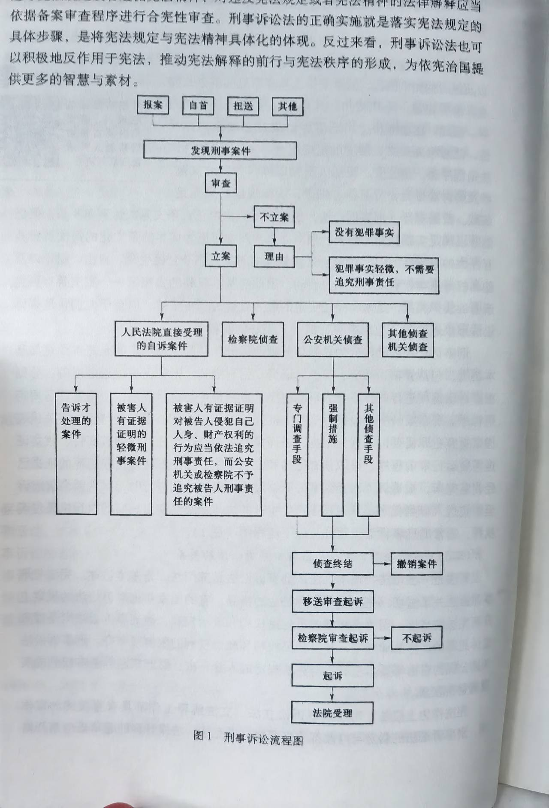

# 刑事诉讼法

[toc]

## 绪论
### 第一节、刑事诉讼与刑事诉讼法
#### 一、刑事诉讼的概念
- 概念：刑事诉讼是为人民法院在控方即人民检察院（公安机关等侦查机关予以协助）以及自诉人的追诉活动与辩方的防御活动之间实施审查，并使双方展开理性争辩与说服，最终对刑事案件作出裁判的活动与过程

#### 二、刑事诉讼法的概念及其法律渊源
- 概念：刑事诉讼法是规范刑事诉讼活动的基本法律
  - 狭义：国家立法机关指定的成文的刑事诉讼法典
  - 广义：一切与刑事诉讼有关的法律规范，即刑事诉讼法的给类法律渊源
- 调整对象：
  1. 公安机关、检察机关或自诉人为揭露、证实犯罪而实施的追诉活动
  2. 被追诉者实施的辩护与防御活动
  3. 法院的审查、裁判活动
  4. 其他诉讼参与人参加刑事诉讼的活动

##### （一）狭义的刑事诉讼法即《刑事诉讼法》
- 特点：
  1. 刑事诉讼法是规范刑事诉讼流程的程序法，法律本身规定的多是刑事案件自立案到侦查、起诉、审判以及执行的整个流程
  2. 刑事诉讼法是程序法，是公安、司法人员据以操作的规范，设计的诉讼行为十分具体、细微，法律规定必须充足，细致
  3. 刑事诉讼法规范的对象是剥夺公民生命、自由、财产以及隐私权等基本权利的刑事司法活动，因此与基本权利的大宪章——宪法具有情迷的法律关系，是落实宪法规定的**最为重要的**基本法律
- 结构：
  1. 总则：规定基本原则与基本制度，包括管辖、回避、辩护、证据、强制措施、附带民事诉讼制度等
  2. 分则：根据诉讼流程进行的顺序分为：
    1. 审前程序
    2. 审判程序
    3. 执行程序
    4. 特别案件执行特别程序
- 通常的刑事诉讼流程图： 

##### （二）宪法性法律渊源及宪法与刑事诉讼法的关系
| 宪法                     | 刑事诉讼法                         |
|--------------------------|------------------------------------|
| 根本大法                 | 部门法、基本法律                   |
| 规定了公民权利和政治权力 | 涉及公民权利和政治权力的限制或剥夺 |
| 规定公民的基本权利       | 涉及公民的基本权利                 |

##### （三）刑事诉讼法与关联法律法规

##### （四）刑事诉讼法的法律解释

##### （五）国际公约、条文与准则
> 与刑事诉讼联系最为密切的四个国际公约是：《禁止酷刑和其他残忍、不人道或有辱人格的待遇或处罚公约》《公民权利和政治权利国际公约》《联合国打击跨国有组织犯罪公约》《联合国反腐败公约》

### 第二节、刑事诉讼法的指定目的与任务
#### 一、刑事诉讼法的制定目的
> 《刑事诉讼法》第1条规定：“为了保证刑法的正确实施，惩罚犯罪，保护人民，保障国家安全和社会共公共安全，维护社会主义社会秩序，根据宪法，制定本法”

#### 二、刑事诉讼法的任务
##### （一）保证准确、及时地查明犯罪事实，正确应用法律，惩罚犯罪分子,保障无罪的人不受刑事追究
1. 保证准确、及时地查明犯罪事实
2. 正确应用法律
3. 以事实为依据，以法律为准绳

##### （二）尊重和保障人权
1. 提升敢最嫌疑人、被告人的诉讼主体地位，保障犯罪嫌疑人、被告人和罪犯的权利，与前一任务中“防止无罪的人受到刑事法律追究”相结合，同时也要防止有罪的人受到不公正的对待
2. 保障刑事诉讼中的被害人、辩护人、诉讼代理人等所有诉讼参与人的合法权利
3. 通过对犯罪的惩罚保护广大任命群众的权利不受侵害，又与下文所述任务结合起来

##### （三）教育公民自觉遵守法律，积极同犯罪行为作斗争
1. 必须是一切犯罪行为都得到应有的追究
2. 必须做到正确、及时、合法地惩罚犯罪，保障无罪的人不受刑事追究
3. 在整个刑事诉讼活动中，都要积极依靠和发动群众，充分调动人民群众同犯罪斗争的积极性

### 第三节、刑事诉讼法学的研究对象和研究方法
#### 一、刑事诉讼法学的研究对象
##### （一）刑事诉讼基本理论
> 刑事诉讼法学基本理论，即刑事诉讼法哲学

1. 诉讼价值
2. 诉讼目的
3. 诉讼构造
4. 诉讼职能
5. 诉讼主体
6. 诉讼客体
7. 诉讼理论
8. 诉讼文化

##### （二）刑事诉讼法律规范及刑事诉讼实践
> 刑事诉讼法律规范指定具有一定的**超前性**，其实施又受到多种因素的影响，导致立法与实践存在一定程度的背离，有些法律规定在司法实践或被虚置，或被扭曲，因此，必须关注刑事诉讼实践，研究出现的各种重大问题，提出对策性建议，为完善刑事诉讼法提供实践支持
- 刑事诉讼法律规范：刑事诉讼实践的法律依据
- 刑事法律诉讼实务：
    1. 侦查实务
    2. 起诉实务
    3. 审判实务
    4. 辩护实务

##### （三）国际条约中的刑事诉讼规则
《公民权利和政治权利国际公约》《世界人权宣言》等国际公约中关于刑事司法准则的规定，体现了人类发展和进步的共性要求

##### （四）其他国家的刑事诉讼法

#### 二、刑事诉讼法的研究方法
马克思主义对刑事诉讼法学研究具有重要的指导意义，**辩证唯物主义**和**历史唯物主义**是刑法诉讼法学研究总的方法
1. 唯物史观和唯物辩证法为刑事诉讼法学的研究提供了认识论和方法论的知道
2. 马克思主义法学基本原则为刑事诉讼法学的研究奠基了理论基础
3. 中国特色社会主义理论体系为刑事诉讼法的开拓创新指出了明确方向

##### （一）历史分析的方法
##### （二）价值分析的方法
##### （三）经济分析的方法
##### （四）比较的方法
##### （五）实证分析的方法

### 第四节、中国刑事诉讼法的历史发展

## 第一章、马克思、恩格斯的刑事诉讼观
> 马克思、恩格斯的刑事诉讼观，是马克思主义法律思想体系的重要组成部分

### 第一节、刑事程序法与刑事实体法的关系
> 程序法与实体法的关系是刑事诉讼法学的基本问题之一

#### 一、程序法与实体法是形式与内容的关系
> 依据法律规定的内容不同，可将法律分为程序法与实体法

- 程序法：保证实体法规定的权利和职权得以实现或行使，义务和责任得以履行的有关程序的法律
    1. 刑事诉讼法
    2. 民事诉讼法
    3. 行政诉讼法
    4. 行政强制法
- 实体法：规定具体权利义务的内容或法律保护的具体情况的法律
    1. 刑法
    2. 民法
    3. 公司法

#### 二、程序法为实体法服务
> 内容和形式的关系，就是决定与被决定的关系、表现与被表现的关系、服务与被服务的关系。**内容决定形式，形式表现内容，形式为内容的实现服务**

#### 三、程序法具有独立价值
> 作为形式的程序法服务于作为内容的实体法，这是程序法的工具价值。在马克思、恩格斯的程序法观念中，程序法的价值并非局限于它是实现实体法的一种工具。**程序法自身也反映正义要求**

1. 肯定“公开的自由的诉讼”
2. 承认资产阶级国家民主的诉讼原则与诉讼形式
3. 揭露和批判刑事诉讼中的程序违法行为

### 第二节、刑事诉讼中的人权司法保障
#### 一、任何人不受非法逮捕和羁押
#### 二、被告人有权获得迅速审判
#### 三、应当给予羁押中的被告人人道待遇

### 第三节、刑事审判权的独立行使
#### 一、司法权独立于行政权
#### 二、法官独立行使审判权
1. 法官应当独立于政府
2. 陪审员应当独立于职业法官
3. 法官应当独立于双方当事人

### 第四节、刑事司法的民众参与
#### 一、民众通过陪审制参与司法
> 司法权是国民的直接所有物

#### 二、保障公民平等地享有参与司法的权利
> 陪审团应当来自各界，来自人民，因为每个人都有权由和自己同类的人来审判

### 第五章、刑事诉讼的程序公正要求
> 司法公正是刑事诉讼追求的基本价值

#### 一、只能由依法设立的法庭刑事审判权
> 由依法设立的法庭行使审判权，是保证刑事诉讼程序公正的必要条件之一

#### 二、法官不能与自己处理的案件有利害关系
> 任何人不能成为自己案件的法官，是程序公正最基本的标准之一

#### 三、严格依照法定程序进行诉讼
> 刑事诉讼的程序公正，实质就是保证体现公正要求的刑事诉讼程序得到严格的遵循

## 第二章、刑事诉讼构造与刑事诉讼主体
### 第一节、刑事诉讼构造
#### 一、概述
> 由社会就会有冲突和纠纷，也就产生了解决冲突和纠纷的方式。刑事诉讼构造就是用以描述不同国家不同时期为解决纠纷而设立的框架结构的范畴

- 概述：刑事诉讼构造，又称刑事诉讼形式或则和刑事诉讼结构，是由一定的诉讼目的所决定的，控诉、辩护和裁判三方在刑事诉讼中的地位和相互关系
- 分类：
    - 弹劾式：
        1. 诉讼由被害人或其他人提出控告，实行不告不理原则，没有被害人或其他人的控告，法官就不能进行审判
        2. 被害人和加害人诉讼地位平等，共同主导着诉讼的进行和结局，由行政官员担当的裁判者居中听审并做出裁断
        3. 对于疑难案件的处理，实行神示证据制度，法官求助于神灵的启示来认定事实和判断双方的是非曲直
    - 纠问式：
        1. 不再实行不告不理原则，及时没有被害人或其他人的控告，担当裁判者的行政官员也可以依职权主动追究犯罪，控诉只能与审判只能合一行使
        2. 当事人特别是被告人的诉讼地位客体化，沦为被拷打、逼问的对象，刑讯合法化和制度化，原告和证人也可以被刑讯
        3. 侦查和审判都秘密进行，实行书面审理方式
        4. 实行法定证据制度，证据的种类、运用和证明力大小均有法律预先规定，法官在审理案件过程中不得自由评断和取舍

#### 二、职权主义诉讼
- 概念：职权主义诉讼是以纠问式诉讼为主、以弹劾式诉讼为辅加以改造后创制的一种刑事诉讼构造
- 特点：注重发挥警察机关、检查机关和审判机关在刑事诉讼中的职权作用
    1. 侦查机关（包括享有侦查职权的预审法官）主导着侦查活动的开展，负责收集证据，犯罪嫌疑人一方几乎不进行实施调查，而且，这些国家的法律制度也普遍不鼓励辩方律师与证人接触
    2. 提起公诉遵循较为严格的起诉法定原则，在案件证据足以证明犯罪事实成立的情况下，原则上检查机关就必须提起公诉。只有在犯罪情节轻微等少数的例外情况下，才可以基于公共利益的考虑对于是否提起公诉进行自由裁量
    3. 法官始终扮演着法庭审理过程中的主角。职权主义诉讼奉行“职权调查”和“实体真实”的审判理念，法官负有查明案件客观真相的责任

#### 三、当事人主义诉讼
- 概念：当事人主义诉讼又称对抗式诉讼，是以弹劾式诉讼为主、以纠问式诉讼为辅加以改造后创制的一种刑事诉讼构造
- 特点：相信一个在法庭审判中消极、被定而且在庭审之前严格制约着侦、控人员的法官角色更有利于查明案件的真相
    1. 在侦查程序中，侦查机关与犯罪嫌疑人一方都是地位平等的当事人，各自都能为准备法庭审判而开展诉讼调查活动，侦查机关的罪案调查活动与犯罪嫌疑人一方的辩护型调查活动同时展开，并相互制约
    2. 提起公诉遵循起诉便宜主义原则，即使是在案件证据足以证明犯罪事实成立的情况下，也允许检察机关基于公共利益或刑事政策的考虑斟酌决定是否起诉以及如何起诉
    3. 辩控双方是庭审活动的主角

#### 四、混合式诉讼
- 概念：混合式诉讼又称折中主义诉讼，是兼采职权主义诉讼和当事人主义诉讼的因素形成的
- 特点：追求刑事诉讼中国家专门机关的群里与被追诉人权利的平衡，力图通过正当程序实现犯罪控制的目的
    1. 借鉴当事人主义诉讼的理念和做法，强化诉讼中控辩双方的平等对抗，加大被追诉人及其律师的辩护活动的对诉讼过程和诉讼结局的影响力
    2. 保留职权主义诉讼中法官依职权主动调查证据的传统，发挥法官在探知案件事实、发现案件真相方面的积极作用

#### 五、我国刑事诉讼法构造及其特征
##### （一）中华人民共和国成立之前的刑事诉讼构造
##### （二）中华人民共和国的刑事诉讼构造
- 特点：
    1. 侦查程序具有一定的强职权主义色彩
        1. 法官不能介入侦查过程
        2. 侦查人员与犯罪嫌疑人之间的地位、权利不对等
        3. 嫌疑人没有沉默权
    2. 提起公诉遵循以起诉法定主义为主、起诉便宜主义为辅的原则
        1. 人民检察院认为现有证据足以证明犯罪嫌疑人犯罪的，**原则**上应当提起公诉
        2. 对于**犯罪情节轻微、依照刑法规定不需要判处刑罚或者免除刑罚的，可以裁量决定不起诉**
        3. 未成年人涉嫌刑法分则第四章、第五章、第六章规定的犯罪，可能判处**一年有期徒刑以下**刑罚，符合起诉条件，但有悔过表现的，人民检察院也可以裁量做出**附条件不起诉**的决定
        4. 法院无权驳回人民检察院的起诉，彰显了我国提起公诉程序的职权主义色彩
    3. 审判程序呈现出以职权主义为主、以当事人主义为辅的混合色彩

### 第二节、刑事诉讼中的审判机关
#### 一、审判机关的性质与职权
##### （一）审判机关的性质
1. 在我国，审判机关专指人民法院
2. 在我国，司法与审判不是同一概念，司法的概念要广于审判

##### （二）审判机关在刑事诉讼中的职权
- 职权：
    1. 决定适用拘传、取保候审、监视居住和逮捕等强制措施
    2. 对该出庭而不出庭作证的证人有权强制其到庭、予以训诫和拘留；在审判过程中，必要时可以进行勘验、检查、查封、扣押、鉴定和查询、冻结
    3. 对于违反法庭秩序的行为进行警告、制止以及采取处罚措施
    4. 执行某些判决和裁定
    5. 对生效判决按照审判监督程序进提审或再审
- 义务：
    1. 通知义务。应当依法及时通知人民检察院、当事人及其他诉讼参与人出庭参加诉讼
    2. 告知义务。开庭时，应当告知当事人、证人和鉴定人等的诉讼权利和诉讼义务
    3. 保证义务。应当保证诉讼参与人诉讼权利的行使
    4. 听取义务。审判过程中，应当听取公诉人、当事人、诉讼代理人、辩护人对证据、案件情况和法律适用所发表的意见

#### 二、审判机关的组织体系及其上下级关系
- 组织体系：最高人民法院、地方各级人民法院和专门人民法院
- 最高人民法院：我国最高审判机关，监督各级人民法院和专门人民法院的工作
    - 最高人民法院审理的案件：
        1. 法律规定由其管辖的和其认为应当由自己管辖的第一审案件
        2. 对高级人民法院判决和裁定的上诉、抗诉案件
        3. 按照全国人大常委会的规定提起的上诉、抗诉案件
        4. 按照审判监督程序提起的再审案件
        5. 高级人民法院报请准核的死刑案件
    - 最高人民法院设立的巡回法庭：
        1. 全国范围内重大、复杂的第一审行政案件
        2. 在全国有重大影响的第一审民商事案件
        3. 不服高级人民法院作出的第一审行政或者民商事判决、裁定提起上诉的案件
        4. 对高级人民法院作出的已经发生法律效力的行政或者民商事判决、裁定、调解书申请再审的案件
        5. 刑事申诉案件
        6. 依法定职权提起再审的案件
        7. 不服高级人民法院作出的罚款、拘留决定申请复议的案件
        8. 高级人民法院因管辖全问题报请最高人民法院裁定或者决定的案件
        9. 高级人民法院报请批准延长审限的案件
        10. 涉港澳台民商事件和司法协助案件
        11. 最高人民法院认为应当由巡回法庭审理或者办理的其他案件
- 地方各级人民法院分为基层人民法院、中级人民法院和高级人民法院
    - 基层人民法院：市辖区、县、自治县、不设区的市涉基层人民法院
        1. 可以根据需要设立人民法庭，人民法庭是基层任命法院的组成部分，其判决和裁定就是基层人民法院的判决和裁定
        2. 受理除上级人民法院管辖的第一审案件外的所有第一审案件
    - 中级人民法院：
        - 设立范围：
            1. 省自治区辖市的中级人民法院
            2. 在直辖市内设立的中级人民法院
            3. 自治州中级人民法院
            4. 在省、自治区内按地区设立的中级人民法院
        - 审理范围：
            1. 受理由他管辖的第一审案件
            2. 基层人民法院报请审理的第一审案件
            3. 不服基层人民法院判决和裁定的上诉、抗诉案件
            4. 依照审判监督程序提起的再审案件
    - 高级人民法院：省、自治区、直辖市设高级人民法院
        1. 根据法律受理由它管辖的第一审案件
        2. 下级人民法院报请审理的第一审案件
        3. 最高人民法院指定管辖的第一审案件
        4. 不服中级人民法院判决和裁定的上诉、抗诉案件
        5. 按照审判监督程序提起的再审案件
        6. 中级人民法院报请复合的死刑案件

#### 三、审判组织
- 概念：审判组织是人民法院审判案件的具体组织形式
- 分类：
    1. 独任庭：法官一人独任审判案件的组织形式
        - 优点：迅速和经济
        - 缺点：容易导致恣意擅断
        - 适用：只限于基层人民法院适用简易程序、速裁程序进行第一审的刑事案件
    2. 合议庭：由审判人员数人集体审判案件的组织形式
        - 适用：除了可以独任审判的第一审案件外，其他案件均应由合议庭审判
        - 组成人员：
            1. 基层人民法院、中级人民法院审判第一审案件，应当由审判员3人或者由审判员和人民陪审员共3人或者7人组成合议庭进行
            2. 高级人民法院审判第一审案件，应当由审判员3人至7人或者审判员和人民陪审员共3人或者7人组成合议庭进行
            3. 最高人民法院审判第一审案件，应当由审判员3人至7人组成合议庭进行
            4. 人民法院审判上诉和抗诉案件，应当由审判员3人或者5人组成合议庭进行
        - 特殊情况：基层人民法院、中级人民法院、高级人民法院审判下列第一审刑事案件，由审判员和人民陪审员组成7人合议庭进行：
            1. 可能判处10年以上有期徒刑、无期徒刑、死刑，且社会影响重大的
            2. 涉及征地拆迁、生态环境保护、食品药物安全，且社会影响重大的
            3. 其他社会影响重大的
        - 特点：
            1. 合议庭的成员人数是单数
            2. 设审判长1人，由审判员担任。院长或庭长参加案件审判则有其自己担任
            3. 审判长主持
    3. 审判委员会：各级人民法院设审判委员会
