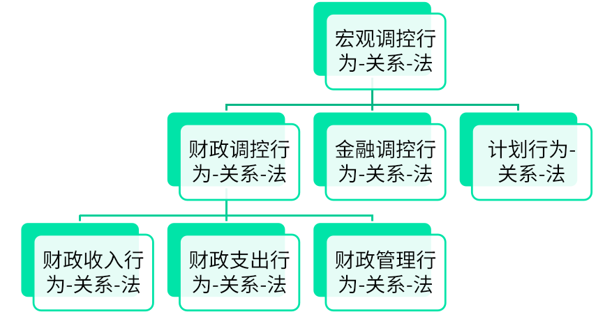

# 经济法

#### 一、宏观调控法的理论基础
##### （一）宏观调控
- 概念：国家对国民经济总体活动进行调节和控制的行为
- 目标：
    1. 总量均衡
    2. 结构优化
    3. 就业充分
    4. 国际收支平衡
- 手段：
    1. 财政调控
    2. 税收调控
    3. 金融调控
    4. 计划

##### （二）宏观调控法的概念
- 对象：在国家对国民经济总体活动进行调节和控制过程中发生的经济关系，即宏观调控关系
- 定义：调整在国家对国民经济总体活动运行进行调节和控制过程中发生的经济关系的法律规范的总称

##### （三）宏观调控法的定位
- 法的体系：
    1. 整个法体系中，经济法是第一层次部门法
    2. 经济法中，宏观调控法是第一层次部门法
- 法域归属：公法
- 与相关法的关系
    1. 与市场规制法同属于经济法
    2. 与行政法在调整对象、渊源、地位、作用方面联系&在调整对象、主体、作用、调整方法等方面区别

##### （四）宏观调控法的价值、宗旨和原则
- 价值：
    1. 公平价值
    2. 效率价值
    3. 秩序价值
- 宗旨：
    1. 初级宗旨
    2. 终极宗旨
- 原则：
    1. 调控法定原则
    2. 调控绩效原则
    3. 调控公平原则
    4. 调控适度原则

#### 二、宏观调控法的体系构成

#### 三、宏观调控法的调整方式
1. 一般禁止式的调整方法
2. 积极义务式的调整方式
3. 有条件的允许式调整方式

### 第二节 宏观调控法的基本制度
#### 一、宏观调控法主体制度
1. 调控主体
2. 调控受体

#### 二、宏观调控权配置制度

#### 三、宏观调控的程序制度
##### （一）不同手段的调控程序制度
1. 财政调控程序制度
2. 税收调控程序制度
3. 金融调控程序制度
4. 国民经济计划程序制度

##### （二）不同环节的调控程序制度

