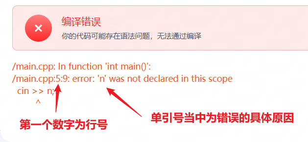

## L1常见题型的复习与练习

### 一、常见错误类型
> Debug的技巧：当出现编译错误的时候，查看其出现在**第几行**和**单引号**当中的内容




### 二、常见题型
> 题型分类：
> 1. **基础题型**：常见的最基本的题目类型
> 2. **复合题型**：多个基础题型的组合，L1中期开始，后续的学习、考试与竞赛当中，所遇到的题目多数都是复合题型。解决复合题型的题目，需要具备一定的题目分析能力，分析题目的意图，将题目拆解为多个基础题型的组合。

##### 1. 格式化输出（基础）
- 题型描述：按照一定的要求输出内容
- 写法：无固定写法，根据题目要求即可
- 注意点：仔细查看题目要求，看清楚空格的位置和数量、小数点保留的位数、是否换行等等
- 练习题：
    1. [输出3个整数的乘积](https://oj.youdao.com/course/83/496/1#/1/7960)
    2. [求总票价](https://oj.youdao.com/course/83/496/1#/1/12112)
    3. [友好的输出](https://oj.youdao.com/course/83/494/2#/1/7910)

##### 2. 数学题（基础）
- 题型描述：数学应用题的变成解法
- 写法：无固定写法，根据题目要求灵活做答。这类题目的编程部分通常不会很难，难点在于如何用数学去分析题目
- 注意点：变量的类型需要观察清楚
- 练习题：
    1. [求总票价](https://oj.youdao.com/course/83/496/1#/1/12112)
    2. [计算体质指数BMI值](https://oj.youdao.com/course/83/496/1#/1/7961)
    3. [买电子听力设备](https://oj.youdao.com/course/83/496/1#/1/12113)

##### 3. 数位拆分（基础）
- 题型描述：将一个整数的各个数位拆分出来，比如将`123`的`个位：3`、`十位：2`、`百位：1`给拆分出来
- 写法：想要拿到最后一位（比如从123中拿到3）就是`%10`，想要删掉最后一位（比如将123变成12）就是`/10`，删掉最后两位就是`/100`。通过删除末尾的数字，使得我们想要的位数变成末尾数字，再通过`%10`拿到即可。如：想要拿到`123`中的`2`，需要先`/10`删掉最后一位，让`123`变成`12`，再通过`%10`获取最后一位`2`
- 注意点：在草稿纸上进行推演，我想要拿到这个数位应该删掉最后几位
- 代码：
    ```cpp
    // 以三位数a为例
    int ge = a % 10; // 获取个位
    int shi = a / 10 % 10; // 获取十位
    int bai = a / 100; // 获取百位
    ```
- 练习题：
    1. [反向输出三位数](https://oj.youdao.com/course/83/494/1#/1/7906)
    2. [输出两个整数个位上数字之和](https://oj.youdao.com/course/83/494/2#/1/12426)
    3. [计算各位的和](https://oj.youdao.com/course/83/496/2#/1/7952)

##### 4. 数字的判断（基础）
- 题型描述：判断一个数字是否符合要求
- 写法：利用if语句、运算和逻辑运算符结合
- 注意点：题目的要求是两个要求同时成立还是其中一个成立
- 代码：
    ```cpp
    // 判断是否为偶数
    if (a % 2 == 0) {
        // 相关操作
    }

    // 判断是否为奇数
    if (a % 2 != 0) {
        // 相关操作
    }

    // 最后一位数是否为3
    if (a % 10 == 3) {
        // 相关操作
    }

    // 是3的倍数但不是5的倍数
    if (a % 3 == 0 && a % 5 != 0) {
        // 相关操作
    }

    // 是否为两位数
    if (a >= 10 && a <= 99) {
        // 相关操作
    }
    ```
- 练习题：
    1. [不一样的计算](https://oj.youdao.com/course/83/509/1#/1/7993)
    2. [末位是不是5](https://oj.youdao.com/course/83/509/1#/1/7994)
    3. [判断是否为三位数](https://oj.youdao.com/course/83/514/1#/1/8051)
    4. [找贝壳](https://oj.youdao.com/course/83/514/1#/1/12908)

##### 5. 字符的操作（基础）
- 题型描述：字符的判断和操作
- 写法：字符种类的判断，只需要判断是否在区间内即可
- 注意点：
    1. 字符可以直接运算
    2. 字符在运算之后会直接转换成`int`类型，不需要提前转换
    3. 字符在运算后注意是否需要转换回`char`类型
- 代码：
    ```cpp
    // 大小写字母之间的转换
    cout << (char)(c - 32); // 小写转大写
    cout << (char)(c + 32); // 大写转小写

    // 判断是否为小写字母
    if (c >= 'a' && c <= 'z') {
        // 相关操作
    }

    // 判断是否为大写字母
    if (c >= 'A' && c <= 'Z') {
        // 相关操作
    }

    // 判断是否为数字字符
    if (c >= '0' && c <= '9') {
        // 相关操作
    }

    // 字符的ASCII码是否为偶数
    if (c % 2 == 0) {
        // 相关操作
    }

    // 字符的ASCII码是否为奇数
    if (c % 2 != 0) {
        // 相关操作
    }
    ```
- 练习题：
    1. [debug程序](https://oj.youdao.com/course/83/514/1#/1/18829)
    2. [加密游戏](https://oj.youdao.com/course/83/514/1#/1/8054)
    3. [字母变换](https://oj.youdao.com/course/83/499/1#/1/12433)
    4. [大小写相互转换](https://oj.youdao.com/course/83/509/1#/1/8003)
    5. [奇偶ASCII值判断](https://oj.youdao.com/course/83/509/2#/1/8009)

##### 6. 筛选范围内符合要求的数（复合）
- 题型描述：输出一个范围之内符合要求的数
- 写法：for循环和**数字的判断**的结合
- 注意点：循环的起点和终点
- 代码：
    ```cpp
    for (int i = 起点; i <= 终点; i++) {
        if (条件) {
            cout << i << ' ';
        }
    }
    cout << '\n';
    ```
- 练习题：
    1. [当for遇到if](https://oj.youdao.com/course/83/515/1#/1/8060)
    2. [进阶挑战](https://oj.youdao.com/course/83/515/1#/1/8061)
    3. [能被7整除的数字](https://oj.youdao.com/course/83/515/2#/1/8074)

##### 7. 输入n个数（基础）
- 题型描述：输入n个数
- 写法：
    1. 定义整数n，输入一个整数n
    2. 定义输入变量t/数组
    3. for循环n次，每次输入一个数
- 注意点：数组的写法，需要观察题目中n的最大值，定义数组时将数组长度定义为最大值+5
- 代码：
    ```cpp
    // 学习数组前的写法
    int n, t;
    cin >> n;
    for (int i = 0; i < n; i++) {
        cin >> t;
    }

    // 学习数组后的写法
    int n;
    int a[n的最大值+5];
    for (int i = 0; i < n; i++) {
        cin >> a[i];
    }
    ```
- 练习题：无

##### 8. 计数问题（复合）
- 题型描述：计算给定的多个数中，有多少个我们想要的
- 写法：
    1. **输入n个数**
    2. 定义计数员变量，并**初始化为0**
    3. 符合要求，计数员变量+1
- 注意点：
    1. 有多少个需要计数的内容，就定义多少个计数员变量
    2. 输入变量t的类型需查看题目要求
    3. 计数员变量必须要初始化为0
    4. 根据技术员变量进行输出，需要写在for循环的外面
- 代码：
    ```cpp
    int n, cnt = 0, t;
    cin >> n;
    for (int i = 0; i < n; i++) {
        cin >> t;
        if (符合条件) {
            cnt++;
        }
    }
    // 根据计数员变量的值进行一些操作
    ```
- 练习题：
    1. [与指定数字相同的数的个数](https://oj.youdao.com/course/83/515/1#/1/8071)
    2. [好事不成双](https://oj.youdao.com/course/83/515/1#/1/18833)
    3. [不同种类糖果的数量](https://oj.youdao.com/course/83/515/1#/1/12888)
    4. [整数的个数](https://oj.youdao.com/course/83/515/2#/1/9036)

##### 8. 找最值（复合）
- 题型描述：给定一些整数，找出其中的最大值、最小值
- 写法：
    1. 输入n个数
    2. 定义最大值/最小值变量，并按照要求初始话他们的值。题目中会告诉我们输入的数的范围，最大值变量`max=最小值-1`，最小值变量`min=最大值+1`
    3. 按照要求更新最大值/最小值变量。如果发现比最大值更大的数，更新最大值；发现比最小值更小的数，更新最小值
- 注意点：如，输入n个整数x（0 <= x <= 1000），则最大值变量`max=-1`，最小值变量`min=1001`
- 代码：
    ```cpp
    int n;
    int a[n的最大值+5];
    cin >> n;
    for(int i = 0; i < n; i++) {
        cin >> a[i];
    }

    // 找最大值
    int max = -1; // 这个值需要根据题目要求变更
    for(int i = 0; i < n; i++) {
        if (a[i] > max) {
            max = a[i];
        }
    }

    // 找最小值
    int min = 1001; // 这个值需要根据题目要求变更
    for(int i = 0; i < n; i++) {
        if (a[i] < min) {
            min = a[i];
        }
    }
    ```
- 练习题：
    1. [最小的整数](https://oj.youdao.com/course/83/515/1#/1/8063)
    2. [挑出最大的西瓜](https://oj.youdao.com/course/83/515/1#/1/8064)
    3. [掐头去尾求平均分](https://oj.youdao.com/course/83/515/1#/1/12891)

##### <++>. <++>
- 题型描述：<++>
- 写法：<++>
- 注意点：<++>
- 代码：
    ```cpp
    <++>
    ```
- 练习题：
    1. [<++>](<++>)
